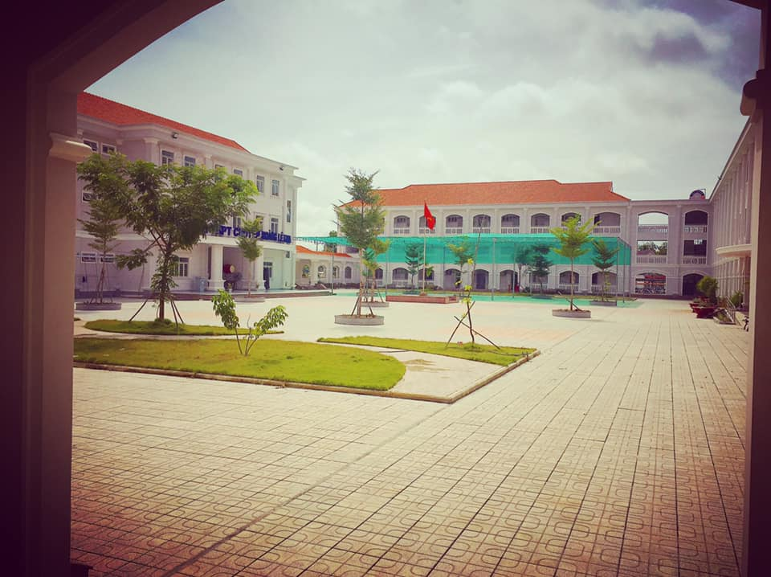

## Kỳ 1: 🏫 CÓ MỘT NƠI ĐƯỢC GỌI LÀ NHÀ

👣 Ở đó, tôi có thể sống hết mình với tuổi trẻ, với những đam mê, khát khao cháy bỏng mà không bị vấn đề cơm áo gạo tiền đặt nặng lên đôi vai mình...

👨🏻‍🎓 Ở đó, tôi có thể gặp được những người bạn tuyệt vời, những thầy cô tận tâm và những hậu bối vô cùng đáng yêu khiến lòng tôi cảm thấy vô cùng tự hào khi là một thành viên nhỏ trong một đại gia đình lớn như thế này...

❤️ Ở đó, tôi bắt gặp được một thứ gọi là “mối tình đầu” của mình, một mối tình rất ngây ngô nhưng cũng đầy những kỉ niệm khó phai nhòa mà đến thời điểm hiện tại rất khó để tìm lại được cảm giác ấy...

📚 Và ở đó, tôi viết nên những năm tháng thanh xuân tươi đẹp nhất của cuộc đời mình với rất nhiều những cảm xúc không nói thành lời...

🗓 Hôm nay là ngày 21/10/2019, còn khoảng đúng 1 tháng nữa mọi người sẽ chính thức gặp được tôi với tư cách là Cựu học sinh chuyên Anh khóa 23 (2016-19), Trường THPT chuyên Hoàng Lê Kha, Tây Ninh.
