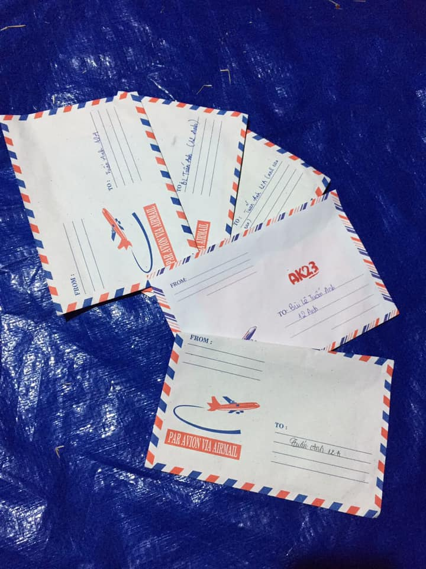

## Kỳ 2: ✉ NHỮNG CÁNH THƯ XUÂN...

📆 Ngày 27/01/2019, sự kiện #HLK_LNYCamping cuối cùng trong đời học sinh của tôi. Vẫn như thường lệ, khối chuyên Anh có một sự kiện đồng hành mang tên "Love Confession - Nơi tình yêu lan tỏa", ở đó bất cứ ai cũng có thể gửi những lời yêu thương tới những người xung quanh thông qua những lá thư "ẩn danh" kia. Năm vừa rồi, #HLK_AK23 đảm nhận vai trò "chủ xị" của sự kiện này và điều bất ngờ nhất đã đến với tôi, một trong những thành viên của AK23...

❌ Bất ngờ ở chỗ, hai năm trước đó, số lá thư mà tôi nhận được là hai con số 0️⃣ tròn trĩnh, mặc dù những người bạn của tôi, có người nhận 7-8 lá hằng năm, nghe sao mà đau lòng 😂

❤️ Nhưng ở sự kiện #lovecfs cuối cùng tôi tham gia chính thức, lần đầu tiên tôi nhận tới 5️⃣ lá thư, thuộc số ít những người "thống trị" số lượng confession nhận được của cả lớp năm qua...

✅ Vâng, đúng là LẦN ĐẦU TIÊN đấy, mọi người không đọc nhầm đâu!!! 🤣

📝 Trong số 5 lá thư tôi nhận được, có:

🔛 2 lá được xếp vào nhóm "THƯ ĐỘNG VIÊN", đọc xong xếp lại gác qua một bên.

😗 1 lá được gửi từ cô bạn thân của tôi (ơ, cái này không nên xếp vào nhóm nào cả, vì chả biết xếp thế nào cho đúng 🤣, và nếu muốn biết người ấy là ai thì...tự tìm đi, gợi ý có trong Facebook tôi 🤣).

😐 1 lá được xếp vào nhóm "THƯ CHỈ NÊN ĐỌC LƯỚT", vì nó gợi cho tôi một cái kí ức nó hơi buồn xíu về một cô hậu bối của tôi (toàn bộ câu chuyện sẽ có ở bài tiếp theo)

🔎 Lá còn lại, xếp sang 1 nhóm đặc biệt, "THƯ TỎ TÌNH" (wow, sốc thật 😲). Still LẦN ĐẦU TIÊN, tôi nhận thư loại này (và nếu như mọi người để ý sẽ thấy một lá khác biệt với phần còn lại). Tôi mở ra xem, suy nghĩ, cảm nhận, và phải mất một ngày sau, nhờ khả năng điều tra thần sầu thì tôi cũng tìm ra được chủ nhân (cuộc điều tra ly kỳ này cũng sẽ đưa vào bài sau 🤣)

🎁 Có lẽ chưa bao giờ tôi vui sướng đến vỡ òa như thế, ngay khi nghe thông báo từ bạn tôi về số lượng thư nhận được của tôi. Đối với tôi, những lá thư ấy, gắn với tôi như một phần kỉ niệm không thể nào phai mỗi khi nhắc đến #HLK, một nơi viết nên thanh xuân tươi đẹp với biết bao thứ tình cảm thật đẹp mà chắc chắn sau này rất khó để tìm lại. Ngày hôm nay, lục lại tấm hình chụp này, tôi chợt hồi tưởng về đêm trại năm ấy và ước gì, tôi có thể có vé để lên chuyến tàu thời gian quay trở lại thời điểm tuyệt vời này...
