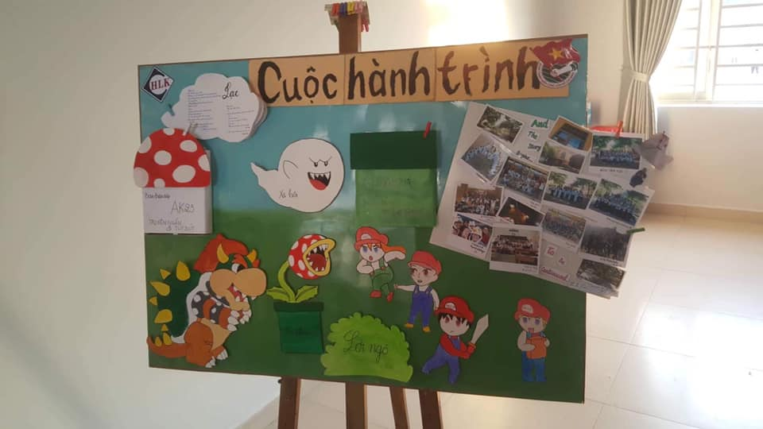
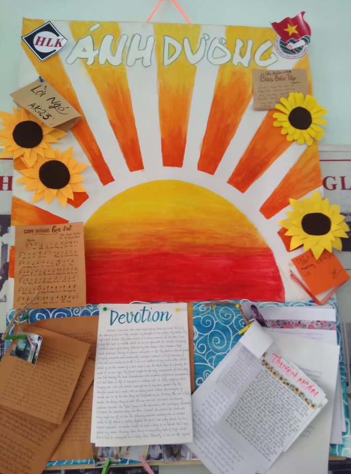
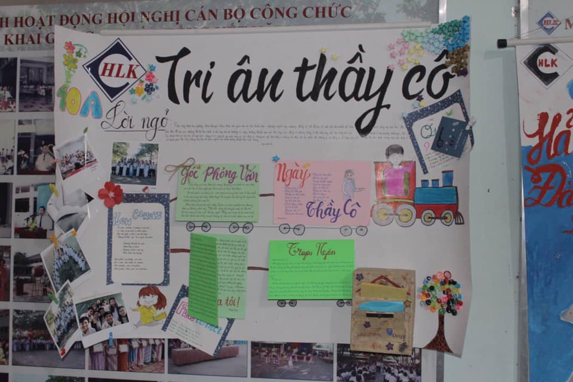

## Kỳ 3: 📝 NÉT BÚT THANH XUÂN 📝

🏫 Hoàng chuyên ngày trước có rất nhiều thứ để kể cho mọi người nghe, nhưng tôi xin chọn một sự kiện ý nghĩa để mọi người hồi tưởng và cảm nhận, đó chính là: BÁO TƯỜNG NGÀY NHÀ GIÁO...

📝 Những năm trước, gần tới ngày 20/11, chùm sự kiện lớn cho ngày Nhà giáo Việt Nam được tổ chức rất quy mô, bao gồm văn nghệ khối chuyên, cắm hoa và đáng nhớ nhất chính là Báo tường, nơi sự sáng tạo được lên ngôi. Có một điều mà mọi người chưa biết, dù tôi văn chương cũng tàm tạm, nhưng vì chữ đẹp nên năm nào cũng phải viết bài cho lớp, và cũng thường xuyên là thằng con trai duy nhất viết bài lên giấy cho lớp. Nghe kì ghê 😂

😢 Thuở ấy, mỗi khi tôi viết bài vào những tờ giấy trắng, tôi thường liếc sơ qua mỗi bài, rồi thỉnh thoảng những dòng nước mắt của tôi chợt lăn dài trên má. Tôi nhớ về những giây phút thầy cô đứng giảng trên lớp, tay trắng xóa vì bụi phấn rơi xuống, còn tôi thì mãi mê tán gẫu với bạn bè, rồi mất tập trung, rồi lại bị gọi tên và bị phê bình. Đúng là nhớ lại lúc đó mình ngốc thật! Họ đã cố gắng hết sức, thế tại sao mình lại làm vậy? Tôi cảm thấy có lỗi, và đó cũng là lí do nước mắt của tôi đã rơi mà không ai biết. Tôi cố gắng dồn hết cảm xúc, từ nội dung của những bài viết và ngòi bút của tôi viết ra giấy tất cả, và mọi thứ trông thật hoàn hảo. Đó có lẽ là những kỉ niệm đáng nhớ mà sau này tôi muốn tìm lại cũng không được ...

🖼 Lục lại tấm hình này, tôi nhớ lại ngày 20/11 cuối cùng của đời học sinh, cũng như vậy, chúng tôi đã suy nghĩ, đã trăn trở, và chọn cái tên là "Cuộc hành trình" cho báo tường cuối cùng của Anh Khóa 23 (2016-19). Trên đó có những tấm hình, những bài viết, ghi lại những gì gọi là hồi ức về thời thanh xuân tươi đẹp của các thành viên khi gắn bó với lớp, với Hoàng chuyên. Và dù cho nó không có giải thưởng gì chính thức, nhưng trong lòng mỗi người, nó đã mang dáng vẻ xinh đẹp, đủ sức đạt giải Nhất luôn rồi. Tôi tự hào khi là một phần của Anh Khóa 23, của đại gia đình Hoàng chuyên, được góp mặt trong một tập thể tuyệt vời mà chắc chắn tôi sẽ không bao giờ quên được. Cảm ơn mọi người vì tất cả, và xin lỗi vì tôi đã từng làm phụ lòng mọi người, hi vọng mọi người sẽ tha thứ cho những lỗi lầm mà tôi gây ra. Hẹn gặp lại mọi người vào một ngày không xa...

:::info
Những tấm hình sau đây đong đầy những kỷ niệm đẹp về Báo tường của AK23, hi vọng mọi người không chê về độ sáng của tấm hình này 😂

**_Cre: Từ thành viên #HLK_AK23 (không phải là tôi)_** 😂
:::

