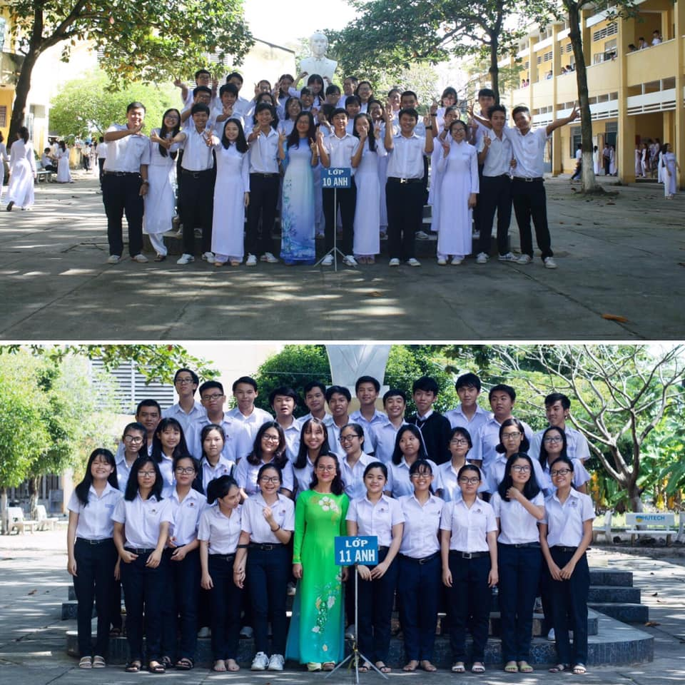

## Kỳ 4: 🍁 ƯỚC HẸN MÙA THU 🍁

👋 Xin chào các bạn, đã đến lúc tôi kể cho các bạn nghe sương sương về lớp tôi - lớp chuyên Anh khóa 23 (2016-2019) của Trường THPT chuyên Hoàng Lê Kha, tỉnh Tây Ninh đây.

🔙 Mùa thu năm 2016, chúng tôi gặp nhau, lúc đó có 32 thành viên, với bầu nhiệt huyết cùng niềm đam mê với tiếng Anh, dưới sự dẫn dắt của cô Mai Linh, chúng tôi đã trở thành 1 tập thể rất vững mạnh, đủ sức trải qua rất nhiều những khó khăn đầu khóa và chứng minh năng lực của mình khi bước vào Hoàng chuyên.

➡️ Mùa thu năm 2017, chúng tôi chào đón thêm một thành viên mới, sau đó dần dần chia tay với bốn thành viên cũ. Tuy số lượng có phần ít đó nhưng với một tinh thần không lùi bước, chúng tôi đã chiến thắng tất cả gian lao, tạo nên một lớp chuyên Anh với rất nhiều gương mặt tài năng và ưu tú. Đây chính là một năm có thể nói là thành công nhất của lớp, với rất nhiều câu chuyện vui để kể (nhưng với khoảng thời gian hạn hẹp thì tôi không thể nói hết ở đây được, mong mọi người thông cảm 😂)

🍃 Mùa thu năm 2018, chúng tôi chia tay cô chủ nhiệm cũ (vì một số lí do khách quan và chủ quan không thể tiết lộ), tuy vậy AK23 vẫn cứ như thế, các thành viên dù cho có những quan điểm khác biệt nhưng vẫn không ngừng nỗ lực để dung hòa tất cả. Đây là một năm cuối cấp khá sóng gió vì phải dồn sức vào kì thi THPTQG, tuy vậy, tất cả mọi người đều vượt qua một cách khá suôn sẻ. 😊

🗓 Mùa thu năm nay, mỗi người đã ở một nơi. Nhưng dù cho có ở bất cứ phương trời nào thì tôi tin chắc rằng sau khi nhìn thấy tấm hình này, mọi người cũng sẽ hồi tưởng lại một thời thanh xuân tươi đẹp gắn bó với Anh khóa 23 (2016-19), với Hoàng chuyên, cùng một lời ước hẹn được gửi lại và chờ ngày thực hiện:

- AK23 ơi, mọi người đã sẵn sàng cho ngày trở về hay chưa??? 😔
