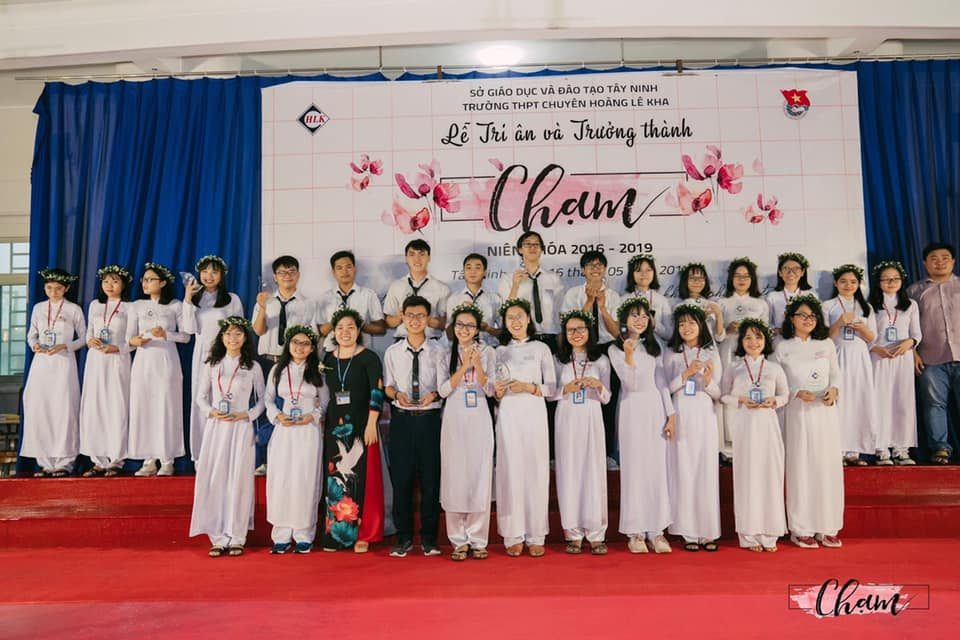

## Kỳ 5: 📚BÀI HỌC ĐẦU TIÊN 📚

🎵 "Bài học đầu tiên, có bóng hình núi sông

Yêu thương những cánh đồng, vẽ tiếp đường cha ông

Bài học đầu tiên, ấm êm lời ru của Mẹ

Con cò trắng bay qua câu ca dao ngọt ngào ...

Bài học đầu tiên, sóng vỗ lời biển xanh

Căng no những cánh buồm, chở tiếng hò quê hương

Bài học đầu tiên, cám ơn thầy, thầy đã dạy

Con đường tới tương lai, xây đất nước đẹp giàu ..."

📺 Lời bài hát này tôi đã được nghe trong chương trình Hòa ca của VTV7 - Đài Truyền hình Việt Nam (đó là video tôi đã share trên Facebook). Và khi giai điệu của bài hát này vang lên, tôi chợt nhớ lại cái lúc mà lớp chuyên Anh khóa 23 của Hoàng chuyên (2016-19) đổi giáo viên chủ nhiệm. Lúc đầu tôi có phần bị sốc toàn tập với quyết định của giáo viên chủ nhiệm cũ, cô Mai Linh. Nhưng sau này, chúng tôi đã hiểu và thông cảm rất nhiều cho cô. Từ đầu năm sau, chúng tôi có giáo viên chủ nhiệm lớp mới, cô Biên Thùy. Và từ đó, chúng tôi đã bắt đầu một cuộc hành trình mới với những bài học đầu tiên...

✅ Thứ nhất, đó chính là bài học về tính kỉ luật trong mọi việc. Đó là cái cách bạn phải chịu trách nhiệm thật sự với những gì mình đã làm. Nhớ một lần, có mấy thằng bạn đứng ngoài ban công ngắm mưa, đúng lúc trống vào giờ vang lên, do không để ý nên đã bị cô phê bình khá nghiêm khắc trước lớp. Sau này họ đã không dám phạm lỗi này, dù chỉ một lần. Trải nghiệm nhớ đời đó nếu tôi nhớ không nhầm là tôi cũng có tham gia thì phải... Chết rồi, nếu đúng là như vậy thì cho em xin lỗi cô vì đã giấu cô, và tôi cũng xin lỗi mọi người vì đã để mọi người phải chịu đựng một tràn những lời phê bình từ cô rồi 😔. Đây là bài học nhớ đời đầu tiên mà chắc tôi chả dám quên phút nào đâu 🤣

📝 Thứ hai, chính là tinh thần trách nhiệm cao, luôn cống hiến cho công việc. Tôi là một thành viên ban cán sự lớp, dù chỉ là lớp phó lao động nhưng qua 3 năm trời thì chức vụ của tôi vẫn y nguyên, không bị miễn nhiệm dù cho có xin từ chức, đổi chủ nhiệm hay thay dàn tướng lớp tôi [Không hiểu lúc đó sao mọi người tiến cử tôi vào vị trí này nữa 😂]. Việc của tôi hơi nặng [nếu mọi người không nhìn thấy chuyện đó cũng không sao, vì đó là công việc thầm lặng mà 😂] và hiển nhiên lúc đó tôi gặp phải áp lực thật sự từ nhiều phía: vừa phải đảm bảo hoàn thành tốt nhiệm vụ được giao, vừa phải dung hòa lợi ích của tất cả mọi thành viên trong lớp. Làm cán sự lớp không phải là chuyện đơn giản đâu, cho nên mọi người dù ở đâu cũng đừng gây sự với dàn cán sự nhé, chúng tôi cũng khổ lắm chứ đâu phải không 😂

🆙 Nhưng từ khi đảm nhiệm chức vụ này, tôi ngày càng học được cách để hoàn thiện bản thân, mạnh mẽ nhưng cũng không kém phần mềm dẻo hơn trong cách xử sự để tránh làm phật lòng mọi người. Giờ đây, tôi thấy bài học này quả đúng là hữu ích cho tôi rất nhiều, thật đấy mọi người 😂

🔛Thứ ba, đó chính là sự tự tin. Tự tin làm những gì mình thích, tự tin làm những gì mình đam mê, nhưng luôn phải tự đặt ra những nguyên tắc để sự tự tin đó không biến thành sự tự cao tự đại quá mức. Đó là cách cô luôn động viên mọi người, cứ thoải mái, đừng quá áp lực nhưng cũng đừng quá buông thả bản thân. Đây chính là chìa khóa giúp tôi hoàn thành xuất sắc kì thi THPTQG, đồng thời trúng tuyển vào Trường Đại học Khoa học Tự nhiên - Đại học Quốc gia Thành phố Hồ Chí Minh - một trong những trường hàng đầu của hệ thống Đại học Quốc gia. Tôi sẽ không quên bài học này trong tương lai đâu, bởi tôi xem nó là kim chỉ nam quyết định sự thành công trong quá trình chinh phục giấc mơ lâu năm mà tôi đang nỗ lực hiện thực hóa: Tham gia trao đổi Sinh viên khu vực Đông Nam Á mở rộng, được học những môn mình yêu thích nhất, trong chuyên ngành mình yêu thích nhất ở trường mà mình yêu thích nhất hoàn toàn miễn phí. Đó sẽ là mục tiêu của tôi trong năm học 2019-2020 này, mọi người cứ chờ đợi những điều bất ngờ từ tôi nhé 😊

🔎 Có lẽ chưa bao giờ tôi có thể viết nhiều như thế, về một giáo viên chủ nhiệm chỉ đảm nhận thay thế cho một người khác trong một năm. Nhưng dù cho có như thế nào đi nữa, tập thể Anh khóa 23 vẫn sẽ không quên những bài học quý báu mà cô dạy cho lớp đâu. Hi vọng tụi em sẽ sớm được gặp lại cô, cùng tâm tình và cùng nhâm nhi "những ly bia" (như lời cô nói 🤣)

P/s: Lời ngỏ cuối cùng gửi tới các thành viên của Anh khóa 23 (2016-19):

- 20/11 này, AK23 đã sẵn sàng cho một chuyến trở về hay chưa ???

Cre: Lễ Tri ân Trưởng thành #Chạm1619, không do tui chụp 🤣
