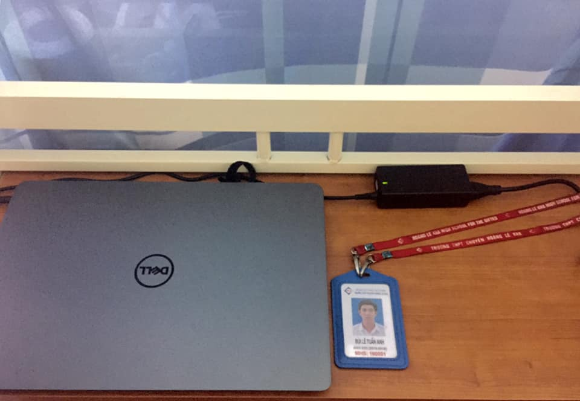

## Ngoại truyện: 🔙 XƯA VÀ NAY 🔜

🤔 Chắc là mọi người cũng sẽ thắc mắc là tại sao tôi lại lên bài vào một khung giờ đêm. Bởi lẽ đây là những bài viết cuối cùng trong chùm bài viết về ngày Nhà giáo Việt Nam 20/11. Và có lẽ sẽ không có nhiều hơn những bài viết tản mạn như thế này vào dịp này những năm sau đâu, nên tôi muốn biến nó thành những kỉ niệm, những ký ức thật sự vui vẻ trong cuộc đời mà có thể mọi người sẽ không bao giờ quên. Còn bây giờ, tôi sẽ nói về lí do chọn cái tên này cho bài viết của tôi.

🖼 Các bạn cũng nhìn thấy trên hình đó, đây là hai thứ không bao giờ thiếu mỗi buổi sáng đi học, bởi lẽ tôi là dân IT của #VNUHCM_US mà 😂. Nhưng nếu chỉ để ý cái máy tính xách tay mà không nhìn sang thứ kế bên thì chắc chắn các bạn chưa xem qua bài viết này... 😂

VÂNG, CÁI TÔI ĐANG MUỐN KỂ CHÍNH LÀ CHIẾC THẺ KIA.

🏫 Chiếc thẻ ấy gắn liền với một thứ gì đó thật đẹp cùng Hoàng chuyên, nơi mà như tôi đã từng nói ở những bài đăng hình trước đây chính là nơi viết nên thanh xuân của tôi. Bởi thế nên tôi quyết định trưng dụng nó làm thẻ sinh viên luôn, nhà nghèo nhưng muốn lưu giữ những khoảnh khắc đẹp của cấp 3 thì dùng cách này cũng không phải là lựa chọn tồi 😂

🏃 Như mọi người để ý, mỗi học sinh của Hoàng chuyên đều có một thẻ, mỗi khối có một màu sắc khác nhau, với khóa 23 chúng tôi dùng duy nhất 1 năm chính thức thì thẻ có màu xanh ngọc, một tông màu mà tôi rất thích. Mỗi ngày, chúng tôi đều phải đi điểm danh tại máy quẹt thẻ, và đó là một cuộc chạy đua để thoát khỏi nguy cơ bị trễ học, trông tương tự như cách các người chơi chạy trốn khỏi nguy cơ bị xé bảng tên trong chương trình "RUNNING MAN - CHẠY ĐI CHỜ CHI" vậy đó. Và hiển nhiên, mỗi lần tôi đứng ngoài hành lang nhìn cảnh tượng này, tôi đều phải khiếp sợ mà nép một bên để nhìn. Chắc là các bạn khóa 23 trở đi cũng hiểu cảm giác chạy thục mạng chỉ để điểm danh nó vất vả thế nào mà, đúng không??? 😂

✅ Bên cạnh đó, nó còn mang trong mình chức năng định danh bản thân nữa, cho nên lúc nào cũng phải đeo, không để thất lạc. Cũng may là chưa bao giờ tôi bị lạc thẻ lần nào cả, nhưng nhìn sang những đứa bạn bên cạnh bị lạc thẻ một cách vô lý, tự nhiên tôi thấy tội nghiệp cho họ biết bao 😂. Giờ đây nhìn lại, tôi thấy mình thật may khi giữ nguyên được thẻ tới lúc này, bởi lẽ nó chính là chìa khóa giúp tôi vào được Hoàng chuyên thăm tụi nhỏ đấy 😂

🏫 Chỉ nhiêu đó thôi cũng đủ biến chiếc thẻ nhỏ xinh kia trở nên ý nghĩa hơn với tôi rồi. Có thể khi đặt chung với một chiếc máy tính xách tay, chiếc thẻ ấy không có gì đặc biệt, nhưng nếu nhìn nó một cách kĩ lưỡng hơn, tôi nhận ra, đó là cả một gia tài của thanh xuân đã dành cho mình suốt 3 năm qua...

❤️ Sẽ thật tuyệt vời khi mấy đứa hậu bối #HLK biết đến sự trở về lần này của anh như đang mang trong mình một sứ mệnh: kết nối các thế hệ lại gần nhau hơn, và lan tỏa tình yêu thương đến tất cả những người xung quanh.

🗓 Hi vọng là mấy đứa sẽ nhanh chóng nhận ra anh vào ngày 20/11 này, chúng ta vẫn còn kèo chụp hình đó nghen 😂

Còn bây giờ, xin chào tạm biệt và hẹn gặp lại...
