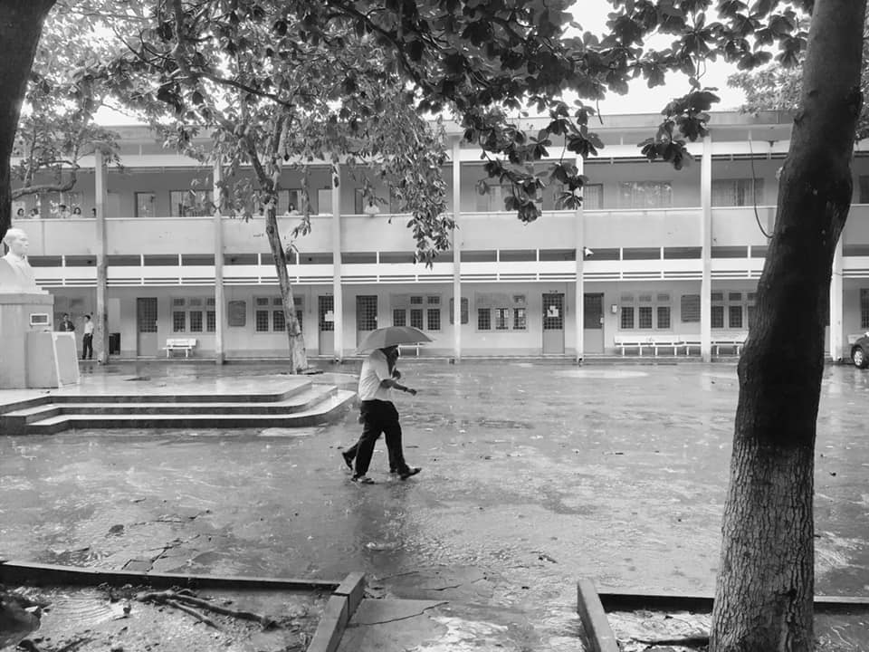

### Phần 1: Mở đầu

📆 Một chiều mưa cuối tháng Mười, tôi lục lại tấm hình này, chợt nhớ lại về một câu chuyện tình yêu tuổi học trò có thể nói là đầy hương vị của tôi để giờ đây, một buổi tối đầy sao đầu tháng Mười Một, tôi sẽ kể cho các bạn nghe...

🍃 Có người nói: Cấp 3 chính là quãng thời gian đẹp nhất của cuộc đời mỗi con người. Và điều đó hoàn toàn đúng với tôi, một chàng trai khi ấy 15 tuổi chập chững bước vào ngôi trường Hoàng chuyên. Cũng như bao người khác, tôi nuôi dưỡng một niềm đam mê mãnh liệt và lòng quyết tâm để được khoác lên mình bộ đồng phục với logo HLK thật oách và được gọi với danh xưng "dân chuyên Anh" chính hiệu, và điều đó thôi thúc tôi cố gắng không ngừng, và tôi đã thành công. Nhưng có một sự thật có lẽ mọi người chưa từng hay biết đó là...

❤️ Tôi đã từng cảm nắng một cô gái từ trước đó, và chính cô gái ấy đã thôi thúc tôi nỗ lực để làm nên thành công đó...

📝 Câu chuyện bắt đầu từ một buổi chiều nọ, tôi vẫn hằng ngày xách cái balo của mình để đến một lớp học thêm, và khi đó tôi bắt gặp một bóng hình rất thu hút, một cô gái với khuôn mặt rất dễ thương cùng mái tóc xoăn trông khá lạ mắt. Nhờ quen biết một bạn nam cùng lớp với cô gái ấy, tôi cũng biết được tên, và chúng tôi cũng có cơ hội bắt chuyện với nhau. Không biết nhờ một cơ duyên nào đó mà chúng tôi cùng thi vào Hoàng chuyên. Ngày công bố điểm thi, khi cô ấy quen biết tôi và nhìn thấy bảng kết quả với cái tên tôi ở chuyên Anh, cô ấy khá bất ngờ, phán cho tôi một câu khá gây sốc: Hồi đó tui tưởng ông thi chuyên Toán chứ !?! [Wow, hồi xưa Toán của mình cũng khá thôi, thi đầu vào cao điểm cũng có một phần nhỏ sự may mắn đã giúp đỡ thôi, vậy mà có người cũng hiểu nhầm đến buồn cười thế này, tôi cũng chả biết nói sao 😂😂😂]

🏫 Chúng tôi thường được xếp chung phòng kiểm tra. Hồi đó mỗi cuối tuần chúng tôi đều có đợt kiểm tra tập trung [và hiển nhiên lần nào kiểm tra xong cũng là "toát mồ hôi hột" 😂]. Tôi và cô ấy có một vài thói quen khá giống nhau, đó là: nhắn tin "trả bài" lẫn nhau và thường xuyên cùng nhau học bài trước giờ kiểm tra. Tôi thường xuyên vừa học vừa xoay sang nhìn cô gái ấy. Có lẽ cũng chẳng biết từ lúc nào mà tôi đã trót lỡ thích cô ấy rồi. Thế là tôi càng ngày càng siêng năng học tập, để được chỉ bài cho cô ấy và để được vươn lên những vị trí top đầu và xứng đáng với những gì mà cô gái kia - bao nhiêu lần vẫn chỉ xem tôi là bạn - muốn thấy ở tôi. Nhưng cuộc đời không như là mơ, điều tôi không mong muốn nhất cuối cùng cũng đã nhen nhóm xuất hiện, và mọi thứ mới chỉ là bắt đầu...
