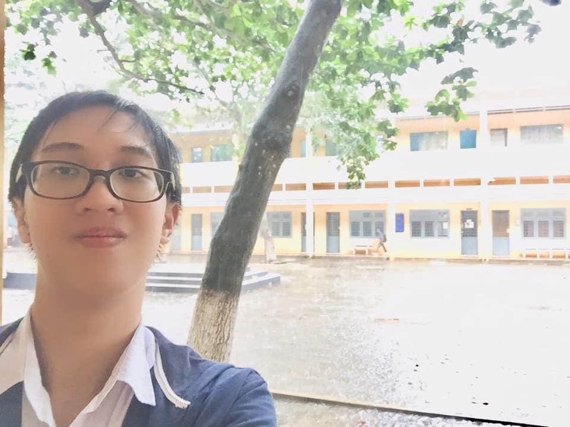

### Phần 2: Những phút giây sóng gió

📚 Sang đến năm thứ hai học ở Hoàng chuyên, một tuần nọ, khi tôi đang ngồi trong một lớp học thêm, cô bạn của crush tôi (cũng là bạn từ nhỏ của tôi) báo tin sét đánh: Crush tôi đang quen một chàng trai cùng lớp!

😲 Hey, hey, hey, có gì đó sai sai ở đây. Lòng tôi thật sự tan nát, vỡ ra từng mảnh. Tôi vẫn cứ nói chuyện, cười đùa như thường với tất cả mọi người, nhưng có lẽ hiếm ai để ý được một đôi mắt ánh lên một nét đượm buồn của tôi. Rồi tôi cũng đã thấy họ đi chung với nhau, rồi tôi cũng thấy họ nói chuyện thân mật với nhau, chụp ảnh cùng nhau nữa cơ. Tôi thật sự chịu không nổi, nhưng lại không dám nói, chỉ sợ nói ra thì có khả năng sẽ mất luôn thứ tình cảm đặc biệt với cô ấy nên tôi đã nén đau thương và tiếp tục việc học của mình, cho dù năm đó việc học của tôi có phần đã bị chểnh mảng đi đôi chút và đã không có tên trên danh sách top 5 nhưng dường như mọi chuyện trôi qua vẫn nhẹ nhàng hơn cả việc mình đang bị cướp đi người mình thầm thương mến. Tôi thấy mà tôi tức á 😔

🎵 Tôi tìm một góc nhỏ trong lớp vào ngày cuối năm học đó để nghe nhạc, để quên đi hình bóng kia, bởi khi đó tôi đinh ninh trong đầu rằng, chắc là cả hai không có duyên nên dần dần tôi cũng cho qua mọi chuyện và ưu tiên cho việc ôn luyện THPTQG. Nhưng rồi lại cũng chính vào mùa hè năm ấy, mọi thứ đảo chiều theo cái cách mà tôi không ngờ đến...

🏫 Lần ấy, tôi thi chứng chỉ nghề Tin học. Thế là may mắn tôi được xếp ngồi trước mặt crush. Tôi mất 15-20' làm bài, sau đó tôi chợt quay xuống hỏi nhẹ:

- Ủa, sắp tới sinh nhật bà rồi đúng không???
- Đúng rồi, ông tặng quà cho tôi đi!
- Cái gì? Sao bà không kêu bạn trai bà tặng cho chứ???
- Ông chưa biết chúng tôi chia tay à???

😉 Hả hả??? Lại cái gì nữa đây??? (insert khuôn mặt bất ngờ, buồn bã nhưng có phần giả tạo trong lòng của mình vào đây 😂 - vốn dĩ trước đó khoảng 1-2 tuần tôi loáng thoáng nghe tin họ kết thúc quan hệ từ bạn tôi, nhưng vẫn cứ giả vờ hỏi cho chắc 😂)

(Mọi người nghĩ tôi sẽ cho cái tâm trạng gì vào đây???)

- Thắc mắc nhỏ - tôi thấy hai người nhìn cũng đẹp đôi mà, sao mà chia tay???
- Vốn dĩ chúng tôi có sự khác biệt trong suy nghĩ, và cả hai không thể dung hòa được, nên quyết định chia tay, thế thôi...

🤨 Ơ, tôi mới vừa quên cô ấy mà, sao ông trời lại trêu tôi thế??? Thế này là thế nào??? Muốn tôi sống sao đây??? Trời ơi là trời 😐

🆕 Cuối cùng, tôi quyết định phải reset mọi thứ, bắt đầu cuộc trò chuyện với crush như hai người bạn thân. Cuộc đời thật khốn nạn mà, cứ bắt người ta khổ rồi cho người ta hi vọng lại là sao??? Không hiểu 🤔

✅ Thế đấy, mọi chuyện dở khóc dở cười mà mọi người đang đọc hoàn toàn là sự thật, không hề có chút dàn dựng nào ở đây cả, và hiển nhiên nếu ai mà rơi vào cùng hoàn cảnh như tôi cũng sẽ chẳng biết trở tay thế nào. Bởi cuộc đời là vô thường, đâu ai đoán trước được tương lai sẽ như thế nào, cho nên mình phải luôn sống hết mình với mọi thứ, rồi mình sẽ không phải hối hận vì những gì mình bỏ lỡ.

❌ Nhìn lại tôi khi đó, chắc chắn tôi sẽ phán cho một câu: ĐÂY LÀ NĂM SỐNG SAI NHẤT CỦA CUỘC ĐỜI MÌNH!!! 😂
