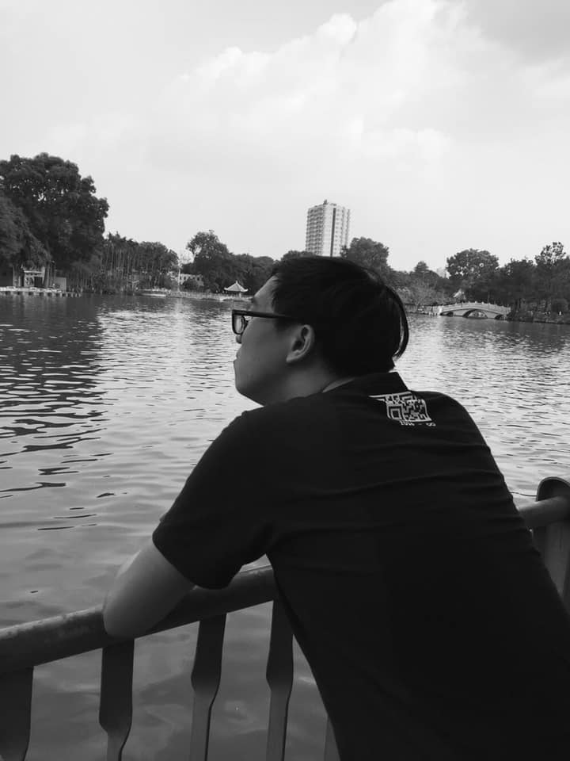

### Phần 3: Những phút giây của cảm xúc

🎆 ... Sang năm cuối cấp, mọi thứ vẫn trở nên rất yên bình với tôi và crush của tôi cho đến trước Tết Nguyên đán...

✉ ... Tôi bỗng nhận được một tin nhắn lạ từ một cô hậu bối chuyên Sinh, nhờ xử lý dịch thuật tiếng Anh. Thế là tui cũng làm, và bắt đầu tìm hiểu xem người nhờ mình là ai. Thế là hai anh em tám chuyện thật khủng khiếp đến mức tôi lần nào cũng phải sạc điện thoại trong tình trạng không thể chịu nổi khả năng thông báo giật lắc mạnh đến như vậy 😂😂😂. Rồi thì...

🎵 Hôm duyệt văn nghệ Tết, khi tôi đang xem rất kĩ lưỡng từng tiết mục thì bỗng dưng, một cậu hậu bối cùng khối chuyên cầm theo ly nước đem lại và hỏi:

- Anh là Bùi Lê Tuấn Anh (AK23) đúng không???
- Đúng rồi em. Có gì không?
- Có một người bí mật tặng cái này cho anh.
- Ơ hay, cái này là thế nào? Ai tặng chứ? - Tôi ngạc nhiên hỏi
- Anh chỉ cần biết đến hai chữ "Trả ơn" là được.
- Này...

Tôi chợt nhớ, rồi tôi chợt giật mình. Không lẽ là nó?

🍋 Tôi đem ly nước kia vào lớp. Thế là một cô bạn của tôi thấy vậy và nói:

- Nay Tuấn Anh cũng xịn xò quá ta, mua ly nước ở chỗ này luôn...
- Ơ, xin nói thật với mọi người - đây là tặng chứ không phải tôi mua.

😲 Cả lớp tôi sững sờ, và hiển nhiên tin đồn về việc "có người thương thầm" này lan tới cả crush của tôi [TRỜI Ạ 😂]. Phải mất mấy buổi, tôi mới có thể giải thích mọi chuyện cho crush mình. Khổ thật 😂

✅ Một hôm nọ, ngay khi tôi nhận được tin sẽ tổ chức #lovecfs trong #HLK_LNYCamping, cô nhóc này chủ động vào nhắn tin xin tui làm cộng tác, và hỏi rất nhiều thứ về sự kiện này cũng như tiêu chí chọn người yêu của tôi [Ơ, LẠ THẾ 😂]. Thế là tôi hoài nghi, lật ngược vấn đề và phát hiện ra một điều: cô nhóc đã cảm nắng mình. [WOW]

❌ Thế là tôi từ chối khéo, nhưng em ấy cũng chả chịu buông, thế là đã có một lá thư không-muốn-nhắc-lại trong bài "NHỮNG CÁNH THƯ XUÂN" như đã nói được gửi cho tôi. Tôi đọc và lướt qua luôn như muốn nhắc nhở bản thân mình rằng: Mình không thể phản bội cô "bạn" kia của mình được. Và cuối cùng, sau bao nhiêu lần giảng giải cho em ấy hiểu, mọi chuyện cũng kết thúc.

🔛 Nhưng câu chuyện về những cánh thư chưa dừng lại ở đó.

🎁 Trong số mấy lá thư kia, như tôi đã nói, có một lá tỏ tình. Lúc tôi mở ra, đó là một cô chuyên Văn cách mình 1 khóa. [WOW lần 2]. Thế là sáng hôm sau, tôi sử dụng hết "kĩ năng tình báo siêu cấp" của mình, và rồi...

😗 Cô gái kia vào nhắn tin, giới thiệu, làm quen. Tôi khá bất ngờ, nhưng tôi cũng lấy lại được bình tĩnh, sau đó đặt lên bàn cân để suy nghĩ và đã làm một điều mà trước giờ mình chưa từng nghĩ đến: Chấp nhận quen với cô gái này.

[VỐN DĨ CÓ 2 LÍ DO: Thứ nhất, crush tôi chưa sẵn sàng để bắt đầu một mối quan hệ mới. Thứ hai, tôi chưa có bạn gái, và cô gái kia lại chủ động tìm mình, điều kiện có phần tốt hơn một chút so với ca đầu tiên, ngại gì không thử]

🆙 Cả hai chọn bắt đầu, nhưng rồi cũng chẳng trụ được bao lâu, cô gái kia chủ động ngừng mối quan hệ giữa hai đứa, và hiển nhiên là báo cho tôi biết vụ này, nên tôi cũng thông cảm, và cả hai quay trở lại vạch xuất phát: hai anh em.

👉 Có một vài chi tiết nhỏ nhặt đáng lí tôi không muốn kể đâu, nhưng vì là phần cuối nên tôi quyết định tung hết ra luôn:

- Trong lúc đi chơi dịp Tết Nguyên đán, có một cô hậu bối chuyên Sinh cách 2 khóa (khác cô đầu tiên) chủ động xin thông tin về tôi, nhưng không may, có người đứng đằng sau vụ này, và bị tôi lật tẩy. Thế là tôi quyết định storm (ép cung) vào messenger người đứng sau, và người này (là một cô gái) phải nhận hành vi này, tôi cho qua.

- Vụ thứ hai, cũng là vụ tôi bực nhất: Một cô chuyên Tin cách tôi 2 khóa tiếp tục xuất hiện trong câu chuyện này, chủ động vào nhắn tin làm quen. Thế là hai anh em tiến nhanh đến mức quan hệ không thể ngờ, nhưng rồi sau khi gặp nhau ngày cuối năm, cô này trở mặt, không chịu gặp nữa, còn đâm ra ghét tôi ra trò. "OK, anh sẽ xem sự việc này là vết cắt trên tay thôi, giờ đây em sẽ không có cơ hội làm tổn thương anh nữa đâu nhé. Trừ khi em chịu xin lỗi anh thôi, nếu không thì hết, anh không nói gì nữa. "

🗓 Trở lại câu chuyện ngày cuối năm. Một hôm, cũng vào buổi kiểm tra, một hôm crush của tôi báo hung tin: cô sắp Bắc tiến để học. O...M...G. Tôi vừa mừng vừa tiếc, một mặt vẫn nở nụ cười tỏa nắng trên môi, mặt khác muốn níu giữ cô ấy ở lại miền Nam. Nhưng cô ấy chọn ra đi. Đã đến lúc rồi, không thể trễ nữa...

🍁 Lễ tri ân trưởng thành của Hoàng chuyên năm nay có cả phần #lastcfs nữa, thùng thư lại đặt ở ngay cạnh lớp tôi. Tôi lén lút rút vài 3 lá, viết cho bạn, cho hậu bối, và cho cả crush của tôi nữa. Thế là thư chuyển tới. Cô ấy bất ngờ.

⛔️ Ngày cuối năm, tôi nhắn tin hỏi thăm về lá thư kia, và tôi chính thức xác nhận là chủ nhân của nó. Cô ấy vẫn không tin vào những gì tôi nói, sau đó crush vẫn bình tâm lại và... TỪ CHỐI.

- VÂNG, TỪ CHỐI ĐẤY...

😔 Tôi buồn bã, nhưng đành phải gác lại nỗi buồn kia mà dồn sức ôn thi để quên đi sự thất vọng ấy, quên đi hình bóng ấy để giờ đây tôi đã sẵn sàng để bắt đầu lại mọi thứ...

🔜 Lần cuối cùng hai đứa gặp nhau là ở kì thi THPTQG 2019, và rồi từ đó đến giờ, từ Sài Gòn - TPHCM, tôi vẫn đang nỗ lực không ngừng để thành công, nhưng cũng chả biết ở ngoài kia, cô ấy đang như thế nào, hi vọng mọi thứ sẽ ổn. Thôi thì tôi cũng chỉ còn biết nói một câu: Chúc bạn luôn bình an...
