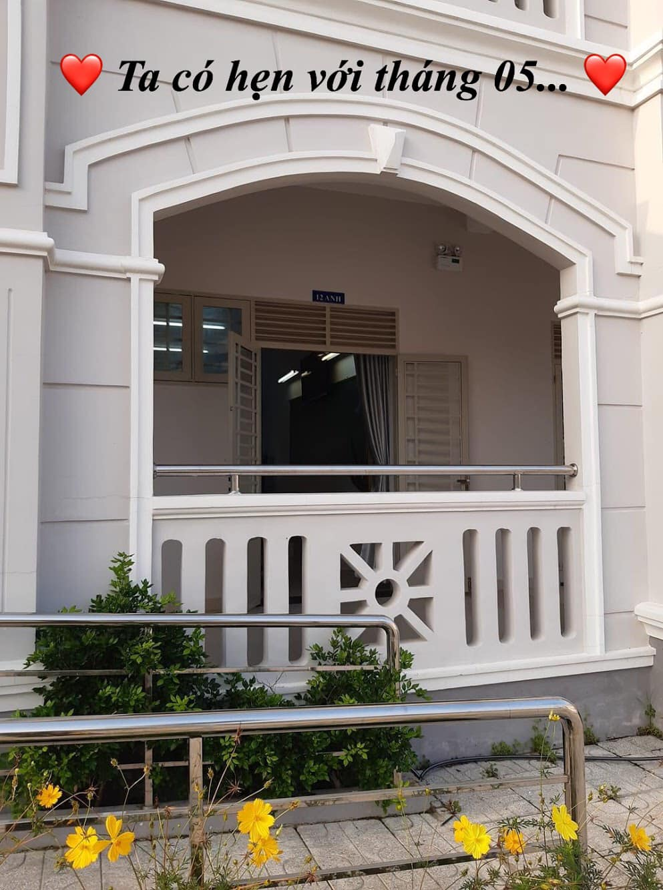

## Tháng 04 :🌲 THANH XUÂN "CÔ ĐƠN" 🌲

😞 Cô đơn - Một từ ngữ chỉ trạng thái ở một mình, không có một ai ngó qua. Có lẽ đôi lúc trong cuộc sống này, ta sẽ rơi vào trạng thái này, nhưng cũng chỉ là đôi lúc. Còn tôi, tôi ở trạng thái này suốt 3 năm ở Hoàng chuyên 🏫 . Ít bạn thân, cũng không có người yêu [ai yêu tôi đi 😂]. Nhưng một sự thật chắc nhiều người sẽ không biết: Cô đơn cũng có lúc mang đến những trải nghiệm mới cho bản thân và một cái nhìn khác biệt hơn về cuộc sống. Đó là lí do tôi rất thích đi chụp hình 📸 một mình, đặc biệt là chụp ở Hoàng chuyên với mấy đứa hậu bối dễ thương siêu cấp của tôi, cũng là một phần lí do tôi mang đến bài viết 📝 cùng bức ảnh 🖼 này.

📆 Tôi chụp nó vào ngày 18/03/2020, cũng hơn 1 tháng rồi. Vào cái ngày mà người người đều thực hiện các biện pháp phòng ngừa dịch bệnh COVID-19 😷 , tôi lại phải đi vào trường để lấy cái tấm bằng tốt nghiệp 🎓 mà tôi đã phải tốn ba năm học ròng rã cố gắng để có được nó. Và tôi đi một mình, mang theo chiếc điện thoại 📱của mình để ghi lại cái sự đổi thay mà hai tháng (chính xác hơn là hơn 1 năm qua) chưa từng nhìn thấy...

✅ Vâng, cũng nhiều thứ mới thật. Đi trong tâm thế là một cựu học sinh, ghé vào canteen thì không đông đúc lắm (không phải là so với trước dịch mà là so với 1 năm trước), chắc là khác biệt về cái không khí 🍃 rồi. Mọi thứ vẫn ở đó, nhưng người thì vắng bóng hơn nhiều. Nay cũng có cả cái bảng rổ 🏀 dựng thẳng đứng lên luôn, 1 năm trước làm gì có. À, còn nhiều thứ nữa mà chưa được gọi tên hay nhìn thấy...

🖼 Quay lại tấm hình, tại sao tôi đặt tấm hình này ở đây, chọn cái tên cho bài viết là Thanh xuân cô đơn??? Nhìn kỹ thử tấm hình này. Chính xác, một gốc cây lớn đã nằm ở đó, vâng chỉ một gốc cây xanh 🌳 trên một khoảng sân 🏟 rộng lớn lúc trước dùng cho #HLK_LNYCamping2019 🏕 ấy mà [mấy cây xung quanh không tính 😂]. Nó đứng một mình, chịu đựng biết bao sương gió 💨 hay nắng gắt 🌞 mỗi ngày, vẫn vươn cao và tạo ra một sức hút, một sức hút lôi kéo nhiều người đến ngồi tựa vào, đọc một quyển sách, nghỉ ngơi hay đơn giản chỉ là nhìn ngắm khung cảnh xung quanh. Dưới tán cây ấy, có thể có những bông hoa 🌺, được chở che và khoe sắc nhẹ nhàng, khiến lòng người đôi lúc cũng bồi hồi xao xuyến [nói cái này hơi ngôn tình hóa rồi, xin lỗi mọi người 😂]. Tuy vậy, tôi lại nhìn và cảm nhận nó theo một cách khác: cảm nhận của kẻ cô đơn.

📸 Chụp xong bức ảnh này, tôi nhớ lại những năm học ở Hoàng chuyên. Buồn vui có đủ, nhưng tôi cũng hiếm khi cười 😊, mà có cười cũng chỉ là mỉm cười một mình, mà lúc cười nhiều nhất lại là những ngày cuối khóa. Cũng lạ, bình thường ngày chia tay thường sẽ có nhiều nước mắt 💧 lắm mà, sao lại cười, ai đó lại bảo tôi điên đây mà!!! Không phải đâu, tôi mỉm cười, vì tôi muốn che giấu cái cảm xúc thật của mình đấy. Tôi cười, vì tôi tự hào rằng: mình là người Hoàng chuyên, là dân chuyên Anh, được tham gia vào nhiều những hoạt động thật ấn tượng 🏐; được quen thật nhiều những người bạn, những hậu bối dễ thương, tuyệt vời và một điều nữa là: tôi cười vì tôi biết rằng, ở Hoàng chuyên không chỉ có việc học hành 📚, mà ở đó tôi có cả những kỉ niệm đẹp 🌱, những kỉ niệm mà dù cho có trải qua bất kỳ sóng gió 🌬 nào trong cuộc đời, tôi cũng sẽ nhớ về nó, như một cách để khích lệ tinh thần cho mình: Giống như cái cây🌲 trong bức ảnh này, dù cho có phải chịu bao nhiêu nắng mưa gió bão ⛈ thì nó vẫn đứng vững ở đó, tạo nên một nơi để những bông hoa 🌸 có thể một phần nương tựa vào và khoe sắc. Phải sống làm sao để dù cho có đi đâu, làm gì cũng đừng quên cội nguồn, cũng đừng quên rằng những thế hệ sau này của chính chúng ta sẽ dõi theo và học hỏi để trưởng thành hơn.

🍂 Năm học này chắc cũng còn hơi lâu mới kết thúc. Nhưng cũng sớm thôi, khóa 24, khóa sau của tôi cũng sẽ "cất cánh" khỏi Hoàng chuyên 🏫 và bắt đầu một cuộc sống hoàn toàn mới, nhiều vất vả, lo toan hơn. Nhưng chỉ xin mấy đứa nhớ một vài điều, một vài điều cuối cùng mà anh muốn viết ở đây thôi 🔑: Đừng quên chúng ta là ai. Luôn tự hào về chính mình, nhưng vẫn tôn trọng người khác. Và quan trọng nhất: sống thật tử tế với cuộc đời này. Bởi chắc chắn chúng ta sẽ không có cơ hội thứ hai để sống lại một cuộc đời tử tế nữa đâu, hãy khắc ghi điều này, không đùa đâu...

## ⏰ TA CÓ HẸN VỚI THÁNG 05 🌧

🎵"Hẹn nhau giữa tháng Năm, khi trời đang nắng hóa cơn mưa đầu mùa..." 🎶

🌺 Vốn dĩ tháng 05 mọi năm là mùa của hoa phượng, của những tiếng ve, của những cơn mưa đầu mùa và là mùa chia tay tuổi học trò. Ấy vậy mà năm nay, có vẻ mọi thứ sẽ rất khác. Dịch bệnh 😷 kéo dài, nói là tệ nhưng thực ra lại giúp các bạn học sinh, đặc biệt là lớp 12 🎓 có thêm thời gian để ở bên nhau. Nghe vậy, tôi lại thấy tiếc cho K23 chúng tôi cũng như các khóa trước, những người đã không còn mang trên mình cái danh là "Học sinh Hoàng chuyên" nữa mà là "Cựu học sinh Hoàng chuyên"... 🏫

📝 Một chữ Cựu, bao ý nghĩa chất chứa. Một chữ Cựu, bao nỗi niềm lưu luyến. Một chữ Cựu, bao câu chuyện vui buồn. Và một chữ Cựu, bao kỉ niệm thanh xuân 🍀. Nói tới đây, có lẽ mọi người sẽ thắc mắc về cái tựa đề của bài viết hôm nay. Tôi sẽ giải thích cho mọi người đây.

📆 Hôm nay là tròn 0️⃣1️⃣ năm kể từ cái ngày mà tôi đã cất bước ra đi để tiếp tục cuộc hành trình viễn chinh của riêng mình. Một năm qua, tôi có được gì: thành công ✅, thất bại ❌, và trải nghiệm 📖. Chỉ có nhiêu đó.

🆕 Tôi sẽ không đi kể lể dài dòng quá để làm gì. Tôi chỉ muốn nói với mọi người, đặc biệt là #HLK_K24 một điều này: Thời gian không chờ đợi một ai. Trân trọng những khoảnh khắc 📸, những phút giây 🕰 còn được bên nhau có lẽ sẽ là những điều tốt nhất mà các bạn có thể làm trong thời gian này. Nhanh lắm 🏃‍♂️, cho nên đừng tự biến mình thành một kẻ chậm chạp quá độ nhé mấy đứa...

📅 Một năm, nói ngắn cũng không ngắn nhưng nói dài cũng không dài. Có lẽ tôi sẽ dùng từ đủ. Đủ để ta chứng kiến được những sự thay đổi ☑️. Đủ để ta có được những bài học đắt giá 🌱. Đủ để ta hoài niệm về quá khứ, tự tin ở hiện tại và hướng nhanh về tương lai. Để những ngày cuối tháng Năm hằng năm, ta lại ngồi một mình ở một góc phòng hoặc góc phố, nhâm nhi một tách cà phê ☕ , trầm ngâm nhớ lại cái hẹn mà ta đã từng gửi trao cho nhau những ngày cuối cùng trong đời học sinh và cùng nhau phấn đấu, nỗ lực không ngừng để có thể một ngày nào đó, cùng trở về gặp mặt với tư cách của những người thành công từng xuất thân từ Hoàng chuyên, từ căn phòng của #HLK_AK23 này - "căn phòng của những người thành công"... 🏡
