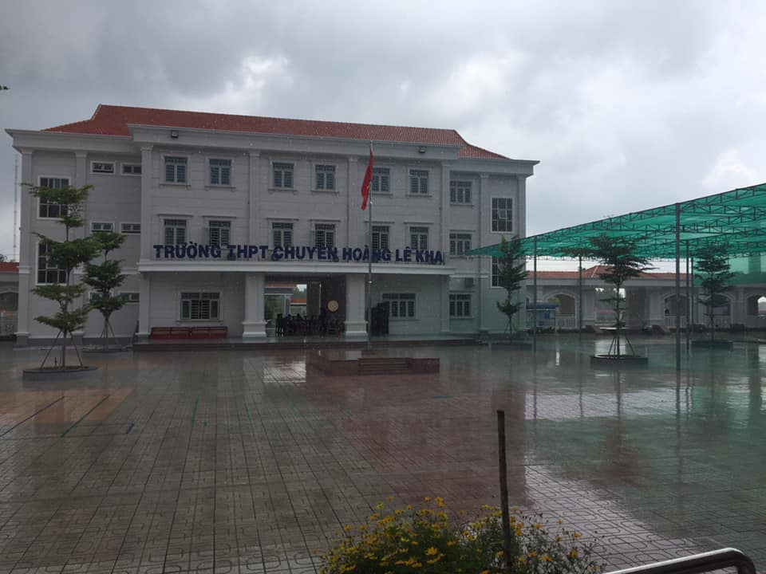
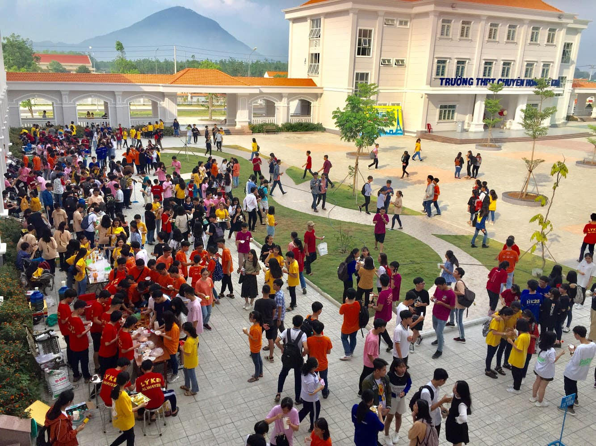
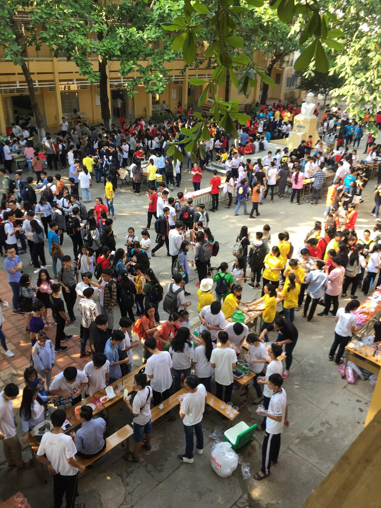

## Tháng 2: 🌧 HOÀNG CHUYÊN NHỮNG NGÀY MƯA 🌧

🌞 Ở cái xứ Tây Ninh đầy nắng và gió như thế này, chỉ cần một cơn mưa xuất hiện, chắc chắn mọi người đều sẽ cảm thấy bất ngờ. Mỗi cơn mưa như mang trong mình một sứ mệnh, đó là làm dịu đi tâm trạng của tất cả những người chứng kiến. Đối với tôi cũng vậy, nhưng nó chỉ đúng khi nó đến ở Hoàng chuyên...

🏫 3 năm - 2 cơ sở - 1 con người. Có lẽ ông trời đã cho tôi được chứng kiến nhiều cơn mưa ngang qua hơn so với các bạn trong lớp, mà hầu hết là ngắm một mình. Điều đó tạo nên thật nhiều xúc cảm cho chính bản thân mình - một con người sống nội tâm. Nó mang đến những khoảng lặng - những khoảng dừng cần thiết cả về thời gian và không gian để tôi có thể trở nên thật tĩnh tâm, ngẫm lại về những ngày tháng đã qua, những việc mình đã làm, xem xét kỹ lưỡng những quyết định của mình. Những cơn mưa như chứa đựng những lời nhắn nhủ về tương lai với chính tôi - một học sinh chuyên Anh lúc bấy giờ, và đó thật sự là những điều tôi ấn tượng về Hoàng chuyên một lần và mãi mãi - không phải về những ngày nắng, mà là những ngày mưa...

🎋 Mưa ở mỗi cơ sở mỗi khác, nhưng tựu chung một nỗi buồn da diết. Có thể sẽ có nhiều người thích ngắm mưa giống tôi, cũng có tâm trạng như tôi, nhưng chưa chắc họ cũng sẽ có nhiều cảm xúc như cách tôi viết ở đây. Tôi nghĩ vậy...

🖼 Chắc một số người khi lướt qua trang Facebook cá nhân của tôi đều nhớ đến bức ảnh chụp trong #Chạm1619 - Lễ Tri ân Trưởng thành dành cho khóa 23. Lúc đó tôi viết dòng chú thích ảnh chỉ trong 1 buổi sáng. Bây giờ tôi sẽ nói cho mọi người tại sao:

💦 Hôm lễ đó có một cơn mưa. Cơn mưa ấy kéo dài suốt hơn 1 tiếng đồng hồ. Lần đầu tiên và chưa từng có tiền lệ - mưa vào lễ tri ân trưởng thành, cũng là lễ chia tay tuổi học trò. Lúc đó cũng vẫn là tôi, đứng ngắm một mình ở một góc, ngoảnh nhìn sân trường một hồi lâu. Tôi chợt nhớ về ngày đầu mình bước vào Hoàng chuyên, rồi quay trở lại thực tại, cố gắng để trở nên mạnh mẽ hơn - ngăn dòng nước mắt có khả năng lăn dài trên khuôn mặt, làm hỏng cái vẻ ngoài thật đẹp trai của mình trong một buổi lễ vô cùng đặc biệt quan trọng của cuộc đời. Từ thời điểm đó trở đi, mình đã không còn là một học sinh chính thức của Hoàng chuyên, không còn ngày nào cũng gặp mặt đông đủ các thành viên của #HLK_AK23. Có lẽ lúc đó ông trời cũng khóc rất nhiều nên lúc đó mưa to hơn và lâu hơn so với những ngày mưa bình thường. Chắc là vậy...

## 🍰 THÁNG 3 VÀ NHỮNG NIỀM VUI CÒN DANG DỞ... 🍧

🤔 Chắc ai cũng tự hỏi, "niềm vui dang dở" trong cái tựa đề kia nghĩa là gì. Vâng, trong cái tình cảnh dịch bệnh khiến cho sự kiện đáng lí diễn ra vào ngày cuối tuần này lại không được tổ chức theo kế hoạch 🗓 , tôi xin được kể cho mọi người nghe một câu chuyện 📚 về nó, để cho mọi người có chút cảm nhận riêng.

🍊 #HLK_FoodFes chính là cái tên mà tôi dùng để miêu tả về sự kiện này. Nó diễn ra sau Tết 🎆 , chắc chắn rồi, thường là vào tháng 03 (cho nên tôi thường gọi nó là sự kiện "vỗ béo hậu Tết" 😂). Nhìn cái tên mĩ miều kia, ít ai ngờ được mọi thứ trông thật đơn giản. Nói một cách chính xác hơn, nó giống như kiểu thi MasterChef - Vua đầu bếp kết hợp với kinh doanh theo hình thức của mấy cái food court 🏢 tôi đã đi ở Singapore 🇸🇬 vào tháng 08 năm trước. [Vâng, mọi người không đọc nhầm đâu. Ở Singapore, người ta ngày nào cũng xếp hàng chờ mua đồ ăn mang về dùng đó 😂].

✅ Nhưng FoodFes có một điểm khác biệt mà tôi xin gọi đây là một cuộc chiến khốc liệt theo đúng nghĩa đen: Cuộc chiến về vé 🎟. Đúng với phương châm "Nhanh tay thì còn, chậm tay thì hết", hầu hết các bạn sẽ rơi vào hoàn cảnh "tranh giành đã đời, chi tiền đã đời, rồi cuối cùng lại không dùng được vì dạ dày không chịu nổi". Đồ ăn, đồ uống cái gì cũng khá ổn về mặt thị giác (và một số cả về mặt khẩu vị), vì thế 3 năm cấp 3 tôi luôn có một tôn chỉ: Không bao giờ "vung tay quá trán" 💵 với vé ẩm thực 🎫 . Điều đó phát huy hiệu quả vô cùng, bởi lần nào chọn món, tôi đều chọn trúng hàng tốt. ⛺ Ngoài ra, đi FoodFes là đi tận hưởng cuộc sống, cho nên tôi đi ăn đi uống lần nào cũng phải từ tốn, không thể quá tham ăn, mất hết hình tượng "cao kều, khá ổn về nhan sắc" của mình được. Do đó, hết sức khuyến cáo: dù bạn ăn ở đâu, ăn cái gì cũng không quan trọng, quan trọng là đừng vứt liêm sỉ của mình ở nhà 🏡 luôn là được 😂.

📝 Vậy rốt cuộc, "Niềm vui dang dở" là thế nào??? Thực ra tôi muốn nói đến các bạn năm cuối cấp 3. Bởi lẽ, sau sự kiện này, họ chỉ còn 🌼 "Lễ tri ân - Trưởng thành" 🌸, và từ đó, họ sẽ có thể không còn tụ hội đông đủ, vui vẻ như ngày trước nữa rồi. Đó chẳng phải gọi là "niềm vui dang dở" hay sao?

🌺 Thời gian luôn là như vậy, trôi nhanh đến kinh khủng. Ấy vậy mà năm nay FoodFes có khả năng sẽ hoãn, hoặc thậm chí là hủy ❌. Nếu điều ở vế sau xảy ra, đó sẽ là một tổn thất vô cùng lớn, bởi nói thẳng ra, sự kiện nào diễn ra sau cùng cũng đều hướng đến một mục tiêu duy nhất là: "Gắn kết các thế hệ lại gần nhau hơn và lan tỏa những giá trị truyền thống". 🏫 Các bạn năm lớp 10, 11 có thể sẽ chưa hiểu đâu, nhưng nếu các bạn là học sinh cuối cấp, cảm nhận sẽ rất khác. Trống vắng 😕 có thể là từ diễn tả chính xác cảm giác đó. "Cuộc vui nào cũng sẽ có lúc tàn, và chẳng bao giờ ta có thể gặp lại nhau đông đủ". 🧠 Lưu giữ kí ức, trân trọng khoảng thời gian quý báu còn lại, đó có thể chính là cách mà các bạn có thể làm vào lúc này để phần nào khỏa lấp cái cảm giác "Trống vắng" mà tôi đã nói ở trên kia.

📆 Rồi sẽ là những bài kiểm tra 1 tiết cuối cùng, bài thi cuối cùng, ngày quẹt thẻ cuối cùng. Rồi trên bảng thông báo của các lớp cũng sẽ có những dòng chữ tuy lạ mà quen, những dòng chữ mà tôi đã từng viết hằng ngày ở #HLK_AK23: "Thi THPTQG còn a ngày, Lễ TATT còn b ngày, Bế khóa còn c ngày". Năm nay có vẻ sẽ khác, con số các bạn viết thay cho a, b, c kia sẽ lớn hơn tôi một chút. Nhưng dần dần mọi thứ cũng sẽ return [trả về] 0️⃣ nhanh lắm, tin tôi đi, tôi không đùa đâu... 😐

🖼 Bây giờ tôi sẽ đặt hai tấm hình tự chụp ở đây cho các bạn chiêm ngưỡng và cảm nhận. Hy vọng mọi thứ sẽ trở lại bình thường, sự kiện vẫn sẽ diễn ra (có thể muộn hơn), dịch bệnh cũng sẽ sớm qua đi, trả lại những gì gọi là thanh xuân cho tất cả các bạn. Cũng đừng quên bảo vệ bản thân mình thông qua việc rửa tay 🤲 sạch sẽ, đeo khẩu trang 😷 đúng cách, đúng lúc, đúng chỗ và cùng nhau cầu mong cho tương lai tốt đẹp hơn nhé.
