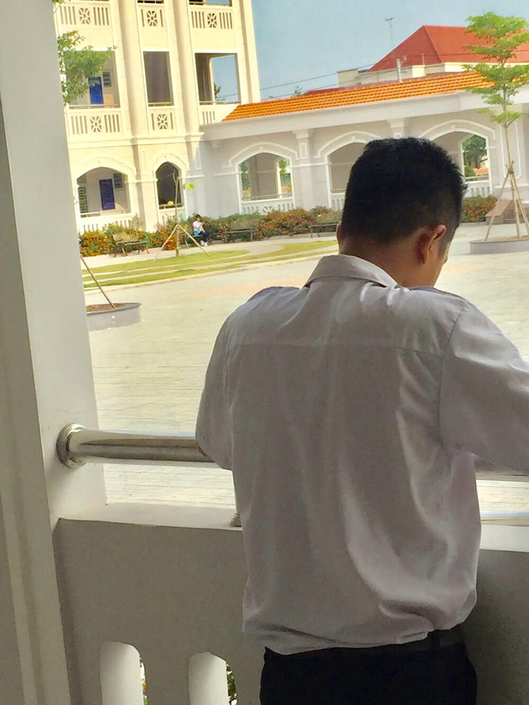
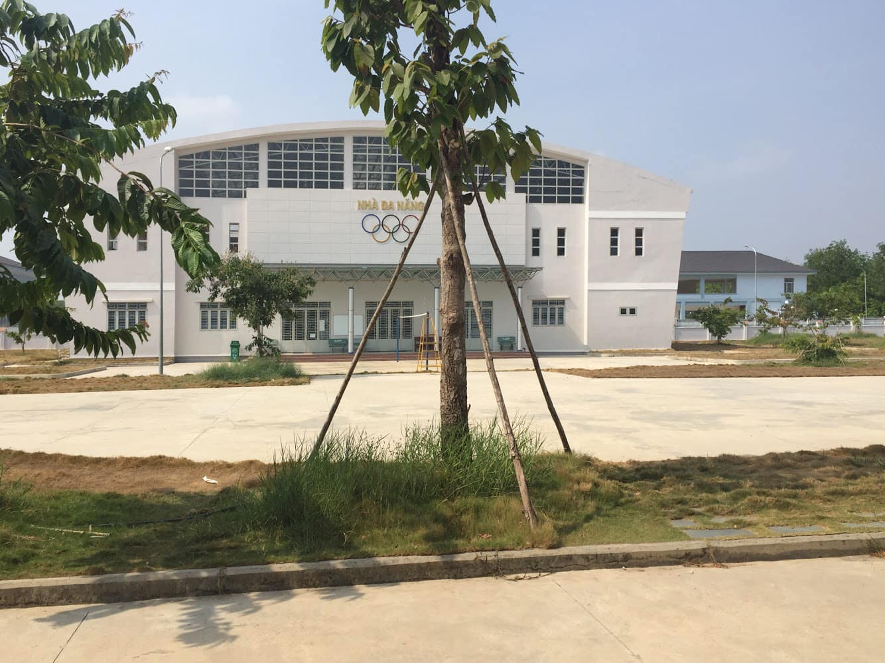

## Tháng 6: 🌿 THANH XUÂN 2020 💐

📅 Đã bao lâu rồi bạn không ngồi một mình, tĩnh tâm suy nghĩ về những câu chuyện về quá khứ??? 01 ngày, 01 tháng hay lâu hơn???...

📝 Hôm nay tôi sẽ mở đầu bài viết của tháng 06 đầy nắng này bằng từ khoá "THANH XUÂN 2020" và câu hỏi gợi mở kia...

🎯 Định là viết nhiều lắm đó chứ, nhưng mà cảm xúc của mình chỉ cho phép viết theo kiểu ngắt theo từng dòng đầy "quái dị" như thế này mới đau. Thôi, chúng ta bắt đầu...

✅ Ba năm cấp 03 để lại cho bạn những kỉ niệm gì???

🗣 Phải chăng là những giây phút được ngồi tám chuyện, ăn uống cùng bạn bè???

📚 Hay là những khoảnh khắc "vã mồ hôi" để vượt qua những bài kiểm tra, những bài thi căng thẳng???

👁 Hay là những lúc ngoảnh nhìn sân trường ngày có nắng, ta lại bắt gặp bóng hình thân thương của "người ấy" ???

💺 Hay đơn giản chỉ là những ngày bạn chỉ muốn ngồi một mình ở một băng ghế ngay góc hành lang dãy phòng học, nhìn ngắm khoảng sân rộng lớn như hoà cùng một nền trời xanh ngắt không một gợn mây ở trước mặt???...

🏫 Dù bạn là ai, dù bạn ở đâu, một khi đã là người của Hoàng chuyên, tôi luôn khuyên các bạn nên thử trải nghiệm cảm giác "cô đơn có thời hạn" để thử hết những điều mà tôi liệt kê ☑️ ở trên (và hơn thế nữa) càng sớm càng tốt. Bởi, một khi các bạn rời xa ngôi trường này, rất có thể các bạn sẽ có rất ít (hoặc thậm chí là không có cơ hội) để thử một lần chiêm ngưỡng hết những nét đẹp mà chỉ ngôi trường này mới có.

🍂 Đó không chỉ là những vẻ đẹp về mặt hình thức mà còn là những kỉ niệm, những năm tháng mà đến khi các bạn bước sang thời điểm học Đại học 🏢, thời điểm mà những nỗi lo cơm 🍚 áo gạo tiền 💵 hằng ngày bủa vây các bạn, sẽ không còn thời gian 🕰 cũng như tâm trí để hồi tưởng lại đâu.

❌ Còn có một điều tôi nói thế này: Nếu như trong đầu bạn đang có suy nghĩ rằng: "Oh, chỗ này không có cái gì để mà nhớ nhung đâu" thì tôi xin thưa với các bạn điều này: Nếu có một ngày con cháu của các bạn trở thành những "hậu bối chính tông chính gốc" 🍀 của Hoàng chuyên, bạn sẽ kể gì cho tụi nó nghe về ngôi trường mình đã từng theo học vào hàng chục năm trở về trước??? 🤔 Chẳng lẽ lại đi kể những điều tồi tệ??? Cũng ít người dám cả gan làm chuyện đó lắm, làm nhục chí tụi nhỏ lại không nên 😅

😘 Cuối cùng, ngay bây giờ, trước khi kết thúc bài viết siêu "quái dị" này, tôi sẽ dùng những câu văn này để gửi những lời chúc thành công và may mắn đến mấy đứa #HLK_K25 và #HLK_K26 đang chuẩn bị sấp mặt với môn Ngữ văn và (hình như) 1-2 môn gì nữa đó (già rồi nên không nhớ 😂)

🎓 Cũng chúc #HLK_K24 sẽ có những giây phút cuối cùng thật trọn vẹn cùng Hoàng chuyên mà không phải lo nghĩ đến chuyện viết lại hồ sơ nhé 📄 😂

## Tháng 7 - 🍃 ƯỚC HẸN MÙA THU 🍁

🕚 Bây giờ là 23:00 ngày Thứ ba, 07/07/2020, cũng khá muộn rồi nhỉ??? Chắc là các bạn khóa 2017-20 cũng khá là mệt mỏi sau nửa ngày đầy cảm xúc cùng Lễ Tri ân Trưởng thành của Hoàng chuyên. Cho nên tôi sẽ đăng bài vào nửa đêm cho bất ngờ, hy vọng là có nhiều người đọc... 😂

🎉 Đã bao lâu rồi các bạn mới được cảm nhận lại không khí của những ngày như thế này??? Không deadlines, không có những đêm dài lắm mộng với những bài tập dài đằng đẳng và cũng không có nhiều cảm xúc như bây giờ...

🏫 Tôi dám cam đoan với các bạn luôn, ít nhất sẽ có khoảng 1/3 số người thuộc khóa 24 đã đọc bài viết này muốn rời khỏi trường càng nhanh càng tốt. Nhưng tôi nghĩ, có nhiều hơn một nửa trong số đó chỉ muốn thoát đi, bởi lẽ họ không muốn lại phải rơi nước mắt vì những kỉ niệm. Vì ở Hoàng chuyên, những kỉ niệm ấy thật tuyệt vời...

📚 Chỉ có ở cấp 3, ở "mái nhà" 368 Trường Chinh và cả "mái nhà cũ" 23 Võ Thị Sáu, chúng ta mới lại được sống trong những năm tháng đẹp nhất của tuổi trẻ, của thanh xuân. Ở nơi ấy, chúng ta không phải quá lo lắng về chuyện cơm áo gạo tiền 💵 . Ở nơi ấy, chúng ta được cháy hết mình trên sân khấu 🎭 những ngày xuân về hay được bay thỏa thích lên thật cao, ra thật xa cùng những đường bóng 🏐 ⚽ , đường cầu 🏸 đầy uy lực trên các sân thi đấu. Ở nơi ấy, chúng ta được ngồi ăn uống thật thỏa thích bên trong canteen, cùng trò chuyện 💬 hoặc hóng drama với đám bạn trong lớp. Hay đơn giản, ở nơi ấy chúng ta có thể có những giây phút được nhắm mắt lại, tựa vào gốc cây xanh🎍và cảm nhận những thanh âm quen thuộc nơi góc phòng học 🎶 hoặc lại hé mở mắt ra, ngoảnh nhìn xuống khoảng sân thật rộng và đẹp kia rồi chờ đợi cái khoảnh khắc mà "người thương thầm trong lòng" (ký hiệu là crush) ❤ đi ngang qua. Tất cả những điều ấy đã rời xa với tôi, nó cũng đang rời xa khóa 24 và hơn hết là sẽ dần rời xa tất cả những khóa sau này...

🎓 "Đi thật xa để trở về", có lẽ câu hát của Soobin Hoàng Sơn đang trở nên rất đúng với dòng tâm trạng này. Liệu sẽ có bao nhiêu người còn nhớ đến ngôi trường ấy, ngôi trường gắn với rất nhiều tiếng cười 😊 và không ít những giọt nước mắt 😢, mà dù đi xa cũng sẽ trở về, để cùng ngồi lại bên nhau, kể cho nhau nghe về những câu chuyện của thời thanh niên sôi nổi??? Hy vọng nhỏ nhoi của tôi chắc là: càng nhiều càng tốt nhể...

🍂 Gặp nhau là để chia ly, xa nhau là để nhớ nhau cả đời. Có lẽ đây chính là bài học mà cuộc sống này dạy cho chúng ta. Rồi những cuộc vui cũng sẽ có lúc tàn, và chẳng bao giờ ta gặp lại được nhau. 🌿Khoảng thời gian này, tôi sẽ để cho mọi người lắng lại một chút. Để chiêm nghiệm, để suy ngẫm về quá khứ 🔙, để trở nên mạnh mẽ hơn ở hiện tại 🔛và để tự tin hơn hướng đến một tương lai 🔜 tốt đẹp hơn. Chúc tất cả các bạn của #HLK_K24 sẽ có thật nhiều sức khỏe và thành công hơn trong con đường mình đã chọn. 🍀 Chúc các bạn "vượt vũ môn" thắng lợi và xin hẹn một ngày không xa, cả tôi và (có thể là không phải tất cả) các bạn sẽ lại một lần cùng trở về, để cùng tôi nhìn lại xem, liệu những điều tôi đã viết ở trên có đúng hay không sau khi vào Đại học 🏢 nhé...

Sài Gòn, 07/07/2020, vừa viết vừa ngắm nhìn những ánh đèn điện nơi những tòa nhà chọc trời rực sáng chốn nội thành...

🖼 Ảnh chụp lỗi nhưng có kỉ niệm nên để lại đăng 😂
