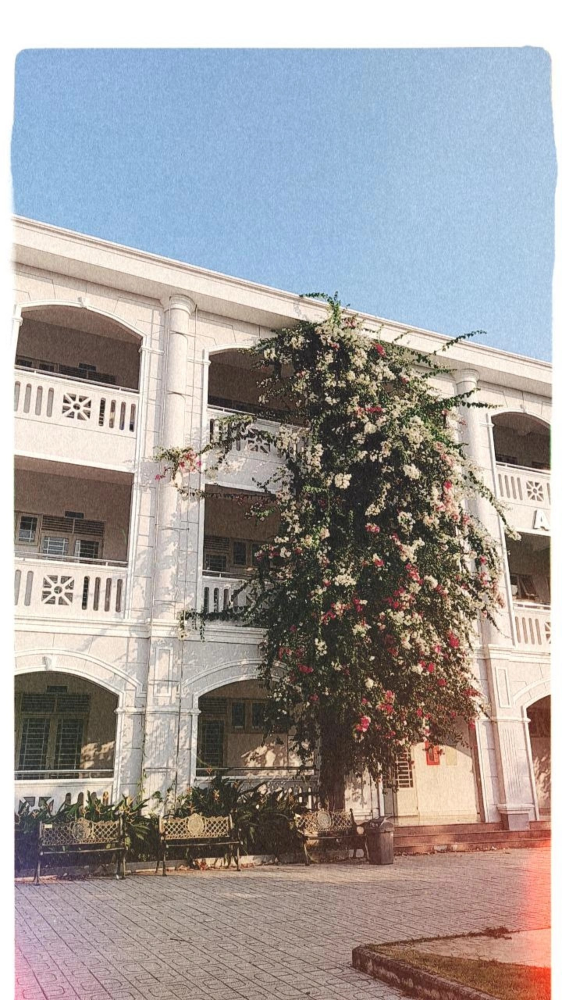

## Kỳ 1: 🏫 NGÀY CHÚNG TA GẶP NHAU

_Nguồn: Khuyết danh - VK27_

Để tôi kể quý vị nghe một câu chuyện...

### Chuyện 3 năm trước...

_Hoàng chuyên đối với tôi - một chàng trai chuyên Anh nhưng đam mê Công nghệ thông tin, là một Hoàng chuyên mang đậm dấu ấn thời gian, sự chuyển giao và những khoảnh khắc đi cùng năm tháng..._

_Trải qua suốt 2 năm cả thế giới hứng chịu những ảnh hưởng nặng nề bởi dịch bệnh COVID-19, mọi thứ dần dần thay đổi. Cùng với guồng quay của công việc và học tập, tôi cũng có ít thời gian hơn để ghé thăm trường. Tôi cũng thường xuyên ghé qua Facebook để ngắm Hoàng chuyên bây giờ thông qua những hình ảnh được chia sẻ bởi những thế hệ tiếp theo._

_Và rồi, tôi cũng dần dần cảm nhận được một điều: **Hoàng chuyên cũng đã thật sự thay đổi**. Thay đổi một cách quá nhanh, nhanh đến mức tôi không còn nhận ra nơi mà ngày xưa đã từng là một phần thanh xuân của mình. Tôi chợt lặng đi và rồi nước mắt lại lăn dài... Cũng may mắn cho tôi, khi trong 3 năm xa **"thanh xuân"** đó, tôi làm quen được với một đứa em dưới mình tận 3 khóa - đủ nhỏ để có thể gọi mình bằng chú (tại tôi có đứa cháu cũng cỡ tuổi đó) nhưng lại đủ lớn để có thể gọi mình bằng anh._

_***"Ủa rồi người ta gọi cậu bằng CHÚ hay ANH?"*** - **"Thế gọi bằng "ANH CHÚ" có được không???"**_ 😂

_Nói chứ, đứa em thân thiết này của tôi cũng có rất nhiều kỷ niệm về Hoàng chuyên trong suốt 3 năm qua, và bạn ấy đang rất sẵn sàng để viết tiếp những dòng tâm sự của mình về **"thanh xuân"** của mình. Nên thôi, tôi sẽ **"xuyên không thời gian"** để quay về thời điểm hiện tại, và giao lại quyển Hồi ký này cho đứa em viết tiếp. Sẽ có rất nhiều bất ngờ dành tặng quý độc giả, hãy đọc tiếp phần dưới nhé._

### Chuyện 3 năm sau...

_Bạn của tôi ơi, chẳng biết bạn còn nhớ không?_

_Về ngày đầu tiên của chúng ta…_

_Mùa hạ năm ấy, dưới ánh nắng gắt đổ lửa vẫn có những bông hoa rực rỡ và tươi xinh nhất ở tuổi mười lăm. Ngày biết được danh sách trúng tuyển chính thức, trên mỗi gương mặt trẻ thơ đều ánh lên nụ cười hân hoan vui mừng, hoặc là những giọt nước mắt xúc động lăn dài._

_Mối nhân duyên giữa bạn và tôi, giữa chúng ta - những con người cùng chung một mái nhà Hoàng chuyên - chính thức nảy nở kể từ ngày đầu tiên đặt chân đến với cuộc sống của một học sinh cấp Ba._ 🙌

_Chẳng biết trước ngày nhận lớp bạn có cùng cảm giác với tôi không? Vẻ hồi hộp xen lẫn niềm háo hức, nôn nao, không biết những chiến hữu ba năm sắp tới của mình là ai nhỉ…_ 😳

_Ngày ấy, chúng ta như đàn nai con bỡ ngỡ trước khuôn viên rộng lớn và tráng lệ của ngôi trường, trước không gian khoáng đãng của phòng học, trước những gương mặt lạ lẫm mới mẻ. Giây phút đầu tiên là những con người xa lạ, nhưng chỉ ít phút sau chúng ta liền được đưa vào danh sách bạn bè của nhau. Những câu chào hỏi làm quen, những câu chuyện đời thường nho nhỏ đã gắn kết chúng ta lại dễ dàng như thế đấy. Có lẽ một cuộc sống không vướng bận, không chất chồng gánh nặng đã nới rộng thời gian để những đứa trẻ được xích lại gần nhau hơn, gắn bó với nhau hơn…_

_Tôi đến với **Nguồn 1 Khóa 26** như một cái duyên rất lớn, một cái duyên thật khó thể bắt gặp lại lần thứ hai. Cho đến hiện tại, chưa bao giờ tôi cảm thấy hối hận vì mối nhân duyên này. Ngày đầu tiên đến trường, tôi giương đôi mắt ngơ ngác vừa đi tìm lớp học của mình, vừa ngắm nhìn dáng vẻ diễm lệ của mái trường. Phải rồi, Hoàng chuyên lộng lẫy như thế kia mà! Nhưng điểm thu hút tôi nhiều hơn là về con người ở **Hoàng Lê Kha**. Tôi tò mò về danh tính của những cái tên ưu tú trên danh sách lớp hơn nhiều. Quen thuộc có, lạ lẫm có, và điểm chung của chúng ta là những đứa trẻ có thực lực nổi trội, một chút may mắn cùng với hoài bão lớn lao. Nhớ mặt quen tên hết thảy bốn mươi bốn con người trong lớp ngay trong buổi đầu tiên thì chắc chắn chưa thể rồi nhỉ? Một buổi, hai buổi, ba buổi, nhiều buổi học trôi qua,... dần dà mỗi cái tên đã in hằn trong trí nhớ của tôi._

_Người đầu tiên dìu dắt lớp chúng tôi là **thầy Hiếu** - giáo viên bộ môn Thể dục của trường. Bề ngoài trông thầy thật nghiêm nghị, nhưng sâu thẳm bên trong là một người thầy, một người cha thứ hai ấm áp và luôn ân cần quan tâm học trò của mình. Thật tiếc rằng thầy chỉ đồng hành cùng chúng tôi trong một năm học mà thôi. Buổi sinh hoạt đầu tiên với thầy trôi qua một cách nhẹ nhàng, thuận lợi, đồng thời tăng thêm sự tin tưởng ở tôi dành cho người thầy chủ nhiệm ấy._

_Kỷ niệm ngày đầu ở Hoàng chuyên của tôi không quá nổi bật, nhưng nó thấm đẫm chuỗi cảm xúc non nớt, trong trẻo như một tờ giấy trắng của một đứa trẻ mới mười lăm._

_Vậy còn cảm nhận của bạn như thế nào nhỉ? Cùng ngồi xuống đây và kể tôi nghe nhé…_ 😊
