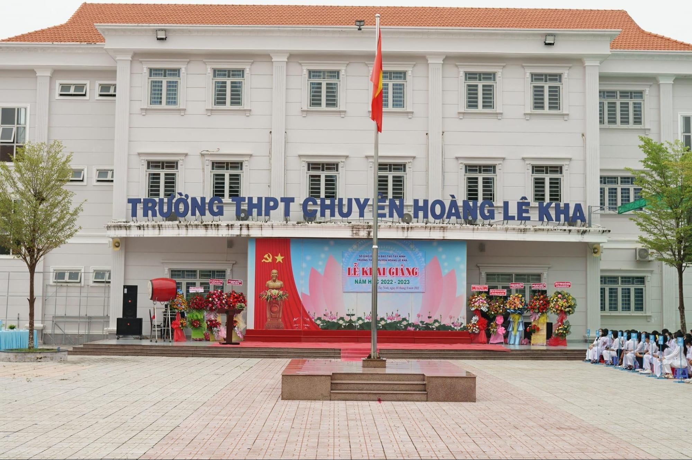

## Kỳ 2: 🌻 MÙA KHAI GIẢNG BỪNG NỞ

_Này, bạn của tôi ơi…_

_Chẳng biết sáng hôm ấy, bạn có chợt giật mình thức giấc vì hôm nay là ngày khai giảng giống tôi không?_

> **_Nguồn: Thầy Ngô Trường Chinh - Giáo viên_**

_Tôi lại nhớ đến dòng văn đầy xúc cảm của nhà văn Thanh Tịnh mỗi mùa khai giảng về:_

> **Hằng năm cứ vào cuối thu, lá ngoài đường rụng nhiều và trên không có những đám mây bàng bạc, lòng tôi lại nao nức những kỷ niệm mênh mang của buổi tựu trường…**
>
> **_"Tôi đi học" - Thanh Tịnh_**

_Có lẽ bất cứ ai trong tất cả chúng ta cũng cùng chung mạch cảm xúc giống như Thanh Tịnh khi dòng kí ức về một thời áo trắng lại mon men ùa về. Và bao giờ cũng thế, mùa khai giảng luôn có sức lay động mạnh mẽ, chạm đến cả những trái tim sắt thép nhất…_

_Năm nay, tôi vẫn được dự lễ khai giảng… nhưng với cương vị là một vị khách quen mặt, không còn với cương vị là một học sinh nữa rồi. Tôi đã chính thức từ giã một thời áo trắng ngây ngô để tiếp tục chắp cánh cho hoài bão, cho dự định của bản thân. Lặng lẽ ngắm nhìn các em nhỏ "**check-in**", lưu lại vô số kỷ niệm lung linh dưới mái trường, lòng tôi lại bồi hồi mãi chẳng nguôi ngoai. Đôi mắt tôi đã ngấn lệ tự bao giờ, tôi cũng chẳng buồn lau đi._

_Mùa khai giảng của khóa chúng tôi đã từng là mùa khai giảng đặc biệt nhất trong lịch sử. Vậy nó "**đặc biệt**" như thế nào? Chúng tôi đã từng ngậm ngùi chào tạm biệt mùa khai giảng cuối cấp bởi dịch bệnh vẫn còn hoành hành. Chúng tôi đã từng đón lễ khai giảng online vỏn vẹn mười lăm phút ngắn ngủi. Thời điểm cuối cấp chẳng còn được bên nhau bao lâu nữa, thế nên điều này đã trở thành một nỗi nuối tiếc lớn đối với tôi. Dẫu bây giờ cuộc sống đã quay trở về thường nhật, học sinh đã có thể dự lễ khai giảng trực tiếp, nhưng tôi thì không thể nữa rồi. Tôi mãi mãi không thể trở về được nữa._

**_Vì vậy hôm nay ta cùng ngồi xuống ôn lại kỷ niệm mùa khai giảng cấp Ba nhé!_**

_Đối với tôi, năm lớp mười là năm duy nhất có một mùa khai giảng trọn vẹn và suôn sẻ. Khi ấy, một đứa trẻ chân ướt chân ráo chỉ vừa đặt chân đến trường được ít hôm như tôi đã mang tất cả những cảm xúc trong trẻo, thơ ngây như một tờ giấy trắng tinh đợi chờ được viết lên những dòng kỷ niệm thanh xuân không bao giờ phai nhòa. Tôi được trải qua khá nhiều "**lần đầu tiên**" ở buổi hôm đấy. Là lần đầu tiên tôi trở thành một cô nữ sinh duyên dáng, thục nữ trong tà áo dài trắng thướt tha. Là lần đầu tiên tôi ngồi dự lễ ở một môi trường mới, những con người mới. Là lần đầu tiên nên tôi bỡ ngỡ rất nhiều, song cũng tràn ngập niềm vui phơi phới. Dẫu sau đó tôi phải tiếp tục những tiết học dang dở, thế nhưng trong chín mươi phút được đặt xúc cảm trong buổi lễ ngày hôm ấy đã khắc sâu vào trong nhận thức của đứa trẻ tuổi mười lăm rằng: "**Nhất định ba năm ở Hoàng Lê Kha phải học thật tốt!**"_

_Đến năm lớp mười một, khi dịch bệnh COVID-19 tạm thời lắng xuống một thời gian, may mắn buổi khai giảng vẫn được tiến hành diễn ra nhưng chỉ có các em lớp mười mới được xuống sân dự lễ thôi, còn các anh chị sẽ dự lễ ngay trong lớp học. Vậy là tôi đã lên hàng tiền bối rồi đấy! Sau buổi lễ, chúng tôi không phải tiếp tục học trên lớp nên đã lưu lại vô vàn bức ảnh kỷ niệm cùng với những gương mặt thân quen._

_Buồn nhất vẫn là mùa khai giảng vào năm cuối cấp. Như tôi đã chia sẻ ở trên, chúng tôi chào đón qua màn hình trực tuyến nên bao cảm xúc hân hoan cũng chẳng có lấy một chút. **Nhưng biết làm sao hơn? Thời gian vốn chẳng đợi chờ một ai mà…**_ 😞

_Nên là năm học này, có một tân sinh viên âm thầm hóa thân thành nữ sinh Hoàng chuyên để tìm về từng chút mảnh kí ức và chuỗi cung bậc cảm xúc trong mùa khai giảng._

_Hy vọng mùa khai giảng của thế hệ sau sẽ luôn được trọn vẹn và tràn ngập niềm vui sướng hân hoan!_ 🍀
