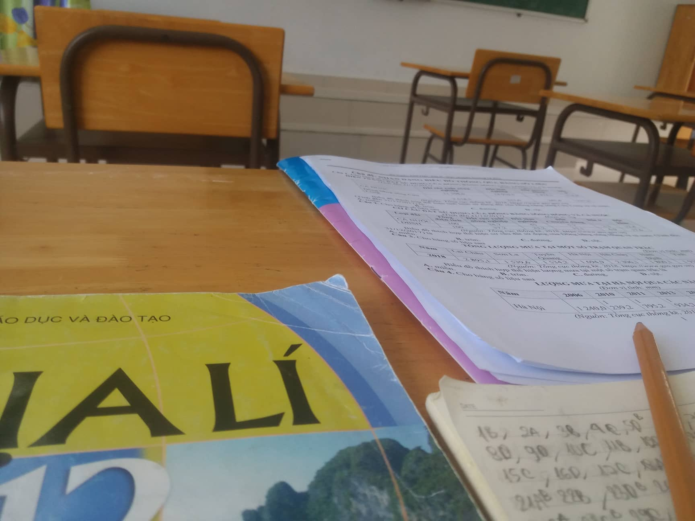

## Kỳ 3: 📚 MÙA THI CỬ LẠI ĐẾN

_Này bạn của tôi ơi, có phải dạo gần đây bạn đang rất mệt mỏi bên chồng sách vở dày cộm chi chít chữ với chữ không?_

**_Bạn mệt mỏi._**

**_Tôi mệt mỏi._**

**_Chúng ta đều mệt mỏi._**

_Đối diện với guồng quay học tập và thi cử, có lẽ cả bạn và tôi thường ở trong trạng thái căng thẳng tột độ. Đó là vô số lúc chúng mình rơi vào cảm giác bất lực và chán nản vô cùng bởi những đề Toán hóc búa, hay những bài văn phân tích tác phẩm văn học mãi vẫn chưa xong. Đó là khi chúng mình tận dụng những giây phút nghỉ ngơi hiếm hoi để nhẹ nhàng đắm chìm vào giấc ngủ ngắn ngủi. Đó là chuỗi ngày kiểm tra dồn dập làm ta xoay sở và dần dà bị nhấn chìm. Trớ trêu hơn, đôi lúc chúng mình **"có công mài sắt"** nhưng không phải lúc nào cũng **"nên kim"** cả._

_Những lúc gian nan chất chồng, bỏ cuộc chính là điều đầu tiên chúng mình sẽ nghĩ đến. Bỏ cuộc là cách tốt nhất để chúng mình thoát li khỏi tháng ngày áp lực ấy, chúng mình sẽ được thỏa thích vui chơi, không phải nghe những lời càm ràm, đôn đốc từ gia đình, thầy cô nữa._

**_Nhưng cuối cùng, chúng mình đều không lựa chọn phương án ấy._**

**_Chúng mình vẫn bước tiếp, để ngày hôm nay chúng mình có cơ hội nhìn lại._**

_Rất nhiều lần tôi muốn gác lại hết tất cả áp lực học tập, thi cử chỉ vì mong muốn sự an nhàn. Tôi chỉ muốn đắm chìm vào những giấc chiêm bao, trốn khỏi cơn ác mộng mang tên Deadline. Nhưng **chạy trời làm sao tránh khỏi nắng**. Tôi buộc phải đối diện với thực tại dẫu cho tôi có than khóc như thế nào. Dẫu bắt gặp đề thi như ý hay không như ý, tôi vẫn phải hoàn thành chúng bằng tất cả khả năng mình đang hiện hữu. Những ngày tháng đầu tiên vào cấp Ba, tôi phải đối diện với các con số mà tôi chưa bao giờ gặp phải suốt chín năm học qua. Dần dà điều đó trở thành một cú trượt dài đối với tôi. Thi cử chưa bao giờ là điều dễ dàng. Và rồi điều gì đến cũng sẽ đến, tôi vẫn đi qua một cách **"trọn vẹn"** cả sáu kì thi của ba năm cấp Ba đấy thôi._

_Hiện tại khi đã gần hoàn thành một học kì ở đại học, đã trải qua những bài kiểm tra ở đây, tôi mới thấy kì thi ở Hoàng chuyên vẫn còn **"nhẹ nhàng"** hơn so với kì thi ở đại học. Phần lớn kiến thức trong đề thi chỉ ở cấp độ cơ bản. Tiếc rằng tôi học lệch nặng nên điểm vẫn thấp, bây giờ ngẫm lại thì hối hận mất rồi._ 😢

_Áp lực trong mùa thi cử là một điều không ai có thể tránh khỏi. Nhưng hãy tin rằng **áp lực sẽ tạo thành kim cương**. Cũng đừng quên phải chăm sóc sức khỏe bản thân thật tốt, tránh để cơ thể rơi vào trạng thái suy kiệt, tệ hơn là phải vào viện, bỏ lỡ mất kì thi quan trọng._

_Dành cho các bạn nhỏ ở Hoàng chuyên sắp bước vào kì thi, chúc các bạn giữ được một sức khỏe tốt, thuận buồm xuôi gió, điểm số như ý và tránh đắc tội với dàn giám thị hùng hậu ở trường mình. **Mùa thi cử là thời điểm quyết định cuộc đời nở hoa hoặc cuộc sống bế tắc của các bạn trong thời gian sắp tới, vì vậy mong tất cả các bạn may mắn nhé.**_ 🤗
