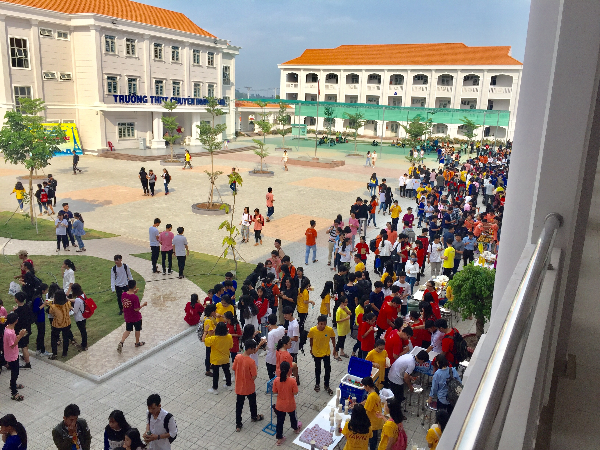

## Kỳ 4: 🍒 VÌ TÔI LUÔN CÓ MỘT CHIẾC BỤNG ĐÓI…

_Này bạn của tôi ơi, hình như có một sự kiện rất thú vị sắp diễn ra ở Hoàng chuyên rồi đấy. Một sự kiện mà bất cứ tín đồ ẩm thực đều thích thú trông chờ. Bạn có thắc mắc rằng đó là sự kiện gì không?_

**_Vâng, Hội chợ ẩm thực đã chính thức trở lại sau ba năm vắng bóng đây!_**

_Hội chợ ẩm thực là một sự kiện thường diễn ra ở các trường THPT nhằm chào mừng ngày thành lập Đoàn Thanh niên Cộng sản Hồ Chí Minh 26/03. Hoàng chuyên chúng mình tất nhiên không nằm ngoài cuộc chơi này rồi, và sự kiện này đã quy vào truyền thống bấy lâu nay ở trường._

_Nhắc đến Hội chợ ẩm thực, hẳn bạn không thể bỏ qua những gian hàng bao gồm món ăn vô cùng hấp dẫn được chế biến bởi các **"đầu bếp"** nghiệp dư trẻ tuổi vô cùng tài năng. Bạn sẽ có cơ hội trải nghiệm chương trình MasterChef nhưng là phiên bản trường cấp Ba ở Việt Nam. Những chiếc bụng đói sẽ hoàn toàn được giải quyết, vì vậy có khi về đến nhà bạn chẳng cần phải dùng bữa tối_ 😆. _Tuy nhiên, không có cái gì trên đời này là miễn phí cả. Để được thưởng thức các **"sơn hào hải vị"** ấy thì bạn sẽ phải trải qua cuộc chiến giành vé đầy cam go và khốc liệt. Nghe bảo năm nay các em giành vé bằng hình thức online, nhưng cũng khốc liệt chẳng kém bởi chỉ cần sau vài phút, vài giây thì form đăng ký vé đã đóng mất rồi! Nên là dù với hình thức nào, ai chậm tay là thua cuộc_ 🤣.

**_Nghe đến đây thôi đã thấy rất thú vị đúng không nào?_**

_Tin tôi đi, **Hội chợ ẩm thực** sẽ là một phân đoạn đắt giá trong thước phim ký ức thanh xuân của mỗi đứa trẻ Hoàng chuyên, nên không thể bỏ lỡ đâu nhé! Đặc biệt là đối với các bạn học sinh lớp 12, quãng thời gian của các bạn đang ngày càng ngắn đi rồi, đây có thể gọi là sự kiện kề cuối ở trường của các bạn. Hãy trân trọng khi còn có thể bởi mai sau cái không khí đông vui, ấm cúng này chẳng thể bắt gặp lại nữa đâu nhé!_

**_Cơ mà, hầu hết các khóa đều được trải nghiệm Hội chợ ẩm thực, ngoại trừ khóa 26 chúng tôi ra…_**

_Khóa 26 chúng tôi không có Hội chợ ẩm thực nào trong ba năm cấp Ba. Xin nhấn mạnh là không một năm nào. Vâng, lý do lại đến từ anh COVID đáng ghét ấy. Anh ta nhẫn tâm vận bám cuộc sống của chúng tôi, không để chúng tôi có được một dịp nào để lưu giữ thanh xuân ở đây cả. Năm nay, nếu không có những tiết học chuyên ngành trên giảng đường đại học thì có lẽ tôi cũng sẽ đi chơi bù, bù đắp cho tổn thất ba năm này_ 😃. _Tôi chỉ có thể ngắm nhìn Hội chợ ẩm thực diễn ra thông qua màn hình điện thoại mà thôi…_

**_Chưa bao giờ khoảng trống trong tâm hồn lại lớn như thế này, có lẽ là vì sự thiếu vắng quá lớn…_**

_Dù sao thì, tôi vẫn sẽ chúc cho Hội chợ ẩm thực diễn ra một cách an toàn, thuận lợi, ngập tràn niềm vui và chan chứa tình yêu thương nhé!_ ❤️

**_Xin chào và hẹn gặp lại ở những bài viết sau._**
