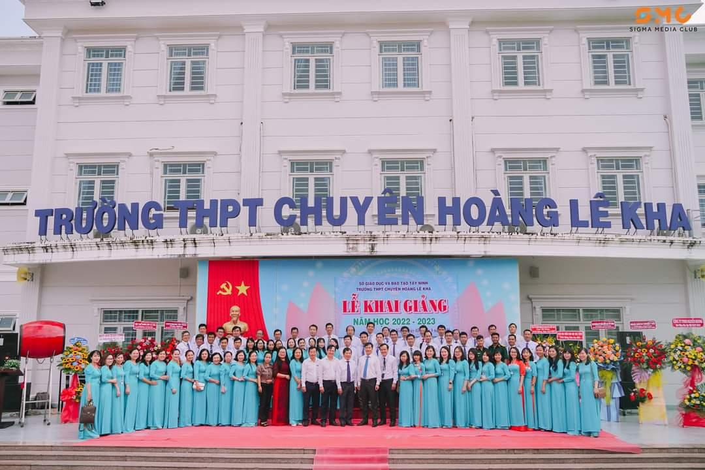

## PHẦN 1: NGHIỆP PHẤN TRẮNG BẢNG ĐEN 👩‍🏫

_Một buổi sớm trên giảng đường đại học, tôi vẫn đang chật vật xoay sở làm cách nào để dung nạp được lượng kiến thức hàn lâm khổng lồ từ các môn học ở đây. Chông chênh lắm chứ, mỏi mệt lắm chứ…_

_Tôi không phủ nhận thầy cô ở đại học vẫn rất tốt và luôn tận tâm với học trò._

_Nhưng sẽ không một ai quan tâm từng li từng tí một, không một ai nhắc nhở tôi phải học bài giống như thầy cô ở thời phổ thông nữa…_

_Bất giác, làn gió thanh xuân lại mơn man trong hồi ức của tôi…_

_Câu chuyện ở Hoàng chuyên của tôi sẽ không thể là một câu chuyện đẹp nếu như thiếu đi sự xuất hiện của đội ngũ thầy cô chất lượng. Nếu phải dùng ba tính từ để miêu tả về họ, tôi sẽ đáp rằng: **Dễ thương, Tận tâm, Ấm áp**._

**_Này bạn ơi, giờ thì nán lại đây, cùng ôn lại kỉ niệm xưa với tôi nhé…_**

> **_Nguồn: Thầy Ngô Trường Chinh - Giáo viên_**

_Năm cấp Ba, độ học lệch của tôi càng lúc càng được thể hiện rõ rệt. Sẽ không ai nghĩ rằng tôi từng học trường chuyên nếu chỉ nhìn vào học bạ ba năm của tôi, vì độ chênh lệch giữa các môn tự nhiên và các môn xã hội có thể ví như khoảng cách từ Trái Đất đến dải ngân hà. Tất nhiên điều này ít nhiều sẽ ảnh hưởng đến tiết học của thầy cô. Nhưng thật may mắn là hầu hết thầy cô ở đây đều không đặt tảng đá áp lực nặng nề lên học sinh rằng phải học giỏi, học xuất sắc môn của họ. Chỉ cần học sinh đạt điểm đủ qua môn và tu dưỡng đạo đức tốt là ổn. Mặc dù chương trình học cấp Ba không dễ dàng nhưng chí ít thầy cô vẫn sẽ tạo điều kiện cho học sinh nên tôi không phải quá gồng mình để đối phó. Có những lúc vì tôi quá nhút nhát, tự ti dẫn đến bài làm của mình không được hoàn thành tốt, nhưng họ không lấy điều đó thành cái cớ để trút bao cơn giận lên học trò của mình, cùng lắm sẽ có một số thầy cô nghiêm khắc la mắng nhưng cũng để rèn cho tôi không tái phạm lần sau. Thầy cô ở Hoàng chuyên dễ thương như thế đấy._

_Để tôi có thể sống sót qua ba năm học vất vả thì chắc chắn không thể thiếu đi đôi tay cần mẫn dìu dắt của dàn giáo viên chủ nhiệm. Vì sao tôi gọi là **"dàn"** mà không phải là **"một"**? Vì mỗi năm lớp tôi đồng hành cùng một giáo viên chủ nhiệm khác nhau. **Tiếc nuối nhiều không? Có chứ!** Bởi thời gian đồng hành cùng nhau không lâu dài so với các lớp cố định giáo viên chủ nhiệm. Tuy vậy, họ vẫn dốc lòng thương yêu và hỗ trợ **"đàn con"** của mình như những người cha, người mẹ thứ hai. Nếu họ không mang tấm lòng bao dung, có lẽ tôi sẽ không thể trụ vững nổi được một năm ở Hoàng chuyên, huống gì đến tận ba năm. Nếu họ không mang cái tâm nghề giáo, có lẽ tôi không được phép sống hết mình và vững bước với đam mê văn chương đến tận bây giờ. Ngẫm lại, nếu là các thầy cô khác thì chưa chắc tôi được hỗ trợ tận tình như thế này trong quá trình học đội tuyển đâu_ 🤔. _Tôi vẫn khắc ghi sâu sắc cách quan tâm thầm lặng đằng sau hình ảnh nghiêm nghị của thầy chủ nhiệm năm lớp mười, năng lượng trẻ trung, dễ thương từ cô chủ nhiệm năm mười một và sự dịu hiền ấm áp từ cô chủ nhiệm năm mười hai…_

_Vì thế mạnh của tôi thuộc khối môn học xã hội, đặc biệt là môn Văn nên thầy cô bộ môn phần nào ưu ái tôi hơn một chút. Nhưng điều này không có nghĩa là họ sẽ đối xử bất công bằng với các bạn khác trong lớp, **đừng hiểu lầm nhé!** Ưu ái ở đây là thầy cô sẽ gọi tôi phát biểu ở những câu hỏi mang tính hóc búa, hoặc khi không khí lớp học trầm lắng bất thường sau câu hỏi của thầy cô,... Họ có thể đóng vai ác trên bục giảng, nhưng khi họ trút bỏ lớp ngoài nghiêm khắc ấy thì họ vẫn là những con người bình thường giống như bao người khác mà thôi. Họ sẵn sàng tư vấn, định hướng con đường cho tôi và thi thoảng sẽ chia sẻ những câu chuyện của nhau, nhờ vậy khoảng cách thầy trò cũng dần được xóa bỏ đi. Đối với những thầy cô dạy khối tự nhiên ở lớp tôi, tôi có phần sợ hãi và ái ngại hơn bởi tôi không học ổn ở môn của họ. Nhưng không một thầy cô nào lấy điều đó làm một gánh nặng. Họ vẫn thương yêu học sinh của mình đấy chứ! Họ vẫn tâm huyết giảng dạy và trả lời thắc mắc của học sinh cho đến khi hiểu đấy chứ! Mặc dù kiến thức các môn tự nhiên đã không còn tồn đọng trong trí nhớ nhưng tôi vẫn kính trọng các thầy cô nhiều lắm._ 😊

_Quay về thực tại, tôi đã trở thành một **cô sinh viên khoa Văn** và từng bước chập chững chinh phục con đường nhà giáo mẫu mực, chân chính. Như bạn từng biết đấy, không phải ai cũng có thể chinh phục môn Văn một cách dễ dàng. Có lẽ tôi sẽ không thể bước tiếp trên chuyến đò Văn Chương, nếu bên cạnh tôi không có sự hỗ trợ đến từ dàn giáo viên tổ Văn chất lượng này đây. **Để tôi kể cho bạn nghe nhé…**_

_Hẳn bạn cũng biết năm cấp Ba tôi từng là thành viên trong đội tuyển học sinh giỏi môn Văn đúng không nhỉ? Dù tôi học lớp Nguồn nhưng tôi đã theo đội xuyên suốt quãng thời gian học cấp Ba, tuy tôi không thể chinh phục đến cuối con đường. Thật ra sân chơi này chỉ dành cho các bạn lớp chuyên mà thôi. Nhưng đã có một cô giáo dạy Văn - cũng là giáo viên tôi vô cùng ngưỡng mộ và kính trọng - dẫn tôi vào cánh cửa đội tuyển, trao cơ hội vàng cho tôi được cọ xát bản thân trở thành phiên bản tốt hơn tôi của ngày hôm qua. Cô không phải là giáo viên bộ môn lớp tôi, càng không phải là giáo viên chủ nhiệm nhưng lửa nghề giáo cô truyền đến không giới hạn ở bất cứ bạn học trò nào. Nhắc đến cô, tôi sẽ vô cùng ấn tượng ở trình độ chuyên môn đối nghịch với tuổi tác và tính cách **"ngoài lạnh trong nóng"** của cô. Nếu kể về chuỗi kỉ niệm quý giá giữa cô và tôi thì nó không có điểm dừng. Tôi vẫn nhớ mãi cách cô ủi an, xoa dịu tâm hồn dễ vỡ của tôi khi nhận phải tin không được bước tiếp vào đội tuyển cấp tỉnh. Cô vẫn ghi nhận sự nỗ lực của tôi ngay cả khi chính tôi cũng không ghi nhận. Cũng từ dạo đấy, lửa nghề giáo trong tôi bắt đầu nhen nhóm cho đến hiện tại, từng bước từng bước tiếp nối cô để trở thành một giáo viên chân chính như thế. Tôi vẫn nhớ mãi những buổi học truyền cảm của cô đã mở ra chân trời văn học đầy nhiệm màu, đã vực dậy ngọn lửa đam mê văn chương trong tôi được sống lại. Tôi vẫn nhớ những lời khuyên nhắn nhủ cô gửi đến tôi vừa nghiêm khắc, vừa chân tình ấm áp để làm nên một tôi trưởng thành, chín chắn hơn. Có một câu nói của cô, đơn giản thôi nhưng đã in sâu trong tâm trí của tôi: **"Cô tin Bình An sẽ làm tốt"**. Tôi nghĩ đến những trái tim sắt đá nhất cũng sẽ tan chảy đấy. Tôi vẫn nhớ về cô dù không còn học với cô hơn ba tháng qua, rất nhiều…_

_Quay trở lại không gian lớp học, tôi hữu duyên gặp được một cô giáo dạy Văn trẻ tuổi khác nhưng vô cùng tâm huyết. Cô phụ trách giảng dạy môn Văn lớp tôi suốt hai năm lớp mười và lớp mười hai, với riêng tôi thì có thêm hai đợt bồi dưỡng học sinh giỏi. Quãng thời gian đầu tiên, hình tượng giáo viên nghiêm khắc, gay gắt mà cô xây dựng đã phần nào đánh mất thiện cảm từ phía tôi, nhưng về sau chính tình thương yêu và lửa nghề giáo trong cô đã sưởi ấm tôi trở lại. Đôi lúc tôi sợ dáng vẻ nghiêm khắc ấy của cô, đôi lúc tôi rơi vào hoài nghi về năng lực văn học của mình mỗi khi bài văn của tôi bị chỉnh sửa gần hết_ 💔. _Cơ mà nhờ điều đấy mà năng lực của tôi dần được nâng cấp lên. Vì khoảng cách tuổi tác giữa cô trò tôi không xa nên ngoài giờ học cô hệt như một người chị giãi bày tâm tư, sẻ chia kinh nghiệm đi trước cho đàn em của mình. Dù bị cô la nhiều nhưng vẫn thương thương cô lắm._ 🥰

_Không riêng hai cô, mà tất cả các thầy cô trong tổ Ngữ văn đều đáng yêu, đều chất lượng như nhau. Vì thời lượng gặp gỡ và học tập cùng các thầy cô còn lại ít hơn nên tôi sẽ dành một góc nhỏ để tỏ bày chuỗi tâm tư ở đây. Nhớ lắm những buổi học bồi dưỡng trực tiếp dưới tiết trời đổ lửa về trưa, nơi có tiếng giảng dạy truyền cảm của thầy cô cùng với dáng vẻ học tập hăng say của các cô, cậu học trò. Nhớ những tháng ngày thầy trò cùng vượt qua đại dịch Covid-19 để hoàn thành sứ mệnh lái đò thiêng liêng qua lớp học online, gian nan nhưng kiên cường biết bao. Bảy thầy cô, bảy phong cách giảng dạy khác nhau nhưng đều chung một tình yêu với sứ mệnh cao cả của mình, với các em học trò mến thương. Vào đội tuyển sẽ không có một dải cách phân biệt giữa chuyên với lớp chuyên, giữa người nổi trội với không nổi trội. Ngay cả khi tôi không học lớp chuyên, thầy cô sẵn sàng tạo điều kiện để tôi được phát huy năng lực vốn có và trau dồi thêm kiến thức chuyên môn. **Áp lực tất nhiên vẫn tồn tại nhưng sẽ tạo ra kim cương mà, đúng không?**_

_Thầy cô của chúng ta, đã không quản ngại khoảng không gian và thời gian để miệt mài, tỉ mỉ chuẩn bị cho tiết dạy của mình được hiệu quả nhất. Thầy cô của chúng ta cũng có thể là những người cha, người mẹ, là người anh, người chị thân thiết quan tâm đến chúng ta từ A tới Z. Thầy cô của chúng ta bao năm hành nghề lái đò đã dẫn dắt biết bao thế hệ đầu xanh mà chẳng cần đón nhận lại sự trả ơn. **Nghiệp phấn trắng, bảng đen dẫu cho bạc bẽo nhưng giá trị chưa bao giờ mất đi.**_

**_Giá như có Doraemon xuất hiện, tôi sẽ mượn một bảo bối nào đó của cậu ấy để được sống lại với những hồi ức đẹp ở Hoàng chuyên, sống trong vòng tay thương yêu của các thầy cô, dù chỉ một lần thôi…_**
