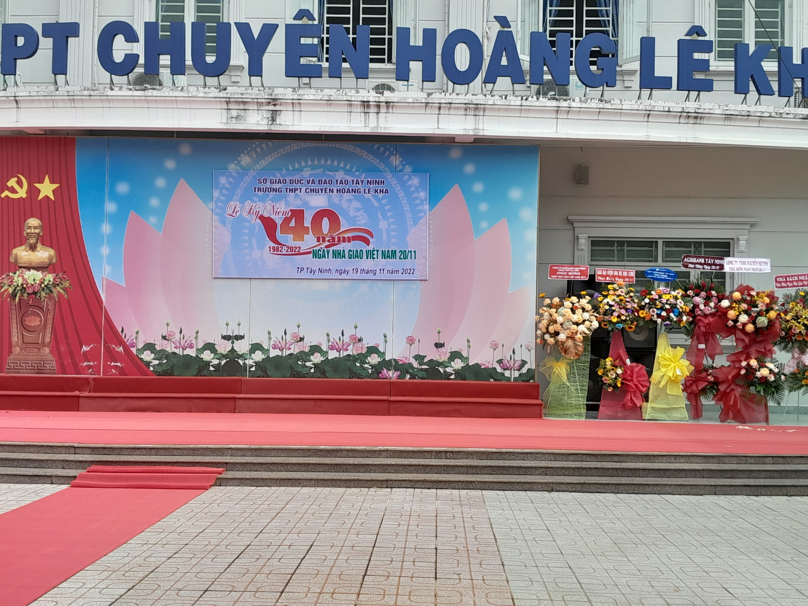

## PHẦN 2: LỜI TRI ÂN 💌

_**Nghề giáo bao giờ cũng luôn là nghề cao quý và trong sạch. Qua đôi dòng chia sẻ của tôi ở bài đăng phần trước, có lẽ bạn cũng phần nào thấu hiểu và thêm trân trọng dành cho thầy cô kính yêu của mình rồi nhỉ?**_

_Hôm nay, em xin dành riêng một góc nho nhỏ nhằm để gửi đến tình cảm, lời tri ân chân thành đến những người thầy, người cô kính yêu của em…_

> **_Nguồn: Anna_**

_**Thầy cô ơi!** Không chỉ riêng Ngày Nhà giáo Việt Nam, mà mỗi ngày thầy cô luôn là những thiên sứ mang nguồn sáng của tri thức đến thế hệ măng non chúng em không ngừng nghỉ. Có những buổi trưa nắng vàng óng ánh đổ lửa, dẫu trán đã đẫm mồ hôi, tiếng giảng thân thương của thầy cô vẫn không dừng lại cùng với sự hăng say chăm chú tiếp thu bài học của những đứa trẻ áo trắng nhiệt huyết. Hay mỗi lúc cơn mưa rào bất chợt ập đến dữ dội, chỉ cần học trò yên vị đợi chờ trong lớp học, thầy cô vẫn sẵn sàng **"đội mưa"** đến lớp, tiếp tục chuyến đò tri thức cùng nhau… Thầy cô vẫn luôn là những người lái đò trí thức sẵn sàng dìu dắt, đưa thế hệ **"đầu xanh"** cập bến tri thức thành công mà chẳng đòi hỏi bất cứ điều gì. Có lẽ, niềm hạnh phúc nhất của thầy cô chính là khi chứng kiến học trò của mình trưởng thành hơn. Những hình ảnh thật đẹp ấy sẽ không bao giờ phai mờ đi trong tâm trí của em, đồng thời cũng đã nhen nhóm lên ước mơ nghề giáo trong em. **Dẫu thầy cô chưa phải là hình mẫu hoàn hảo nhất, nhưng thầy cô sẽ mãi là hình tượng đẹp trong cặp mắt và trái tim của những cô cậu học trò chập chững tuổi mới lớn.**_

_Hai tiếng **"Cảm ơn"** và **"Xin lỗi"** là những điều mấu chốt em muốn gửi gắm đến thầy cô. Em xin cảm ơn một hành trình không ngắn nhưng cũng không hề dài cùng với các thầy cô để em gặt hái vô vàn trải nghiệm bổ ích, chuỗi cung bậc cảm xúc khác nhau và những thước phim kỉ niệm **"đắt trời cho"** không bao giờ tìm thấy lại ở lần thứ hai. Những đôi bàn tay vun đắp không ngừng nghỉ của thầy cô đã giúp em khám phá ra kho tàng tri thức quý báu, hay những chia sẻ về kinh nghiệm cuộc sống của thầy cô sẽ là thứ hành trang quý giá để em tiến một bước gần hơn với chân trời mới. Em cảm ơn tấm lòng bao dung, tình thương yêu bao bọc của thầy cô đã trao một **"chìa khóa vàng"** cho em được tỏa sáng với niềm đam mê của mình đến tận hôm nay. Đôi lúc độ học lệch của em làm thầy cô trăn trở, lo lắng thật nhiều, nhưng thầy cô vẫn không cản ngăn con đường của em. Em thật sự cảm ơn thầy cô, vì tất cả những tinh tú thầy cô trao đến cho em để nâng đỡ em được như ngày hôm nay._

_Qua đó em cũng muốn gửi lời xin lỗi cho những phút giây bồng bột, thiếu chín chắn của em đã gây cho thầy cô thêm buồn lòng và nghĩ suy rất nhiều. Đã đôi lần em không hoàn thành nhiệm vụ thầy cô giao thật tốt vì không dồn toàn tâm toàn lực vào chúng, đã bao lần em không can đảm đưa tay phát biểu dẫu biết câu trả lời bởi vì sự nhút nhát, rụt rè vẫn kìm hãm, nhưng thầy cô chưa bao giờ nổi giận quá dài lâu. Nhất định em sẽ trưởng thành hơn em của ngày xưa, để nụ cười rạng rỡ đầy niềm tự hào trên môi thầy cô xuất hiện…_

_Nhân kỉ niệm bốn mươi năm Ngày Nhà giáo Việt Nam 20/11, chúc thầy cô sẽ luôn giữ được dung nhan tươi trẻ như thuở đôi mươi, có thật nhiều sức khỏe, gặt hái thật nhiều trái quả ngọt ngào cùng niềm hạnh phúc để tiếp tục chuyến đò tri thức cùng biết bao thế hệ **"đầu xanh"**. **"Một chữ là thầy, nửa chữ cũng là thầy"**, dẫu trở ngại có xuất hiện ngày một dày đặc vẫn mong thầy cô giữ trọn vẹn giá trị nhân văn của nghề nghiệp cao quý này._

_Cuối cùng, để khép lại chuyên mục Ngày Nhà giáo Việt Nam, em xin gửi đến thầy cô cũng như toàn thể độc giả một bài thơ tri ân nhà giáo do em sáng tác:_

> **_Dòng sông tri thức ngược xuôi_**
>
> **_Con đò vẫn đưa chúng tôi sang bờ_**
>
> **_Dẫu rằng phía trước mịt mờ_**
>
> **_Niềm tin sẽ chẳng bao giờ mất đi_**
>
> **_Lời thầy luôn phải khắc ghi_**
>
> **_Thành nhân, hạnh phúc, kiên trì, thành công_**
>
> **_Cả đời thầy chỉ trông mong_**
>
> **_Chúng tôi sống trọn ước mong của mình._**
