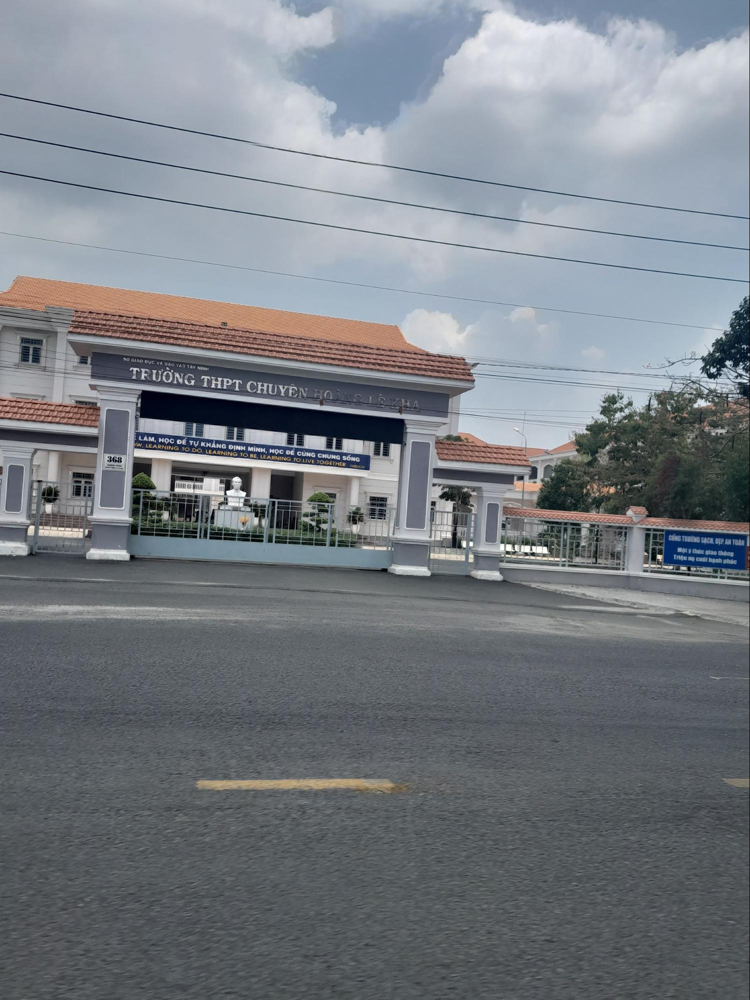

## PHẦN 2: THƯƠNG LẮM, NGUỒN 1 ƠI!

> **_Hạ về, lòng lại nhớ thương_**
>
> **_Ba mùa áo trắng, vấn vương một đời..._**

_Khi ngắm nhìn lại những tấm ảnh chụp cùng lớp, bao cung bậc cảm xúc được đúc kết qua hai câu thơ ngẫu hứng trên của tôi. **Hạ đã về, tháng năm đã về rồi đấy! Kể ra, tôi đã xa Nguồn 1 gần một năm rồi nhỉ...**_

**_Này bạn của tôi ơi, bạn có biết không? Biết rằng nỗi nhớ Nguồn 1, nhớ Hoàng chuyên chưa bao giờ nguôi ngoai trong tôi..._**

_**Tôi sẽ nhớ lắm giây phút vỡ òa khi đón nhận danh sách kết quả trúng tuyển, khi được xếp lớp**. Cuối cùng, tôi có thể thực hiện ước mơ của mình dưới danh phận là học sinh lớp Nguồn 1, trường THPT Chuyên Hoàng Lê Kha._

_**Tôi sẽ nhớ lắm những tiết học cả trực tiếp lẫn trực tuyến ở Nguồn 1.** Ba năm qua, sự vận hành của dịch bệnh Covid-19 đã không làm cho thanh xuân của chúng tôi trọn vẹn, nhưng không vì vậy mà mỗi giờ phút trôi qua của chúng tôi trở nên quá buồn tẻ, nhạt nhẽo. **Chúng tôi vẫn có thể bày đủ trò nhất quỷ nhì ma, vẫn cười nói vui vẻ, vẫn tạo được những kỉ niệm đắt giá đấy thôi!**_

_**Tôi sẽ nhớ lắm những gương mặt đáng yêu mà tôi đã từng và đang gặp gỡ**: từ những người bạn xã giao cho đến những người bạn thân cực thân, từ đội ngũ giáo viên tận tâm trong trường cho đến cả những thầy cô ngoài nhà trường, những anh chị, các em nhỏ, và cả người yêu của tôi nữa. Mỗi một người là mỗi gam màu sắc khác nhau, nhưng điểm chung là đều để lại cho tôi những bài học nhân sinh bổ ích, những mảnh kí ức khó thể nào quên. **Hẳn đây chính là cái duyên mà ông trời đã sắp xếp nhỉ!** Dẫu cho duyên không còn, tôi vẫn sẽ rất biết ơn vì họ đã từng đến với tôi._

_**Tôi sẽ nhớ lắm tôi của năm ấy**. Tôi của năm ấy dẫu vẫn còn vương sót khuyết điểm, dẫu không hoàn hảo, nhưng tôi vẫn có thể ngẩng đầu hãnh diện vì sự trưởng thành theo năm tháng. Không còn là một cô bé non nớt, hồ đồ nữa, tôi đã dần điềm tĩnh và nhìn sự đời với nhiều góc nhìn hơn. Tôi biết lo nghĩ về tương lai và biết yêu thương những người thân yêu của tôi hơn._

**_Cuối cùng, tôi muốn gửi lời cảm ơn đến tất cả._**

**_Cảm ơn gia đình vì đã luôn bên cạnh yêu thương và chăm sóc con từ ngày nhập học cho đến khi đã tốt nghiệp._**

**_Cảm ơn thầy cô đã luôn cưng con và tận tình dạy dỗ cho con, không chỉ về kiến thức mà còn dạy về đạo làm người._**

**_Cảm ơn tất cả những người bạn tôi từng và đang gặp gỡ, vì đã đồng hành cùng tôi và nâng đỡ tôi rất nhiều._**

**_Cảm ơn người yêu của tôi đã đến và xoa dịu trái tim của tôi sau mười sáu năm cô đơn, lạc lõng._**

**_Cảm ơn Nguồn 1, cảm ơn Hoàng chuyên vì đã "ươm mầm" tôi suốt ba năm, mở ra quãng đường trưởng thành của tôi thật thuận lợi._**

**_Cảm ơn tôi của ba năm qua vì đã sống hết mình với thanh xuân, vì đã trưởng thành thật tốt!_**

**_Sau này, bất luận tương lai diễn tiến như thế nào, tôi sẽ không quên những năm tháng được học tại đây, và tôi nhất định sẽ trở về thường xuyên như một cách để nuôi dưỡng tình cảm ấy mãi mãi..._** ❤️

**_Lắm lúc giận hờn nhiều lắm, nhưng thương thì cũng thương nhiều lắm._**

**_Nguồn 1 sẽ sống mãi trong tim rất nhiều thế hệ Hoàng chuyên, trong đó có tôi._** 😊

_Series Khối Nguồn 1 này xin phép được dừng tại đây. Hẹn gặp lại quý độc giả vào những bài sau nhé!_

**_Xin cảm ơn và chào mọi người!_**
