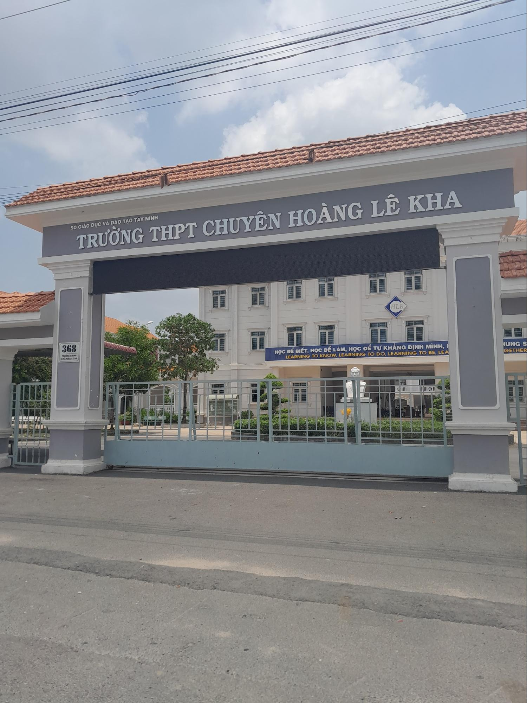

## PHẦN 1: THANH XUÂN CỦA TÔI LÀ NGUỒN 1 KHÓA 26

> - **_"Trường chuyên mà lại có lớp không chuyên thì hỏng rồi!"_**
> - **_"Trường chuyên mà học lớp không chuyên nghe nó vô duyên!"_**
> - **_"Lớp không chuyên của trường chuyên chỉ toàn những đứa chuyên đút lót, dùng tiền để vào..."_**

_Có ai đã và đang học tập ở lớp không chuyên trong trường chuyên nghe phải những định kiến như trên không nhỉ? Chỉ mới cách đây một tháng thôi, tôi đã không thể kiềm lòng khi phải đọc những bình luận tiêu cực về một môi trường tôi đã từng học như thế. **Lớp không chuyên trong trường chuyên, có thật sự chỉ là một vết nhơ bôi bác trường chuyên như lời mọi người nói?**_

**_Này bạn của tôi ơi, hãy cùng tôi quay trở về gặp tôi của thuở niên thiếu, khi tôi còn là thành viên lớp Nguồn 1 Khóa 26 - Trường THPT Chuyên Hoàng Lê Kha nhé!_**

_Trường THPT Chuyên Hoàng Lê Kha đã từ lâu là niềm tự hào của quê nhà tôi, là khu vườn sạch đẹp nuôi dưỡng rất nhiều bông hoa ở tuổi mười lăm. Nơi đây đã chắp đôi cánh để các bạn học sinh được thỏa sức bay cao, bay xa với đam mê, với hoài bão mà chẳng phải màng đến chuyện cơm áo gạo tiền đè lên tấm vai của mình._

_Cách đây tầm bốn năm, tôi chỉ là một cô bé ôm giấc mộng lớn bước vào lớp chuyên Văn trong ngôi trường chuyên ấy, là nơi tôi hằng mong ước từ lâu và mong được thuộc về. Tuy nhiên, con số **0.5** đã cản bước tôi lại. Đó là một con số rất nhỏ, và điều này khiến tôi tiếc nuối khá nhiều. Nếu tôi không cẩu thả trong bài thi tiếng Anh, có lẽ tôi đã giành được một vé vào lớp chuyên Văn rồi nhỉ! Nhưng may mắn làm sao, tôi không bị "**đá**" khỏi trường, tôi được "**vớt**" lên lớp Nguồn 1. Và thế là, **câu chuyện thanh xuân của tôi bắt đầu**..._

_Mọi người thường bảo, vào lớp nguồn thiệt thòi nhiều điều lắm. Chúng tôi không có cơ hội tranh giành học bổng như các bạn lớp chuyên. Chúng tôi không được học những tiết chuyên đề trong môn học yêu thích của mình. Chúng tôi phải đón nhận vô vàn định kiến và cả sự miệt thị đến từ những người ngoài cuộc. Đôi lúc tôi vẫn thấy buồn, hóa ra vẫn còn khá nhiều người tỏ ra khinh thường và giễu cợt trước sự tồn tại của mô hình lớp học này._

_Nhưng hãy nhìn từ góc độ khác nào! Lớp nguồn vẫn nhận được rất nhiều ưu ái cơ mà. Tuy chúng tôi không có cơ hội nhận học bổng, nhưng chúng tôi không chịu quá nhiều áp lực trong quá trình "**cày điểm số**". Chỉ khi bị loại yếu trở xuống, chúng tôi mới bị "**tống cổ**", nhưng khả năng này hiếm khi xảy ra lắm nên chúng tôi yên tâm học tập tại trường thôi. Tuy chúng tôi không được học các tiết chuyên đề, nhưng chúng tôi có nhiều thời gian để cân bằng đồng đều các môn học hơn. Quan trọng là năng lực của lớp nguồn chúng tôi không hề thua kém các bạn lớp chuyên. Bởi chúng tôi đều phải trải qua kì thi tuyển sinh như nhau, phải dùng chính thực lực của bản thân đối chọi với hàng trăm thí sinh khác để có một vé vào trường. Vào lớp chuyên đã không dễ dàng, vào được lớp nguồn lại càng khó khăn hơn bởi cách tính điểm ở hai hệ là khác nhau. Có lẽ vì hầu hết các bạn đều từ chuyên Anh xuống, nên trình độ tiếng Anh của đứa nào cũng giỏi (**trừ tôi ra vì tôi từ chuyên Văn xuống**_ 🥲*). Thi thoảng, khi ai đó nhắc đến, tôi gọi vui đấy là lớp "**Chuyên Anh 2**".*

_**Nhân duyên vốn thật khó định trước. Bạn không thể biết trước được mình sẽ gặp những ai, họ sẽ đối đãi với mình như thế nào, mối quan hệ giữa mình và đối phương tốt hay xấu...** Sau ba năm học Nguồn 1 ở trường, tôi may mắn tạo lập và giữ vững được khá nhiều mối quan hệ, nhưng cũng có một số mối quan hệ bị mất đi. Không thể phủ nhận, được học ở một môi trường chuyên nghiệp và được gặp gỡ đúng đối tượng sẽ khiến bản thân ngày một hoàn thiện hơn. Tôi được học cùng những bạn có học lực hạng "**khủng**", là những gương mặt ưu tú trong suốt chín năm học qua và sẽ tiếp tục tỏa sáng trong ba năm cấp Ba đây. Tôi được đội ngũ giáo viên giỏi của tỉnh nhà giảng dạy. Thật ra không phải ai cũng giỏi, cũng xuất sắc, tuy nhiên lượng người ưu tú như thế lại chiếm đa số trong trường chuyên._

_**Áp lực không? Áp lực nhiều chứ!** Mặc dù học lớp nguồn không phải lo lắng về chuyện bị đuổi khỏi trường, nhưng khi đối diện với rất nhiều gương mặt ưu tú ấy, áp lực là một điều không thể tránh khỏi. Áp lực đến cả từ cái mác học sinh trường chuyên cho đến chuyện học tập ở lớp. Áp lực đến từ rất nhiều điều..._

**_Nhưng..._**

_Nếu được hỏi tôi có hối hận khi vào Nguồn 1 không?_

_Tôi sẽ trả lời rằng: "**Không bao giờ**"._

_Bởi vì..._

_**Tôi vẫn còn một gia đình kề cạnh**. Một câu trả lời nghe có vẻ chẳng liên quan đến câu hỏi lắm nhỉ? Nhưng tôi nghĩ vẫn có sự liên quan. Bởi vì nếu không có họ chăm sóc, thương yêu thì tôi đã chẳng đi qua ba năm đầy khổ ải như thế này đâu. Họ đã dành dụm từng cắc từng đồng để đóng học phí cho tôi đi học. Chỉ biết rằng, trên lộ trình đi học của tôi không bao giờ thiếu vắng đi những "**tài xế**" tuyệt hảo là ba mẹ của tôi, luôn đèo tôi đi học dẫu mưa dẫu nắng. Chỉ biết rằng, sau mỗi buổi học là những bữa cơm giản đơn chứa chan vị tình thương của ngoại đã được dọn sẵn trên bàn, chỉ đợi chờ tôi về ăn nữa thôi. Đôi lúc có xảy ra cãi vã, xung đột, nhưng tôi sẽ không bao giờ bị bỏ rơi. **Bất luận như thế nào, gia đình vẫn sẽ luôn đồng hành cùng tôi, cùng bạn, cùng chúng ta.**_

_**Tôi có một tập thể lớp không hoàn hảo, thi thoảng vẫn xảy ra bất đồng quan điểm, tranh cãi, xung đột**. Tôi vẫn nhớ, mùa trại đầu tiên cũng là mùa trại duy nhất của chúng tôi đã không được thuận lợi, có lẽ vì thời gian gặp nhau chưa lâu nên chúng tôi chưa thật sự hiểu nhau. Cả những lúc bàn áo lớp, chúng tôi đã không ít lần "**sứt đầu mẻ trán**" vì nhiều ý kiến trái chiều. Nhưng tập thể ấy sẵn sàng vì lợi ích chung mà cố gắng gác lại cái tôi sang một bên, vẫn có sự gắn kết mạnh mẽ, vẫn vui vẻ bên nhau suốt năm tháng thanh xuân. **Còn nhớ lớp chúng tôi đã từng lấy được giải nhất cuộc thi flashmob chứ?** Đó là sự nỗ lực tập luyện không ngừng nghỉ chỉ trong vài ngày ngắn ngủi của cả một tập thể nói chung và cá nhân nói riêng. **Còn nhớ không những giây phút vui vẻ trong những buổi đi chơi, những sự kiện trong trường?** Đến tận bây giờ, điều tôi nuối tiếc nhất là không dành thời gian cho lớp nhiều hơn. Một phần vì tôi đầu tư phần lớn thời gian cho việc ôn luyện đội tuyển học sinh giỏi, một phần vì tôi không biết đi xe máy_ 🥲*. Nhưng dẫu sao, tôi vẫn rất biết ơn và trân trọng vì đã từng và **sẽ mãi mãi là một mảnh ghép không thể thiếu của tập thể Nguồn 1 Khóa 26**.*

_**Tôi có những người bạn, từ bạn xã giao cho đến bạn thân, từ các anh chị khóa trước cho đến các em khóa sau**. Tuy thời gian gặp nhau không quá nhiều, **nhưng khi cần, chúng tôi sẵn sàng nâng đỡ nhau mỗi lúc khó khăn**. Quãng thời gian đầu tiên ở cấp Ba luôn là quãng thời gian chật vật nhất. Khi mới vào trường, chắc hẳn bạn cũng như tôi, **cô đơn, lạc lõng, thậm chí là khó chịu** vì có sự chuyển đổi ở môi trường học tập. **Nhưng đừng lo, các anh chị luôn niềm nở đón tiếp và sẵn sàng đồng hành cùng chúng ta trong chặng đường sắp tới đấy thôi!** Các anh chị không chỉ gây ấn tượng bởi thành tích học tập đáng nể mà còn nhiệt huyết, thân thiện, sẵn sàng hỗ trợ và thậm chí còn có thể là một người bạn chí cốt của chúng ta. Lễ chào đón tân học sinh của Sigma Media Club - **một trong những câu lạc bộ chủ chốt trong trường** - đã chứng minh được điều đó, giúp cho những tân học sinh chúng tôi ngày ấy đã gắn chặt nhau hơn. Chúng tôi có thể huyên thuyên cả ngày đêm, có thể trút bỏ hết thảy áp lực, căng thẳng để khóc cười cùng nhau. Có tận hai con bạn thân sẵn sàng lắng nghe tôi lải nhải đủ chuyện vui buồn, chuyện xàm xí, vân vân,... Có những người bạn mới sẵn sàng giúp đỡ mà chẳng cầu mong nhận lại điều gì. Không chỉ là với cả những người bạn cùng tuổi, tôi có kết bạn với một số em khóa sau, chủ yếu cách nhau từ một đến hai khóa. Trò chuyện với các em nhỏ vui vẻ thật sự, bên cạnh đó còn giúp cho mình trẻ hóa nữa. Đa số các em đều rất dễ thương, gần gũi và tài giỏi không đợi tuổi. Toàn những nam thanh nữ tú_ 😁*. Thi thoảng, nếu nhớ nhau thì chỉ cần một cuộc gọi hay một buổi tâm sự ở đâu đó cũng đã đủ để xoa dịu trái tim sau những giờ phút mệt mỏi, căng thẳng nơi học tập, làm việc. **Biết ơn các anh chị, các bạn và các em nhiều lắm**.*

_**Tôi được gặp những người thầy, người cô dốc lòng vì nghề, tận tâm vì trò**. Để đến được vị trí như ngày hôm nay, chắc chắn không thể thiếu đi đôi bàn tay vun đắp hạt giống tri thức và tâm hồn một cách cần mẫn của thầy cô. Ba năm cấp Ba, dưới sự dìu dắt của thầy cô, không chỉ được dung nạp về kiến thức chuyên môn mà tôi còn được học vô vàn bài học thành nhân. Mỗi một thầy cô là mỗi một phong cách giảng dạy khác nhau, nhưng cũng chính vì thế họ đã tạo nên một thương hiệu ở họ, là điều thu hút học sinh nhiều nhất. Có lẽ vì tôi may mắn được gặp những giáo viên trình độ chuyên môn cao, dễ thương, tận tâm nên đã tác động phần nào đến ước mơ của tôi. **Ấy là hiện tại, tôi đang đặt những bước chân đầu tiên đến với sư phạm, và tôi luôn nỗ lực từng ngày để trở thành một giáo viên ưu tú giống như họ**._

_**Tôi đã "nhặt" được người yêu về**. Suốt mười sáu năm đầu tiên của cuộc đời, tôi đã mặc định một con ngốc như tôi sẽ không thể yêu đương. Việc của tôi chỉ xoay quanh bốn điều: ăn, học, chơi và ngủ. **Thế nhưng vào năm lớp mười một, tôi vô tình va phải một cậu bạn chuyên Anh rồi "trót" hạnh phúc bên nhau tới hiện tại luôn!** Mối tình của chúng tôi hệt như hai nhân vật phim hoạt hình Tom và Jerry, thường ngày chọc ghẹo cho điên tiết nhưng thương thì cũng thương nhiều lắm, nếu cần gì thì sẽ có mặt ngay. Chúng tôi chấp nhận mọi ưu khuyết điểm của nhau, luôn lắng nghe nhau và cùng nhau giải quyết mọi khó khăn. **Nghĩ lại thì đây cũng là duyên số cả, đúng không?**_

_**Cuối cùng, tôi đã trở thành một phiên bản "tôi" tốt hơn quá khứ**. Tôi trở nên điềm đạm hơn, chững chạc hơn, trưởng thành hơn, không còn sự bồng bột, non nớt như thuở bé. Mặc dù tôi vẫn còn nóng tính, tuy nhiên tôi đã học được cách hạ cái tôi xuống vì lợi ích chung. Hành trình học Văn của tôi là một minh chứng. Từ một cô bé sợ Văn, luôn gánh lên vai áp lực điểm số mỗi khi học Văn, đến bây giờ tôi học Văn bằng cả trái tim, tôi yêu Văn một cách chân thành, tôi tìm đến Văn bằng sự say mê đích thực. Tôi đã học Văn một cách đúng nghĩa - **học để làm người**, không học vì điểm số. Thật ra đó là cả một quá trình để đổi thay và để chấp nhận: đổi thay tư tưởng học Văn và chấp nhận mọi ưu khuyết điểm của bản thân khi học Văn. Sức mạnh nội tại của bản thân luôn là yếu tố tiên quyết. Dù nỗ lực thật nhiều, phấn đấu thật nhiều, nhưng thành quả lớn nhất mà tôi đã nhận được ấy là sự ghi nhận đến từ những người tôi thương yêu. Nước mắt tôi chực trào ra, không phải vì không đạt được thành tích cao, mà **chính là vì tình thương yêu và sự trao truyền hơi ấm đến từ gia đình, từ các thầy cô tổ Ngữ văn và từ các bạn của tôi**. Tôi yêu cái cách gia đình quan tâm tôi, không vì điểm số mà vì sức khỏe của tôi hơn. Tôi yêu cái cách cô giáo của tôi an ủi vỗ về, động viên và không ngừng tiếp lửa Văn cho tôi khi tôi gặp thất bại. Tôi yêu cái cách các thầy cô tin tưởng tôi vô điều kiện, ngay cả khi năng lực của tôi không xuất sắc. Tôi yêu cái cách mấy nhỏ bạn thân, người yêu, những người bạn trong đội tuyển, những người bạn cùng lớp, những thầy cô bộ môn khác đã luôn âm thầm ủng hộ và để tôi có cơ hội bước tiếp với lựa chọn của bản thân như vậy. **Tôi yêu lắm!**_

**_Ở Nguồn 1, nó đã lấy mất đi sự hồn nhiên, thơ ngây của tôi, nhưng nó cho tôi nhiều điều đắt giá hơn cả vàng bạc, châu báu._**

**_Ở Nguồn 1, nó sẵn sàng để tôi nếm trải hương vị đắng cay, nhưng nó cũng đã dạy tôi thật nhiều điều quý báu trước khi "thả" tôi ra giữa dòng đời xô bồ._**

**_Ở Nguồn 1, tôi được nhận nhiều điều, và tôi học cách cho đi nhiều điều._**

**_Ở Nguồn 1 đáng nhớ thật mà, nhỉ?_**

**_Dẫu thước phim kí ức thanh xuân không hoàn hảo tuyệt đối, nhưng đối với một đứa trẻ đang chập chững từng bước làm người lớn thì thước phim kí ức ấy luôn luôn đẹp nhất._**

**_Luôn cất giữ trong tim, thanh xuân của tôi, Nguồn 1 Khóa 26 của tôi._** ❤️
