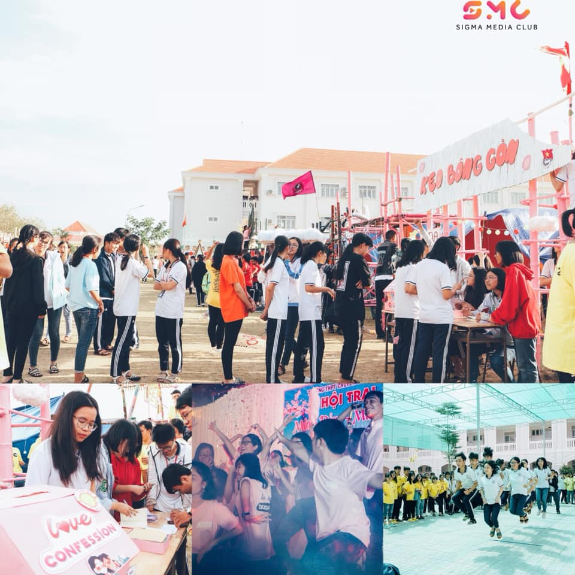

## Kỳ 3 - 🏵 MÙA XUÂN Ở HOÀNG CHUYÊN 🌸

🏕 Năm nào cũng như năm nào, thấy tháng Giêng là thấy én, mà thấy Trại về là thấy Tết. Người người, nhà nhà tất bật chuẩn bị mọi thứ, sẵn sàng cho một ngày cháy hết mình cùng Hội trại. Và hiển nhiên, những thứ đã gọi là truyền thống như thế này vẫn mãi vẹn nguyên, không bao giờ thay đổi (đến năm nay, #HLK_LNYCamping vẫn còn đó). Có một số thứ gọi là linh hồn của Trại, bao gồm các hoạt động như:

✉ Love Confession - CÁNH THƯ MÙA XUÂN: Nơi tình yêu lan tỏa, nơi bày tỏ nỗi lòng đến những người thân thương của bạn. Mỗi mùa Trại, khối chuyên Anh (chính xác là 12A - luân phiên theo khóa, năm nay là #HLK_AK24 đảm nhận) sẽ chuẩn bị sẵn cho bạn: 1 phong bì, 1 mảnh giấy (và 1 phần quà tùy theo năm, năm trước là kẹo bông gòn còn năm nay là xí muội thì phải). Hãy đến xếp hàng sớm, nếu không bạn sẽ phải chịu cảnh chen chúc và không có quà tặng cho người ta đấy, giống như trong bức hình kia 😂. Với những thứ tưởng chừng như đơn giản kia, bạn có thể viết bất cứ thứ gì từ tận đáy lòng bạn gửi đến cho người ấy mà chẳng cần phải tiết lộ bạn là ai. Sau đó ghé lại, bỏ vào thùng thư, và rồi, khi màn đêm buông xuống, những cánh thư ấy lại được trao tận tay người nhận, và dĩ nhiên, với kinh nghiệm của một người giao thư có uy tín như tôi, tôi cam đoan, bất cứ người nhận nào cũng sẽ bất ngờ với những món quà "siêu to khổng lồ" đấy!!! Tin tôi đi, tôi không đùa đâu 😂

🏆 TRÒ CHƠI VẬN ĐỘNG: "Sáng hai, chiều sáu nhé" 😂. Năm nào cũng vậy, buổi sáng luôn có hai game vận động cho các bạn, mà toàn game truyền thống không à: Kéo co và nhảy dây. Bật mí cho các bạn: Kéo co không phải là sở trường của #HLK_AK23, nhưng nhảy dây thì ôi thôi rồi, muốn phá kỷ lục mà lớp chúng tôi đặt ra 2 năm qua không phải chuyện đơn giản đâu nhé (từ việc chơi cho vui đến chức vô địch là một cuộc hành trình không tưởng, giống y chang như cách U23 Việt Nam 🇻🇳 tiến vào chung kết Châu Á hai năm trước đấy 😂). Hy vọng là năm nay, khối chuyên Anh sẽ có thành tích (phá được kỷ lục thì càng tốt, không lẽ cứ để lớp tụi anh giữ mãi à, mà cũng chả sao, miễn chuyên Anh giữ là được, không cho người khác phá 😂😂😂). Còn về buổi chiều, cụm trò chơi vận động gồm 6 games mang tính hiện đại nhiều hơn và lần nào cũng vậy, chơi tới game thứ tư, thứ năm là khá đuối rồi, nên khuyến cáo các bạn hãy dưỡng sức trước ngày Trại nhé, đừng tự làm khổ bản thân mình và cả đội đó 😂

🎤 CHƯƠNG TRÌNH NGHỆ THUẬT ĐẶC BIỆT (BUỔI TỐI): Ahhh, cái này không cần nói cũng biết là gì rồi. Cơ mà, dưới ánh đèn lấp lánh và được trình diễn trên một sân khấu lớn luôn là trải nghiệm không thể nào quên đối với bất kỳ ai, thế nên nếu được lựa chọn, hy vọng các bạn hãy tỏa sáng hết mình trong phần trình diễn nhé. Có một điều tôi vẫn thắc mắc, thế rốt cuộc năm nay tôi nên xem U23 Việt Nam 🇻🇳 đá giải Châu Á hay là xem trình diễn nghệ thuật (ngày hôm đó chúng ta đá với Cộng hòa Dân chủ Nhân dân Triều Tiên 🇰🇵 lúc 20h15)??? Đừng nói là các bạn bắt tôi phải phân thân nhé. Ai đó trả lời tôi đi mà 😂😂😂

✅ Và đó là tất cả những gì gọi là tinh túy nhất của #HLK_LNYCamping, rất là hy vọng các bạn sẽ tận hưởng trọn vẹn tất cả nhé. Cuối cùng, xin được chúc các bạn sẽ có một kỳ Hội trại thật nhiều niềm vui, cũng như chúc các bạn có một năm mới thật nhiều sức khỏe và thành công hơn trên con đường mình đã chọn. Hẹn gặp lại các bạn vào ngày 16/01/2020 (ngày gì thì các bạn cũng biết rồi đó 😂)

❤️ P/s: Yên tâm đi, kiểu gì Tiền bối cũng có hình đẹp chụp chung với mấy Hậu bối cho mà xem 😉

🖼 Ảnh ghép từ các ảnh đơn lẻ được chụp bởi: Câu lạc bộ Truyền thông Sigma - Sigma Media Club (SMC).
