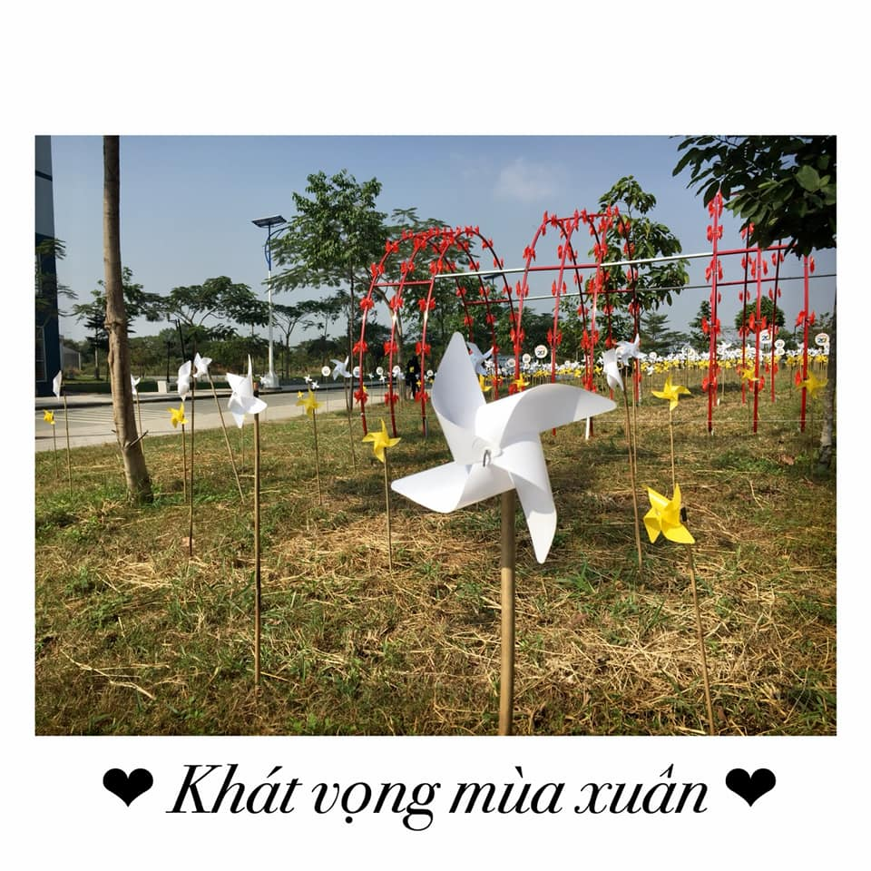

## Kỳ 4: KHÁT VỌNG MÙA XUÂN

🗓 Năm Kỷ Hợi đã qua đi và một năm Canh Tý đã sắp đến. Trong cái không khí rạo rực của ngày 23 tháng Chạp - ngày Tết Ông Công, Ông Táo - đánh dấu 1 tuần trước dịp Tết Nguyên đán, tôi muốn mời các bạn hãy tĩnh tâm lại một chút, chậm lại một phút, và hãy chọn cho mình khoảnh khắc ấn tượng nhất vào một lúc nào đó trong năm.

🏕 Đối với tôi, có lẽ những ngày giữa tháng 5 đến khoảng cuối tháng 6 là những giây phút mang đến nhiều ấn tượng nhất. Đó là thời điểm tôi chính thức trở thành một cựu học sinh của Hoàng chuyên. Thời điểm ấy tôi cũng viết và chia sẻ rất nhiều bài, rất nhiều bản nhạc, rất nhiều hình ảnh về những khoảnh khắc chia tay tuổi học trò giống như trong thời điểm này. Ngày ấy tôi buồn lắm, lắm lúc lại thấy tiếc. Sao mọi thứ trôi qua nhanh quá? Lại nhớ cái ngày hôm qua tôi vào cùng với mấy đứa hậu bối để tham gia trại, thấy tụi nó chơi đùa tưng bừng mà mình cảm giác như hơi lệch pha, cảm giác như mình già dặn hơn tụi nhỏ, rồi lại thấy tiếc cho những giây phút mình không được tham gia trại một cách máu lửa cùng những người bạn cũ của #HLK_AK23. Nhưng tiếc thì có được gì, thời gian trôi qua, mọi thứ đều đã đổi khác, chỉ có tôi vẫn cứ ở đó, mãi lưu luyến một quá khứ đầy những điều khiến bản thân phải hối tiếc. Thú thật, tôi cũng hơi ngốc thật.

📝 Rồi sang những ngày thi THPTQG. Mọi thứ lại trôi qua một cách thật chậm, thật chậm, nó chậm giống như 30 năm, chứ không phải là 3 năm cấp 3. Rồi tới môn thi cuối cùng: Tiếng Anh. Khi tiếng trống cuối giờ vang vọng, lẫn vào tiếng ve kêu vang cả một góc sân trường thi rợp bóng hoa phượng cũng là lúc tôi nhận ra rằng: Đời học sinh của tôi nó đã kết thúc như vậy đấy. Bảo sao không tiếc khi nó kết thúc bằng một kì thi thay vì một buổi chia tay. Bảo sao không buồn vì đây là lần cuối cùng được chính thức khoác lên mình bộ đồng phục đã gắn bó với mình suốt cả đời học sinh. Bảo sao không thương khi đó là lúc chiếc thẻ mà tôi hay mang trên người đã trở thành một món đồ kỉ niệm. Và bảo sao không xót khi từ thời điểm ấy, cái mác "Học sinh" đã có thêm một chữ "Cựu". Một chữ thôi nhưng nó đã làm cho mọi thứ đã khác.

✅ Nhưng có một thực tế phải ghi nhận rằng: Giờ đây tôi - một cựu học sinh của Hoàng chuyên - đã trở thành một con người khác. Một con người biết quan tâm đến những đứa hậu bối - những thế hệ tương lai. Một con người luôn hướng về nguồn cội, hướng về những giá trị truyền thống song hành cùng việc phát triển những nét hiện đại làm nên một thực thể lớn. Một con người luôn sẵn sàng nhìn về quá khứ, nghĩ về hiện tại và hướng về tương lai với biết bao những hoài bão đang ấp ủ. Và đó chính là điều mà tôi đây muốn tất cả các hậu bối sau này luôn phải khắc ghi.

🌼 Mùa xuân này, tôi trở về và già thêm một tuổi, nhưng năm nào cũng mang trong mình rất nhiều những khát vọng: Khát vọng về một mùa xuân an lành, đầy sức khỏe đến với chính tôi và tất cả mọi người, khát vọng về một năm mới đầy những thành công và may mắn hơn cho những mảnh đời bất hạnh, khát vọng về những ngày đoàn tụ cùng những đứa Hậu bối thiệt là dễ thương ở nơi cũ và quan trọng nhất, khát vọng về những điều tuyệt vời nhất đến với những cánh chim chuẩn bị lìa khỏi tổ (ý ở đây là những thế hệ sắp rời khỏi đại gia đình chuyên Hoàng Lê Kha cũng giống như tôi một năm về trước). Hy vọng tất cả mọi thứ sẽ tốt đẹp cho năm Canh Tý 2020 này.
