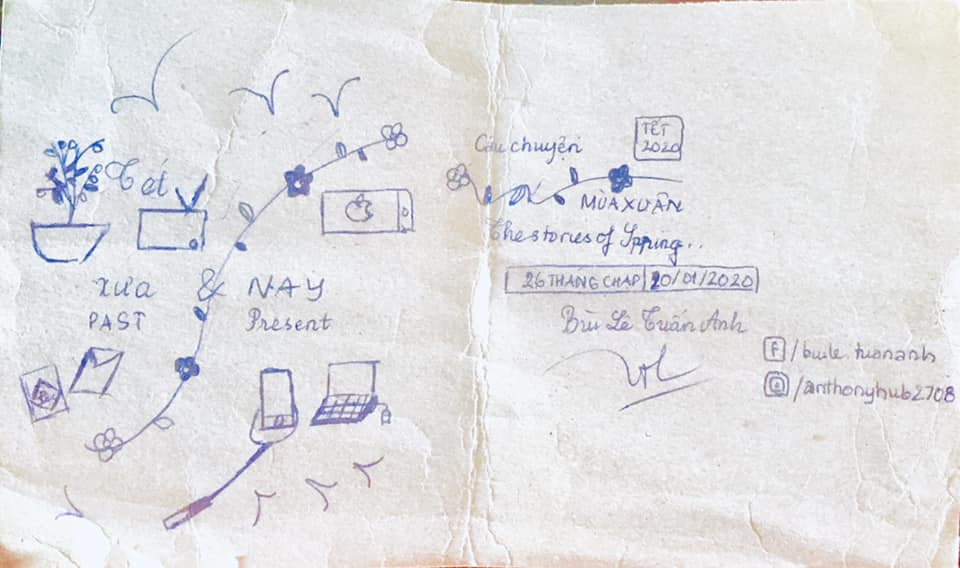

## Kỳ 6: TẾT XƯA VÀ NAY

📝 Tết xưa và nay có cái gì thú vị để mà tôi kể cho mọi người nghe??? Vậy mời mọi người hãy đọc kỹ bài này để hiểu tại sao tôi lại chọn nói về cái này.

🎍 Tết xưa có gì??? Nào là những ngày trước Tết háo hức được sắm sửa quần áo mới, được quây quần bên nhau cùng nấu bánh chưng, bánh tét, cùng dọn dẹp phòng ốc, được khiêng mấy chậu hoa vào nhà để trang trí cho căn nhà và cùng ngắm pháo hoa rực sáng cả bầu trời trong đêm giao thừa kì diệu. Những ngày đầu năm được đi chúc Tết, được nhận lì xì, được đi chơi với họ hàng, được ăn những món ăn quen thuộc của ngày Tết. Đó là những thứ gọi là Tết xưa.

🎆 Còn Tết nay có gì? Đi chơi với bạn bè, gặp gỡ những thầy cô (những phong tục mà mấy năm gần đây mới có dịp trở lại), ngày ngày check in trên smartphone, khoe lì xì, đi hát karaoke, uống trà sữa, v.v... Nghe đúng chất hiện đại nhỉ 😂

✅ Nhiều người hỏi tại sao Tết nay lại nhạt hơn những cái Tết xưa, nhưng với tôi, Tết không phải nhạt dần đi, mà chính ta đã thay đổi dần qua năm tháng. Thời đại mới, ai ai cũng có bên cạnh một chiếc điện thoại thông minh, luôn có sẵn kết nối Internet để chia sẻ những khoảnh khắc đẹp nhất của Tết lên các mạng xã hội như Facebook hay Instagram. Nhưng họ quên mất rằng, giá trị của Tết không nằm ở những thứ này, mà thực ra, nó nằm ở sự đoàn viên, sum vầy. Và cũng xin đừng hỏi tại sao tôi lại nói vậy - hãy tự ngẫm lại chính mình xem, bạn dành bao nhiêu thời gian cho gia đình bạn? Liệu thời gian dành cho những thứ vô bổ có nhiều hơn cho những người thân trong gia đình bạn hay không???

🏡 Tôi sẽ không viết quá nhiều như bài #5 trong SERIES TẾT 2020 này. Tôi muốn mỗi người sau khi đọc xong những dòng này sẽ có thể đưa ra cho mình một lựa chọn phù hợp nhất về việc cần làm cho bản thân trong dịp Tết này.

👉 Bởi: Giữ Tết truyền thống - Sống Tết hiện đại mới chính là những thứ làm nên ngày Tết Việt Nam trong thời đại mới. 🇻🇳

👋 Trân trọng cảm ơn và kính chào.
