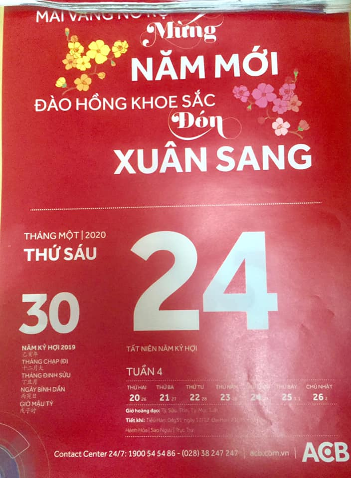

## Kỳ 7: GIAO THỪA

"🎆 Tết - Điều tuyệt vời mỗi năm chỉ đến một lần. Và Giao thừa là khoảnh khắc thiêng liêng, ý nghĩa của mỗi người sau cả một năm nhiều lo toan, bận rộn..."

📚 Nhìn lại năm Kỷ Hợi nhiều chuyện vui nhưng cũng không ít chuyện buồn vừa qua, tôi nhận thấy bản thân mình đã thay đổi. Tôi đã thật sự trở thành một con người bản lĩnh hơn, điềm tĩnh hơn so với trước kia. Để giờ đây, tôi lại được trở về bên gia đình, bên bạn bè, bên những đứa hậu bối thân thương của #HLK với một diện mạo tuy cũ mà mới, được nhiều người quý mến hơn. Tôi cảm thấy đó là thành công lớn nhất trong cuộc đời mình.

🏆 Dẫu còn đó bao nhiêu những khó khăn trên con đường học vấn và công danh của mình trong tương lai, nhưng với tôi, Tết chính là dịp để tôi có thể lấy lại nguồn năng lượng, lấy lại nguồn cảm hứng để chinh phục những thành công mới trong cuộc sống.

🎋 Có thể năm nay không phải là may mắn với tôi, hay với một số người, nhưng tôi hy vọng rằng: Dù bạn là ai, dù bạn ở đâu thì Tết này, mọi thứ sẽ hồi sinh. Năm mới đến, hạnh phúc đến, bình an đến, thành công đến và may mắn cũng sẽ đến.

🎉 Hãy nhanh chân chạy trở về nhà, quẳng gánh lo đi và vừa ăn Tết, vừa nạp lại sinh lực cho năm mới nhé! 😊

🎍 Xin được phép kết thúc bài viết này bằng một câu dẫn mà tôi rất tâm đắc của nhà báo Quang Minh trong chương trình "Tết nghĩa là hy vọng" (2018 - VTV) để nói về ý nghĩa của những chuyến trở về mùa xuân:

"... Gắn kết các thế hệ lại gần nhau hơn, và lan tỏa những giá trị truyền thống của ngày Tết. Bởi Tết là để yêu thương, Tết là để sum vầy, Tết là để trở về và Tết nghĩa là hy vọng... "
