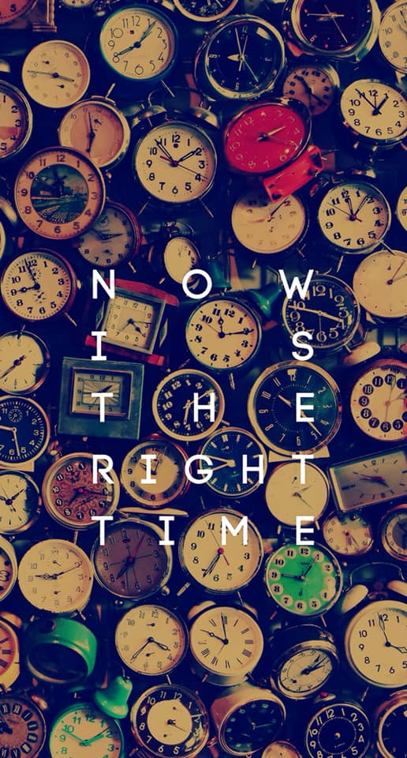

## KỲ 13: KHÔNG ĐỀ

📝 Bài viết hôm nay sẽ không có nhiều nội dung như trước, vì trong cái tình hình mà ai cũng đang lo cho cái lịch nghỉ được kéo dài để phòng virus Corona thì chắc bài này sẽ lại flop, thậm chí còn tệ hơn các bài trước nữa. Nhưng vì không thể để trễ thời gian nên vẫn phải viết, để không người ta hỏi tại sao mình tới phút chót cũng lười biếng, kì lắm 😂

🗓 Mùng 7 rồi, ăn Tết cũng đã rồi nên quăng cái hình này để báo hiệu rằng: Đã đến lúc quay trở lại với guồng quay công việc, học tập rồi. Dù sớm, dù muộn thì cũng có một số lời khuyên: Rất mong mọi người hãy giữ gìn sức khỏe, cố gắng thu xếp một cách ổn thỏa tất cả mọi chuyện trước khi trở lại nhé. Đừng quên cập nhật thông tin về dịch bệnh, cũng như có những biện pháp phòng chống cần thiết cho bản thân và những người xung quanh.

👋 Hôm nay viết nhiêu đó thôi, ngày mai sẽ lên bài cuối cùng. Còn bây giờ, tôi lại phải chờ dời lịch học Quân sự từ Trường ĐH, thấy người ta được nghỉ mà phát ham 😢
