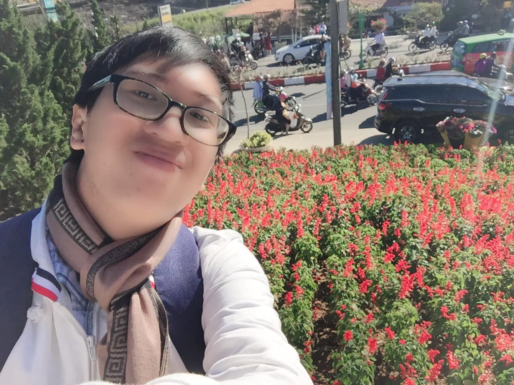

## Kỳ 2: THÁNG 01 - CÒN CHÚT GÌ ĐỂ NHỚ...

📆 Hôm nay lại nổi hứng viết vài dòng. Và tấm hình này cộng với cụm từ chủ đề bài viết hiện ra gần như cùng lúc trong đầu tôi..

😕 Cũng lạ, ngày trước tôi cười cũng nhiều lắm, nhưng nhiều người bảo tôi khó vì ít thấy tôi cười. Còn bây giờ, chả khác lắm, chỉ khác ở chỗ số người thấy tôi cười ít lại. Giữa hàng vạn con người lướt qua trong cuộc đời, có mấy ai chịu dừng lại để nhìn thấy nụ cười ấy...

🍀 Xã hội này thay đổi hay chính bản thân mình đang thay đổi? Chắc là cả hai. Đôi lúc cũng đăm chiêu, suy nghĩ xem mình là ai, mình đang đứng ở đâu trong thế giới này. Và tôi chọn cách sống riêng biệt cho mình mà nhiều người nghe xong có thể sẽ bất ngờ: Sống cho mình, nhưng sống vì người khác...

🏡 Chúng ta định đoạt cuộc sống của chính mình, nhưng chúng ta sẽ cống hiến cuộc đời này cho những người mà chúng ta yêu thương...

✅ Chấp nhận buông xuống những mối quan hệ không còn quá quan trọng nữa và kiếm tìm những mối quan hệ mới, những người dù có nói thẳng, nghe không xuôi tai với mình nhưng ít nhất vẫn là những người có tâm...

📚 Học cách chấp nhận sự thật rằng: Nếu bạn không phải là người nổi tiếng, bạn sẽ đôi lúc cô đơn trên con đường đi tìm lẽ sống của chính mình. Và chỉ cần vượt qua những sự cô đơn ấy, tin chắc rằng bạn sẽ trưởng thành hơn rất nhiều...

📸 Cũng như lúc chụp hình, cho dù dòng xe kia có đi nhanh hay đi chậm, điều quan trọng nhất vẫn là dám bước sang bên kia đường, cầm chiếc điện thoại lên và thu hết tất cả mọi cảm xúc vào trong một tấm hình như thế này. Rồi sau đó lại lưu nó làm kỉ niệm, để sau này còn chia sẻ lại với những người khác...

😊 Nụ cười này vẫn sẽ hiện diện ở đây, như một minh chứng cho sự lạc quan của mình, chờ được mọi người nhìn thấy. Rồi ngày mai sẽ lại là một ngày mới, gặp gỡ những con người mới và sẵn sàng đón đợi những câu chuyện mới, cho ta thêm những bài học về cuộc đời này...

❤️ Cảm ơn mọi người đã đến với tôi - dù ở bất cứ vị trí nào - bạn bè hay người thân, người lạ hay người quen...

🖊 Và cảm ơn vì đã đọc hết cái mớ bòng bong tâm trạng này của tôi. Tết này về sẽ kiếm tìm một ai đó để giải bày tâm sự - còn về việc ai đó là ai thì xin mọi người tự đoán nhé 😂

🛵 Sau ngày Thứ sáu, 05/02/2021 (24 tháng Chạp - Canh Tý), chuyến hành trình bằng xe máy về nhà ăn Tết sẽ bắt đầu (hiện vẫn đang thiếu người ngồi yên sau 😂). Và sau đó thì sẽ tăng thời lượng viết bài lên, xin hẹn mọi người sau nhé. Lạng quạng năm nay lại có thêm màn trực tiếp pháo hoa 🎆 nữa đấy 😂

Còn bây giờ, tôi đi ngủ, sáng mai còn thi Cấu trúc dữ liệu & Giải thuật nữa, ôi thật mệt mỏi 😂

Hình chụp ở đâu tự mò, bài viết từ Tp. HCM 😂
