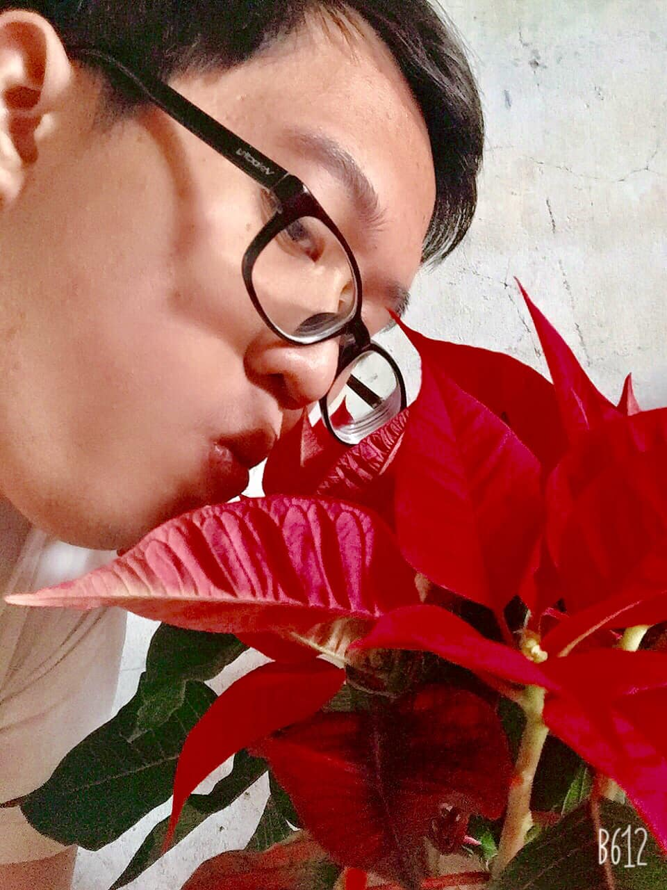

## Kỳ 3: Khát vọng mùa xuân (Phiên bản 2021)

📚 Nhanh nhỉ, 1 tuần nữa là năm mới gõ cửa từng nhà rồi. Hòa trong những dòng cảm xúc đặc biệt của đất trời, tôi mới lại có dịp được viết nên những lời chia sẻ thật nhất của mình...

### Những ngày không bình thường

📆 Ba ngày qua là ba ngày rất "không bình thường". Mọi chuyện lại thay đổi theo hướng mà mình không ngờ tới. Nhưng cũng chính vì những sự thay đổi ấy mà mình trưởng thành hơn qua từng ngày...

😌 Năm Canh Tý dạy ta phải điềm tĩnh hơn, hiểu chuyện hơn, quan tâm mọi người xung quanh hơn. Được hiểu cảm giác "bị thử thách cao độ" là như thế nào. Bình thường thì mọi người sẽ thấy tôi đẩy lên Facebook 💻 rất nhiều thứ, nhưng đó không phải là câu chuyện của những ngày vừa qua (dù stories vẫn có tin về COVID-19) và chắc chắn là cả sau này nữa...

🌿 Năm Canh Tý dạy ta cách tiết chế cảm xúc hơn, chấp nhận sự khác biệt để hòa hợp tốt hơn. Luôn hướng đến tương lai với một cái nhìn khách quan nhưng lạc quan nhất. Luôn phải sẵn sàng để đương đầu với khó khăn, để tạo chỗ dựa tinh thần vững chắc cho những người mình thương 😚. Có lẽ, đôi khi ít nói đi một chút lại giúp mình nhiều điều...

### Khát vọng năm mới

🌺 Rồi một năm Tân Sửu sẽ đến, biến động chắc chắn sẽ có, nhưng tôi tin chắc sẽ tốt hơn năm qua: Một sự nghiệp học hành 🏫 ổn định, một công việc "tay trái" sắp khởi động ✅, một nguồn động lực "siêu to khổng lồ" từ những người thân 🏡 và hơn hết là có một điểm tựa, mối quan hệ vô cùng đặc biệt (viết cụm từ này là đủ rồi 😂) để mình gìn giữ lấy ❤️. Tôi tin chắc rằng, 2021 - Tân Sửu sẽ là năm chuyển tiếp và khởi đầu của những điều mới mẻ hơn, cho tôi và cho tất cả chúng ta. Và tin tôi đi, tôi không đùa đâu 🎉

### Lời chào tạm biệt

🌸 "Tạm biệt Canh Tý, chúng tôi phải rời đi rồi...". Riêng tôi phải cảm ơn cậu rất nhiều, vì cho dù tính cách của cậu khó chịu thật, nhưng cậu đã đưa tôi đến gặp những con người rất tuyệt vời, cho tôi một niềm tin rằng trên đời này luôn có người để mình có thể yêu thương, trân trọng và bảo vệ hết mình. Năm nay có luôn một người rất đặc biệt xuất hiện nữa, siêu cảm ơn cậu luôn 🥰. Tôi sẽ đi gặp cậu bạn Tân Sửu với một phiên bản mới, một Tuấn Anh thành công hơn đây, cậu yên tâm nhé. Chào cậu.

Cũng chúc mọi người một năm mới hoàn thành hết những mục tiêu của mình và hẹn gặp lại trong những bài viết đặc biệt vào cuối năm nhé 😊

P/s: Xin đừng để ý tới cặp mắt lỗi toàn tập của tôi, cây Trạng nguyên - Biểu tượng của sự thành công đã về tới nhà ăn Tết cùng tôi rồi 😂
