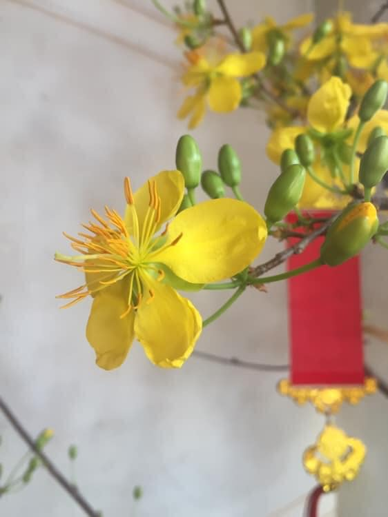

## Kỳ 4: 29 Tết - GỬI CHÚT HY VỌNG CHO NĂM MỚI

🕰 Tết - điều tuyệt vời mỗi năm chỉ đến một lần. Và chỉ còn khoảng chưa đầy 30 tiếng đồng hồ nữa thôi, năm Tân Sửu sẽ bắt đầu. Đáng lẽ ra là sẽ có một bài tổng kết, nhưng mà do tháng 12 đã viết rồi nên là thôi, hôm nay sẽ chia sẻ những dự tính mới toanh cho năm mới 🎍 đi, cho nó lạc quan xíu nè 😊.

### Wishlist cho năm mới

Có mấy điều này cũng chỉ mong muốn cho năm mới tôi sẽ làm được thôi:

1️⃣. Sức khỏe sẽ ổn định hơn trong năm mới cho mình và mọi người, dịch bệnh sẽ bị đẩy lùi, để tôi có thể được gặp mặt những người mình yêu quý: từ người thân trong nhà 🏡 ra đến ngoài ngõ, từ bạn bè cũ, "người ấy" của tôi ❤️ cho đến hậu bối thân thương ở #HLK nè 🏫.

2️⃣. Chắc chắn rồi, sẽ có thể cải thiện bảng điểm Đại học của mình 📚. Đến lúc bật dậy sau bão tố và chiến đấu cho tương lai rồi. Mục tiêu săn học bổng 📜 (kể cả cấp trường lẫn ra nước ngoài) sẽ phải "kích hoạt" lại rồi. 😂

3️⃣. ✏️ Thi IELTS/GMAT. Tôi nói thiệt chứ cái đà này thì chắc là phải chuẩn bị tinh thần cho trạng thái "bình thường mới" rồi. Vừa thi vừa đeo khẩu trang, gặp trong phòng có máy lạnh nữa thì chắc lúc lo lắng sẽ thở đến phát hờn luôn quá 😂. Còn ai thắc mắc GMAT 📕 là gì thì xin mời tra Google, cái này chắc phải thi sớm để phòng thân với chuẩn bị cho cái mục tiêu 2️⃣ kia thôi.

4️⃣. Chạy 1-2 công việc bán thời gian 📆 mới, có thể liên quan đến IT + Tiếng Anh. Từng nghe mấy cái vụ phải xuống tiền cả triệu cho mấy cái thứ không dùng đến nên tôi cũng hơi xót, phải ra tay. Nếu ai có vấn đề về phần mềm máy tính 💻, cần xử lý (ví dụ như cài lại hệ điều hành chẳng hạn), qua Tết 🎋 có thể liên hệ tôi, khi làm thì có thể thu phí nho nhỏ tùy theo nhưng mà mọi người yên tâm về chất lượng ✅ nhé, đảm bảo máy tính sẽ chạy ngon, có thể không mất dữ liệu quan trọng 🗂 luôn đấy. Nhìn cái máy hơn 10 năm 🖥 của chị tôi hồi sinh lại cũng đủ hiểu khả năng của tôi rồi 😂

5️⃣. Kích hoạt lại dự án cho mấy đứa nhỏ. Trong đầu đang ấp ủ một dự án về một cuộc thi được tổ chức chính quy để "chọn mặt gửi vàng" 🏅(nói tới đây mọi người có thể đoán mò 😂) thay thế cho việc chọn lựa bình thường. Nếu được thì hy vọng sẽ nhận được hỗ trợ về mặt hồ sơ công văn 📋 này nọ. Cam đoan nếu chạy được dự án này sẽ là một cú hích, hút người xem với thể thức thi đấu hấp dẫn lắm đấy 🎉.

6️⃣. Thay đổi bản thân theo hướng hoàn thiện hơn, bớt xấu tính lại. Sớm khôi phục lại những mối quan hệ gặp vấn đề trước đây, để gặp nhau đỡ khó khăn hơn, còn những mối quan hệ đang có sẽ ngày càng phát triển tốt hơn qua từng ngày 🥰.

### Lời chào đặc biệt

🍀 Đó là những thứ sẽ làm nên năm 2021 - Tân Sửu của tôi, hy vọng sẽ thực hiện hết những điều này. Cũng mong nhận được sự giúp đỡ của mọi người trong năm mới, để Tuấn Anh này sẽ trở thành một phiên bản tốt hơn qua từng ngày 🎇.

Cảm ơn tất cả mọi người, vì năm 2020 đầy ý nghĩa. Xin chúc đất nước một 2021 bình an, mọi người khỏe mạnh, thành công và may mắn. Hẹn mọi người trong đêm Giao thừa 🎊. Không pháo hoa 🎆 nhưng sẽ có nhiều điều để kể. Tạm biệt nhé 👋.

🖼 Ảnh cũ nhưng giữ lại dùng. Ngày mai có hình mới toanh đăng riêng luôn 😂.
