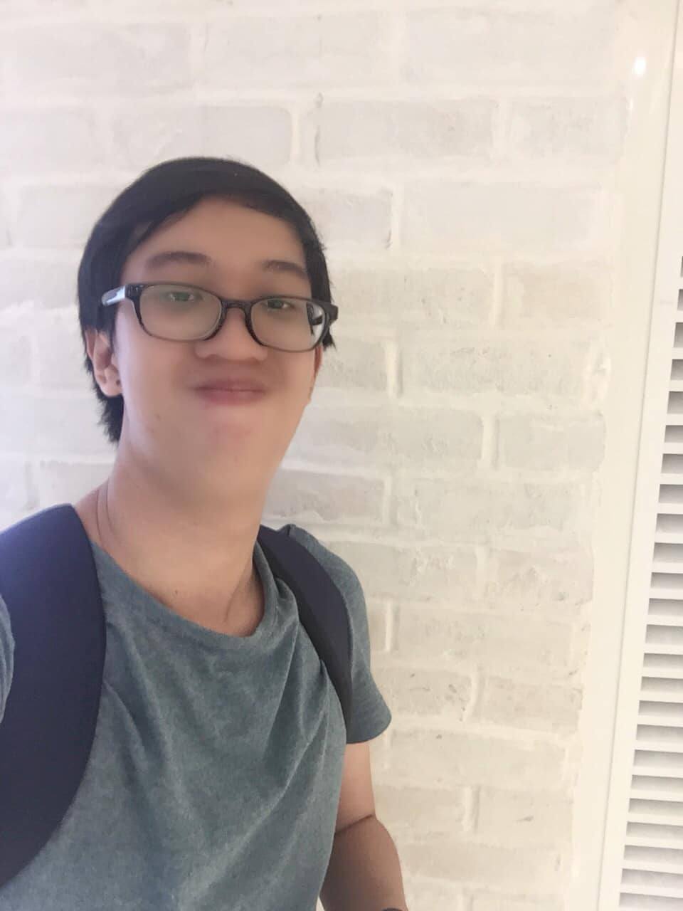

## THÁNG 3 - CÓ ĐÔI LẦN...

Có đôi lần, bạn từng hỏi bản thân những câu như: Bạn là ai?, Bạn đang làm gì cho cuộc đời của mình?, Bạn có đang chọn đúng con đường mà mình đi???, vân vân..., rất nhiều câu hỏi khiến chúng ta trăn trở không biết làm sao có thể giải đáp trong ngày một, ngày hai... 📆

Cho đến khi những vấn đề phát sinh trong cuộc sống vượt quá khả năng giải quyết của mình, ta mới bắt đầu thấm thía đáp án cho những thứ ở trên kia. 📚 Nghe có vẻ khá là trừu tượng, nhưng cũng phải nói thật, khi mỗi con người có một khối óc riêng biệt, một trái tim riêng biệt thì tính cách và cảm xúc của mỗi người cũng trở nên khác biệt, người thế này người thế kia...

...

Có đôi lần, bạn yêu một người, yêu rất da diết nhưng chưa dám nói ra vì sợ mất đi những mối quan hệ đang rất tốt đẹp hay không???... 😐

Có đôi lần, bạn cảm thấy hối hận khi chấm dứt một mối quan hệ mà trước đó các bên đều cố gắng níu giữ cho đến những phút giây cuối cùng, và bạn vẫn còn nhung nhớ những thứ quan hệ kia hay không???... 😞

Có đôi lần, khối óc và trái tim của bạn lại trở nên mâu thuẫn với nhau trong những thứ cảm xúc hỗn độn không thể tả nổi, để rồi chính sự mâu thuẫn kia như dày vò cái tâm trí của bạn trong suốt thời gian dài hay không???... 💔

Thứ cảm xúc không thể nói ra kia, ai trải qua rồi đều sẽ thấm 🥺. Thấm rồi thì sẽ đau, mà đã đau rồi thì sẽ tổn thương. Tổn thương có thể tự chữa lành ✅, cũng có thể tạo thành vết sẹo trong lòng ❌, cũng tùy thuộc mỗi người. Mà cũng lạ, cách tốt nhất để chữa lành vết thương lại chính là quay ngược lại thời điểm trước khi tổn thương xuất hiện, vốn chỉ xảy ra trong thế giới có "Cỗ máy thời gian" của Doraemon mà thôi... 😔

Chọn 3 từ này cũng là cách tôi bắt đầu chùm bài từ tháng 3. Đôi lần đặt hàng loạt những câu hỏi và tự đi tìm cho bản thân những câu trả lời cho những câu hỏi là cách tôi khởi động một ngày mới. 😕 Nghe hơi quái dị nhỉ??? Nhưng đây là cách tôi tự hoàn thiện mình. 🥰 Dù có người yêu hay không. 🏡 Dù có ai bên cạnh hay không. Dù có người quan tâm nhắn tin 💬 hỏi han mình hay không. Và điều ấy vẫn sẽ tiếp tục, nhẹ nhàng và điềm tĩnh, như cách mà mỗi buổi sáng mở mắt dậy, vươn vai vài cái để bản thân thật khỏe hơn. Để một ngày nào đó, cuộc hành trình đi tìm hạnh phúc sẽ kết thúc có hậu. Nhất định sẽ thành công... ☺️

Chờ nhé... Thương thương ❤

🖼: Chút hình cũ những ngày chưa có COVID, còn vui lắm. Bây giờ thì vừa buồn vừa nhớ...
