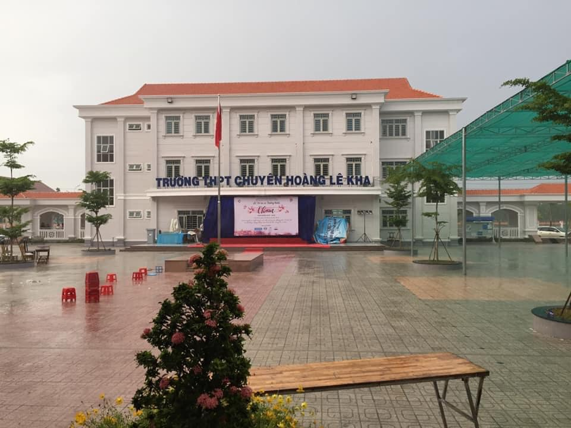

## 🌅 THÁNG 5 - MÙA HÈ, MÙA CHIA TAY... 💔

Tôi viết những dòng này, hai năm sau cái buổi lễ ấy, kể lại những điều chưa từng kể,
về sự thay đổi so với hai năm trước...

### 3 mùa tri ân

📆 Năm 2019, một Lễ Tri ân - Trưởng thành được tổ chức vào giữa tháng 05, dưới cơn mưa 🌧 xối xả, nhưng chừng ấy là đủ cho một buổi chiều đầy kỷ niệm với một tấm hình 🖼 để đời ở dưới. Lần đó là lần duy nhất tôi thắt cà vạt 👔, và cũng là lần gần nhất được ngắm nhìn những tà áo dài trắng của những cô bạn thân, tính cho đến thời điểm hiện tại. Cảm xúc phải nén lại đến tột cùng, để buổi chiều hôm ấy mình không khóc 😢: mọi người quen nhìn tôi với hình ảnh một chàng trai nghiêm nghị, nhưng ít ai biết đến những phút yếu lòng mà tôi giấu đi khi ở một mình...

🎉 Năm 2020, một Lễ Tri ân - Trưởng thành khác được tổ chức, lần này bị hoãn đến đâu đó khoảng tháng 6. Khác một chút là cái nắng cháy da 🔥 của mảnh đất Tây Ninh đã giúp cho sự kiện diễn ra khá trơn tru và để lại nhiều ấn tượng 🍀...

🕖 Bây giờ là năm 2021. Mọi chuyện đã khác. Dịch bệnh bùng phát trở lại - ngay đầu tháng 05 - với hai chủng biến thể lây lan siêu nhanh của virus. Toàn bộ sự kiện bị hủy bỏ hoặc hoãn vô thời hạn ❌. Mà đối với tụi nhỏ, hoãn vô thời hạn chẳng khác gì việc hủy bỏ. Ngày chia tay vì lẽ đó cũng không còn trọn vẹn 🥺...

### Những nuối tiếc còn mãi

Hỏi rằng tiếc không???...

✅ Tiếc. Tiếc chứ...

🎍Năm 2019, không tham dự trọn vẹn đã là một sự tiếc nuối với bản thân rồi. Nhưng ít ra tôi vẫn may mắn khi có mặt được ở phần đầu...

🏡 Năm 2021, thậm chí khóa này còn không được tham gia một buổi lễ ý nghĩa...

Mùa hè về, ai cũng mang trong mình một nỗi niềm... 😕

Một mình dạo bước vào một ngày nắng, trên con đường dẫn vào KTX 🏢 nơi tôi tạm trú trước khi đại dịch ập tới, thấp thoáng bóng phượng đỏ tìm về. Tiếng ve cũng kêu vang khắp một khoảng không gian rộng lớn. Tôi chợt nhận ra, mùa chia tay đã đến... 🏫

### Những nỗi buồn khó phai

Mùa chia tay năm nay sẽ không vui vẻ lắm đâu. Giãn cách mà. Nhưng hy vọng tất cả sẽ trân trọng những giây phút, những khoảnh khắc cuối cùng bên nhau ở cấp 3. Bởi lẽ:

"Khi ai đó hỏi tôi về những khoảng thời gian đẹp nhất cuộc đời, tôi sẽ chọn cấp 3. Không có quá nhiều lo toan như khi lên ĐH. Không có quá nhiều sự ngây ngô như hồi nhỏ. Được làm người lớn, được học hết mình 📚, chơi hết mình 🏐, yêu hết mình ❤ và sống hết mình với đam mê. Chừng ấy là đủ cho những tháng năm rực rỡ nhất của tuổi trẻ, mà chắc chắn sẽ không thể có lần thứ hai..."

### Khát vọng bình an

Gửi những cánh chim sắp rời tổ...
Gửi lại tất cả của những năm về sau...

Bỏ lại lo âu, và bước tiếp nhé... 😊
Tạm biệt mọi người. Tháng sau hy vọng sẽ không quá bận rộn, để viết lại cho nó hay hơn. Hẹn gặp lại sau 👋
