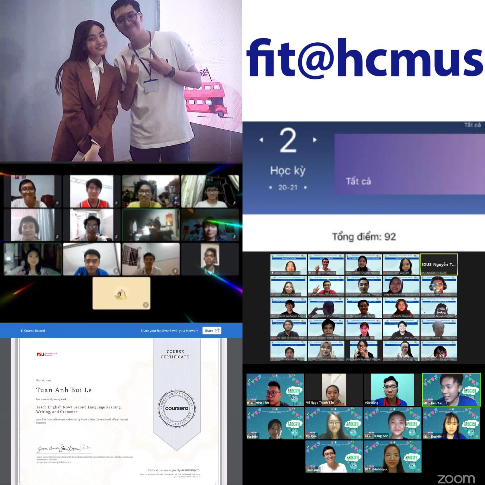

## Kỳ 1: Recap 2021 ⏪

Cuối cùng thì ngày này cũng tới, ngày cuối năm. Hôm nay được dịp rảnh rỗi, tôi quyết định nhìn lại một năm "đầy bão" của bản thân mình với tấm ảnh ghép này. Tôi chia ra làm nhiều cụm cho nó dễ đọc.

### Cụm học tập - rèn luyện

- Lần đầu tiên trong thời sinh viên, con điểm rèn luyện của chính mình lên được mức 9️⃣2️⃣/💯 - Xuất sắc (chắc sau này sẽ khó lên lại lắm đây, vì bận học dữ lắm 😂).

- Ngoài ra, sau tất cả, cuối cùng thì mình cũng vào được chuyên ngành mà mình yêu thích: Mạng máy tính 💻. Giờ dù có trầy trật với deadlines vẫn thấy nó phê 😂

### Cụm IDUS/Ban Quốc tế HSV 🌏

Tôi phải tạo riêng cụm này, vì nó có chuyện để kể:

- Đầu tiên là màn chạy event đến bầm tím cả chân của tôi tại GED và Roadshow, kết quả là sau đó được chụp hình 📸 với idol của mình, ui nó sướng 😂

- Sau đó là màn dẫn MC 🎤 ké làm delay 🕰 quá độ (xin lỗi 🥺), nhưng mà cuối cùng cũng có báo 📰 cho mọi người xem 😂

### Cụm Đoàn thanh niên

- Đầu tiên là Mùa hè xanh🎍, mùa hè của những ngày code khá sấp mặt (dù chưa xong hoàn chỉnh nhưng ít ra cũng vui 🤣)

- Sau đó là màn ra mắt trong đội hình Ban Phong trào - Học tập với chương trình trò chơi truyền hình trực tiếp 📺 đầu tiên của riêng mình (sắp hết đình công rồi 😂)

### Cá nhân

Sau 1 năm đầy khổ sở vì dịch COVID-19 thì tôi quyết định học TESOL, mục tiêu sau này sẽ có nghề tay trái là đi dạy Anh văn. Cuối cùng thì đạt 5️⃣/8️⃣chứng chỉ. Hooray 🎉

### Wishlist

Wishlist của năm sau chắc sẽ thế này:

✅ Kiếm việc làm (tôi không muốn bị thất nghiệp đâu 😂)

✅ Thi IELTS và TT (IELTS bị delay 2 năm rồi, còn TT đang kiếm thêm đồng đội để chiến đấu 🍀)

✅ Hoàn tất TESOL (cái này thì cố mà đăng ký ít môn lại 🏫)

✅ Tốt nghiệp (chắc ráng sắp xếp lại để còn chạy tiến độ thôi 😂)

✅ Qua môn và bình yên về mọi mặt. Hy vọng sớm ngày gặp lại mọi người trực tiếp (cơ mà đang có Omicron nên giờ cũng khá căng...)

### Tổng kết

Hết phần recap. Một lần nữa, chân thành cảm ơn tất cả mọi người đã giúp đỡ để tôi có thể vượt qua năm 2️⃣0️⃣2️⃣1️⃣ đầy khó khăn này. Hy vọng năm 2️⃣0️⃣2️⃣2️⃣, tất cả chúng ta sẽ có nhiều sức khỏe và thành công. Rồi chúng ta sẽ lại được gặp nhau ở bên ngoài, chứ không phải qua những chiếc màn hình vô tri vô giác 🖥 nữa.

🏡 2️⃣0️⃣2️⃣1️⃣, một năm đầy khổ nhọc đã sắp kết thúc. Chúng ta chia tay nhau từ đây. Chào từ biệt 2️⃣0️⃣2️⃣1️⃣, và xin chào 2️⃣0️⃣2️⃣2️⃣ (đừng biến 2️⃣0️⃣2️⃣2️⃣ thành 2️⃣0️⃣2️⃣0️⃣ + 2️⃣, là toang nhé 😂)

🌸 Câu chuyện mùa xuân 2️⃣0️⃣2️⃣2️⃣/2️⃣3️⃣ 🌼 - Kỳ 2️⃣ sẽ lên sóng trong vài ngày nữa. Goodbye mọi người, tôi đi làm đồ án tiếp 😂
