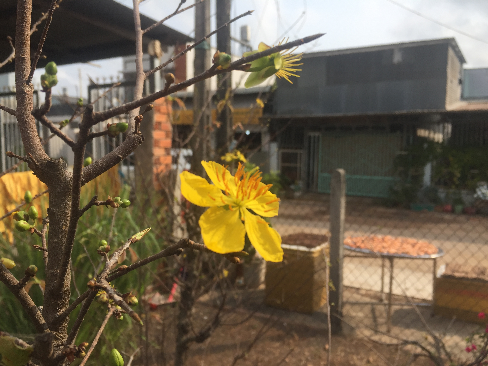

## Kỳ 2: Mùa đoàn tụ 🏡

🎍Tết - Điều tuyệt vời mỗi năm chỉ đến một lần. 🎆 Và Giao thừa chính là khoảnh khắc thiêng liêng, ý nghĩa nhất của mỗi người, sau cả một năm dài làm việc vất vả...

Năm Tân Sửu đã sắp trôi qua với biết bao nhiêu khó khăn, thách thức nhưng ẩn chứa rất nhiều cơ hội. Giờ đây, những chuyến xe 🚍, chuyến tàu 🚞, chuyến bay 🛫 chở những người con xa quê đã bắt đầu xuất phát đến khắp mọi miền đất nước, mang theo niềm hy vọng về một năm mới bình an, hạnh phúc đến với mọi người, mọi nhà...

Những cánh hoa mai 🌼, hoa đào 🌸 hay những loài hoa khác đang đua nhau khoe sắc. Những hương thơm của những món ăn Tết cũng bắt đầu len lỏi vào từng góc nhà. Những cánh én cũng bắt đầu xuất hiện, mang đến hình ảnh của một mùa xuân - mùa của sự khởi sinh...

❤️ Trong những giây phút cuối cùng của năm Sửu, một lần nữa, tôi xin cảm ơn tất cả mọi người, từ gia đình, bạn bè đến những người xa lạ. Cảm ơn vì đã không ngừng cố gắng, nỗ lực để giờ đây cùng hướng đến một cái Tết thật nhiều hứng khởi...

Cảm ơn những y bác sĩ 👨‍⚕️ ở tuyến đầu, cảm ơn các chiến sĩ 👮 đã không quản ngại gian khổ, ngày đêm túc trực để đảm bảo bình yên cho cuộc sống này. Tôi mong tất cả có một cái Tết thật trọn vẹn...

Vẫn còn đó rất nhiều người không biết khi nào mới có thể về nhà 🏠. Cũng có hàng nghìn người khác đã vĩnh viễn ra đi và không thể đón Tết 🎋 cùng chúng ta. Nhưng guồng quay của thời gian vẫn tiếp tục, dù có gì xảy ra chỉ mong tất cả được an nhiên...

Chào tạm biệt năm Sửu 🐃 , một năm đầy những cảm xúc đặc biệt. Đón chào năm Dần, năm Nhâm Dần, với sức mạnh của một chú hổ 🐯, mang sinh khí và sự phồn thịnh cho đất nước và mọi gia đình Việt Nam 🇻🇳...

Chúc tất cả một năm đại thắng... Xin hẹn gặp lại mọi người vào năm Nhâm Dần. 🎉

🎇 Chúc mừng năm mới 🎆
