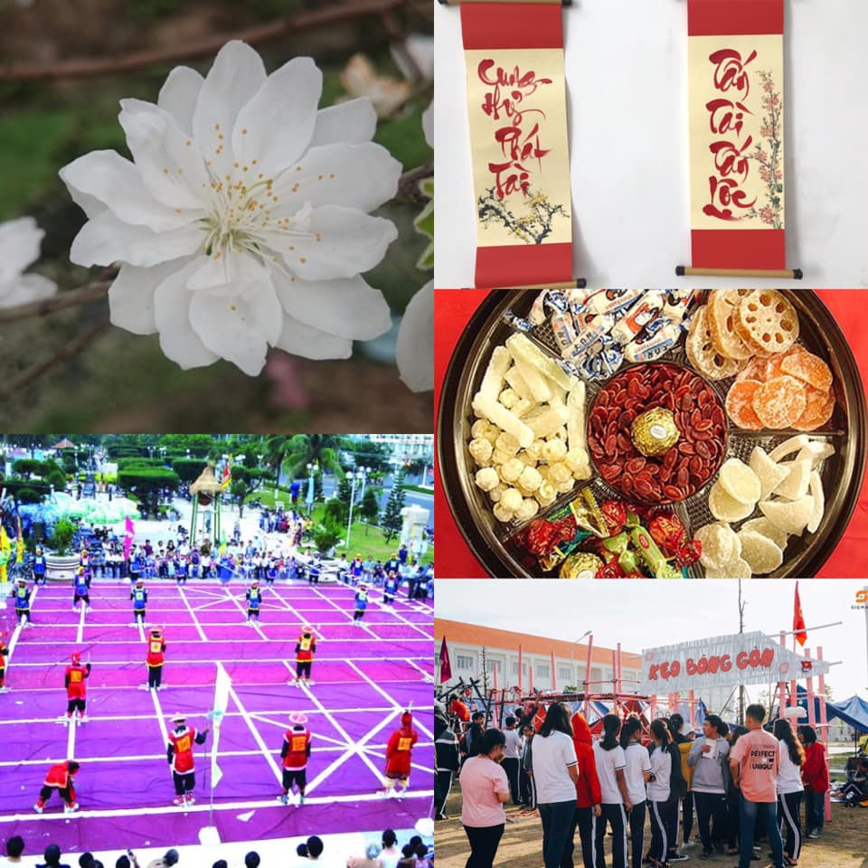

## Kỳ 2 - 🏵 NHỮNG ĐIỀU THÚ VỊ VỀ PHONG TỤC ĐÓN TẾT TRÊN KHẮP ĐẤT NƯỚC 🌸

🏡 Ngày hôm nay, thoát khỏi những chuyện mang tính cá nhân, không thu hút gì mấy thì xin mời các bạn cùng nghe tôi kể về những phong tục tập quán đón Tết trên khắp ba miền đất nước Việt Nam ta nhé.

✅ Đầu tiên là hoa Tết. Bình thường người người nhà nhà sẽ đặt chậu hoa đào 🌸 (đối với miền Bắc) hoặc hoa mai 🌼 (đối với miền Nam) để trang trí trong nhà. Nhưng ít ai biết rằng, ngoài hai thứ đó ra thì ở một số vùng miền núi Tây Bắc nước ta, có một loài hoa cũng khoe sắc đúng dịp Tết mà theo như cách gọi đúng là đào tuyết (hay đào trắng). Cánh hoa có màu trắng, khác hoàn toàn với đào hồng, và hiển nhiên khi khoe sắc thì đẹp chẳng kém gì đào hồng. Giá của nó??? Khá chát (theo các nhà vườn ở miền Bắc, cụ thể là ở Hà Nội (nơi đã nhân giống thành công) thì giá của mỗi chậu khoảng từ 800.000 đến 2.000.000đ tùy theo dáng cây - dáng càng đẹp càng đắt). Dù vậy nhưng trước vẻ đẹp của nó, bao nhiêu tiền cũng là đáng mà 😂

✅ Thứ hai là câu đối và tranh Tết. Câu đối thì khu nào cũng có, nhưng tranh thì miền Bắc treo nhiều hơn. Tục xin chữ đầu năm cũng bắt đầu từ những hoạt động như viết câu đối thế này. Các ông đồ thường hay ngồi ở Văn Miếu (Hà Nội) hay Phố ông đồ (tp. Hồ Chí Minh) để cho chữ đầu năm những vị khách thập phương, trong đó những năm gần đây có cả những ông đồ trẻ, với mong muốn gìn giữ những nét đẹp truyền thống của phong tục này. Đây là một điều rất đáng được trân trọng.

✅ Thứ ba là mâm ngũ quả và thức ăn ngày Tết. Gọi là mâm ngũ quả, bởi lẽ 5 loại quả tương ứng với ngũ hành (Kim, Mộc, Thủy, Hỏa, Thổ) và con số 5 (lẻ) tượng trưng cho sự sinh sôi, phát triển. Ở phía Bắc, mâm ngủ quả thường được chuẩn bị rất kĩ, mặc dù không quá khắt khe như ở trong Nam. Nói vậy chứ ở miền Nam, người ta chỉ kiêng những loại đắng cay hay có tên xấu thôi, ví dụ: Chuối (Ai mà muốn chúi nhủi cả năm 😂), Cam (Cam chịu?), Lê (Lê lết ư? Không thể nào 😂), Sầu riêng (Sầu trong sầu muộn, sống không có niềm vui), Bom (miền Bắc gọi là Táo, nó giống kiểu deadline dội bất ngờ từ trên xuống vậy đó 😂), Lựu (lựu đạn, ý nghĩa chả khác gì bom 😂).

Còn về đồ ăn 🍰 : Chắc chắn là thịt mỡ, dưa hành, canh khổ qua, củ kiệu, bánh tráng rồi... (hiển nhiên là còn nhiều lắm nhưng tôi là fan cứng của mấy món này 😂). Ở Quảng Nam thì có một món gọi là Bánh tổ Hội An, ở miền Bắc thì có thêm giò lụa (miền Nam gọi là chả lụa). Còn có bánh chưng, bánh tét, v.v... nữa (dịp này ăn dễ lên cân thấy mà sợ 😂). À quên, mứt, bánh kẹo ngọt 🍬 kìa (trời ơi, ăn xong chắc tắt thở luôn quá 😂).

✅ ❌ Thứ tư: Về phong tục tập quán khác: Nhiều điều để nói lắm: Cấm quét nhà, xông đất đúng tuổi, nhớ lễ chùa đầu năm, nhớ mua muối (Đầu năm mua muối, cuối năm mua vôi mà), nhớ khai bút đầu xuân (năm nào tôi chả làm chuyện này, vì nó đem lại may mắn 🍀 cho tôi mà 😂), kiêng xin lửa - nước, kiêng có tang, kiêng màu trắng-đen, kiêng chuyện buồn, kiêng nói to... (kể xong tôi tắt thở 😂). À, còn đó là những trò chơi dân gian ngày Tết mà hiện giờ cũng khá hiếm rồi. Ấy quên mất, có một điều quan trọng nữa: trả nợ cũ trước giao thừa 🎆. Ai lại muốn nợ từ năm này sang năm khác chứ??? Cũng đừng đi mượn tiền đầu năm nhé, kì lắm, kiêng luôn 😂

✅ Thứ năm, cũng là cuối cùng: Lễ hội. Lễ hội thì nhiều vô số kể, nhất là phía Bắc, cả trăm cái lễ hội lớn nhỏ. Trong Nam cũng có, nhưng không dày.

🎆 À, lại quên mất. Có một thứ mà nếu như không tham gia dịp cận Tết thì coi như Tết đó tui ăn uống không ngon lành gì đâu, đó chính là chùm hoạt động của #HLK_LNYCamping. Cái này thì chắc để trước khi diễn ra sự kiện năm nay tôi sẽ kể cho mọi người nghe (trước sau gì tần suất lên bài cũng sẽ được tăng cường sau bài viết này, bởi lẽ U23 Việt Nam 🇻🇳 cũng đang đá giải Châu Á mà 😂). Hi vọng mọi người sẽ tiếp tục đồng hành cùng chùm bài viết TẾT 2020.

👋 Còn bây giờ, trân trọng cảm ơn và kính chào.

🖼 Ảnh: Internet và Sigma Media Club - SMC.
