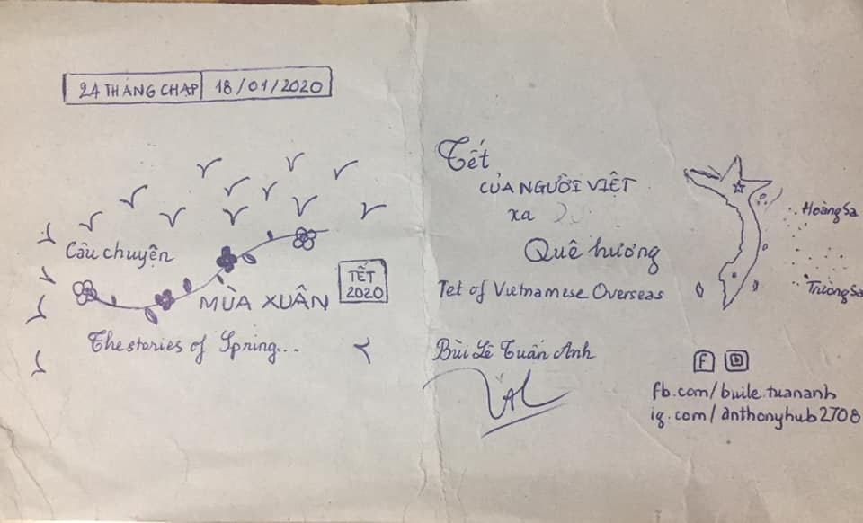

## Kỳ 5: TẾT CỦA NGƯỜI VIỆT Ở NƯỚC NGOÀI

🎆 Chắc hẳn ai cũng biết, Tết không chỉ được tổ chức bởi người Việt trong nước mà những người Việt ở nước ngoài cũng có cách hòa vào niềm vui đón Tết của riêng họ. Nhưng ít ai biết rằng, Tết ở nước ngoài nó buồn lắm...

🏡 Không được nghỉ như ở Việt Nam. Không có bánh chưng, bánh tét, mai, đào, phải nhờ chuyển từ trong nước sang hoặc tự làm bằng những thứ thay thế. Không thể đầy đủ những thành viên trong gia đình (ngoại trừ các gia đình định cư) và đặc biệt: Không thể cảm nhận được không khí như ở Việt Nam. Đó là cái thiệt thòi khi đón Tết xa Tổ Quốc...

📚 Có ai muốn đón Tết ở nước ngoài đâu. Nhưng vì công việc, vì du học hay vì những lý do khác nhau mà họ - những người Việt Nam đang sinh sống trên khắp thế giới - chọn ăn Tết xa quê hương. Đó là một lựa chọn mà ít ai dám đưa ra, và chúng ta cũng không thể trách họ vì đưa ra những quyết định như thế. Họ có cái lí của họ, nhưng cái giá phải trả cũng không hề ít. Họ đã chấp nhận ở lại, hi sinh thời khắc đoàn viên để kiếm tìm đồng ra đồng vào, kiếm tìm hai chữ "thành công". Ở chốn đất khách quê người, ăn Tết đơn giản chỉ là một buổi tối có thêm món thịt kho, khổ qua, trong nhà chưng thêm mai đào cho đẹp không gian. Thế là đủ...

✈ Cũng có nhiều người Việt chọn đi nước ngoài trước Tết, nhưng là sang du học/định cư chứ không phải đi du lịch. Họ chọn cách đón Tết ở nước ngoài, đón giao thừa trên máy bay. Và cảm giác khi pháo hoa rực sáng bên cạnh chiếc máy bay đang cất cánh ngay trong đêm vừa vui mà cũng vừa buồn làm sao...

🎋 Tết này, có nhiều người sẽ ăn Tết xa Tổ Quốc. Nhưng dù ở nơi đâu, dù làm việc gì thì tất cả đều cùng nhau chung tay gìn giữ những giá trị truyền thống của ngày Tết thông qua những hoạt động tuy đơn giản nhưng đậm đà bản sắc dân tộc. Bởi với bất cứ một người con đất Việt: Tết là để yêu thương, Tết là để sum vầy và Tết nghĩa là hy vọng.

🇻🇳 Chúc cộng đồng người Việt trên khắp thế giới sẽ có một cái Tết thật trọn vẹn.
