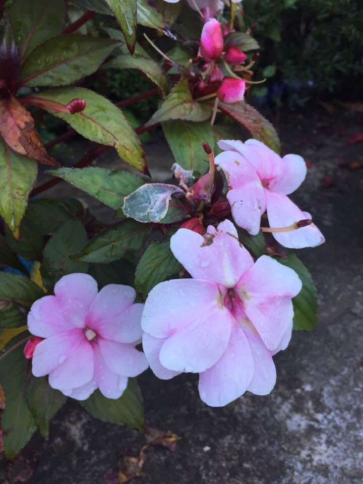

## Kỳ 10: XUÂN VÀ TÌNH YÊU

_"... Vì em đã biết anh chiều qua, người em vẫn thấy khi nằm mơ_

_Người vừa hiền khô, dễ thương, lại vừa đẹp trai nhất vùng, đến theo cùng hoa cỏ mùa xuân..._

_Và mùa xuân biết em, biết em đã mang một mối tình_

_U ơ u ơ... Biết em! Biết em..._

_Thế nên cỏ hoa thật là dễ thương... "_

🎼 Nghe những giai điệu này trong ngày mùng 3 Tết Nguyên đán Canh Tý 2020 đem lại cho tôi những cảm xúc để chọn chủ đề "Xuân và tình yêu" cho bài viết ngay sau đây.

❤️ Mùa xuân là mùa của sự sinh sôi, nảy nở. Mùa xuân cũng là mùa của sự đoàn tụ, sum vầy. Nhưng quan trọng nhất, mùa xuân cũng chính là mùa của tình yêu.

🎍 Xuân về, mọi thứ liên quan đến tình yêu đều được làm mới trong mỗi người chúng ta. Với những người chưa có người yêu (như tôi chẳng hạn 😂), mùa xuân đến cũng là dịp tôi được làm mới mình để có thể kiếm được một người hợp ý mình. Đối với những người đã có người yêu thì đây cũng là dịp để thắt chặt tình cảm của mình, đó cũng là một cái hay.

🎋 Tựu chung lại, mùa xuân chính là thời điểm phù hợp để ta có thể làm mới chính mình, sẵn sàng cho những mối quan hệ đang hoặc sắp có với một nửa của mình, cho nên ai ai cũng nên phải cảm ơn ông trời vì đã mang đến một khoảng thời gian tuyệt vời như thế này.

✅ Cũng đừng quên rằng, không phải chỉ có mùa xuân, chúng ta cũng phải biết trân trọng những mối quan hệ với tất cả mọi người vào bất cứ lúc nào, bất cứ nơi đâu, vì đó chính là cốt cách của một người có ý thức.
