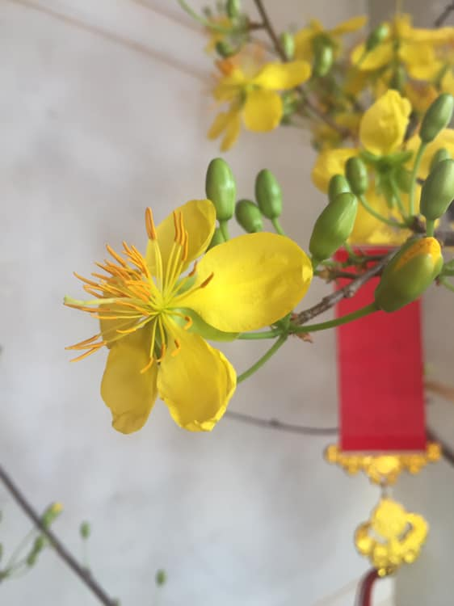

## Kỳ 9: MÙA XUÂN, MÙA ĐOÀN TỤ

🎍 Lấy cảm hứng từ hai chữ "đoàn tụ", tôi viết nên những dòng tâm sự cho ngày mùng 2 Tết Nguyên đán Canh Tý 2020.

🃏Lần nào cũng vậy, cứ đúng ngày này, cả nhà nội của tôi cùng nhau tề tựu đông đủ, cùng nhau trò chuyện, cùng nhau ăn uống và đặc biệt là: Cùng nhau chơi bài (chơi vui thôi nhé 😂)

💵 Mà năm nào cũng vậy, chả biết bằng một niềm tin son sắt nào đó, tôi thua bài hơi đau (nhưng năm nay thì đỡ hơn một chút, nói chung là vẫn còn ổn 😂). Tôi có cặp mắt quan sát rất kĩ, nên đôi lúc tôi chợt nhìn về bà nội của tôi. Một người rất hiền, trông rất phúc hậu. Bà cười rất nhiều, cười như một đứa trẻ. Bà vui lắm, vui vì con cháu trở về, vui vì cả nhà đoàn viên. Tôi thương lắm, nhưng cũng buồn lắm. Bà tôi cũng đã lớn tuổi rồi, không biết còn bao nhiêu năm nữa để vui cùng mọi người. Cũng mong sao có nhiều hơn những ngày như thế này để tất cả cùng nhau chia sẻ những giây phút tràn ngập yêu thương. Ấy cũng là một phần lí do tôi quý trọng cái Tết Việt, quý trọng cái mùa xuân, cái mùa của sự sinh sôi, nảy nở, phát triển. Và hơn hết, mùa xuân chính là mùa của sự đoàn tụ.

🏡 Ai cũng có công việc hay sự nghiệp riêng của mình. Nhưng khi Tết về thì xin đừng quên đi giá trị của gia đình, bởi chỉ có gia đình là thứ có thể giúp bạn có được nguồn năng lượng tích cực để có được những thành công trong chính công việc hay sự nghiệp của bạn. Hãy nhớ rằng: Tết là gia đình.
