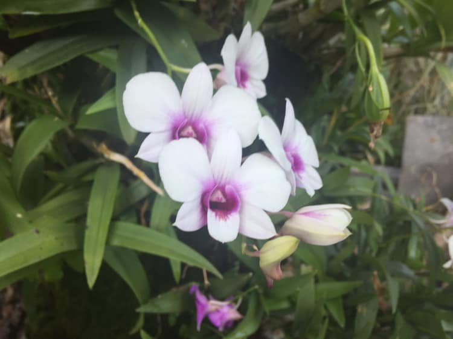

## Kỳ 11: DƯ VỊ NGÀY TẾT

🎋 Tết của bạn năm nay thế nào??? Vui hơn??? Buồn hơn??? Chán hơn??? Nhạt hơn??? Điều đó không quan trọng. Quan trọng nhất là câu này: Tết này để lại gì trong lòng bạn???

🗓 Hôm nay là mùng 4 Tết Nguyên đán Canh Tý 2020, mặc dù vẫn còn nghỉ lễ, vẫn còn có một số những chuyến đi chơi nhưng cũng bắt đầu thưa dần. Có người cũng đã bắt đầu đặt vé để trở về chỗ làm, chỗ học. Nhanh thật, đúng là hết Tết rồi...

🎆 Nhìn lại cái Tết vừa qua, tôi thấy vừa vui vừa buồn. Vui vì mình được trở về với gia đình, được vui chơi với một số đứa hậu bối và bạn bè và vui vì được nhận lì xì (có lẽ đủ dùng để đóng học phí 😂). Nhưng lại buồn vì biết rằng: Mình đã già đi thêm một tuổi, lại không có người yêu, thấy trống vắng và cô đơn thật sự.

🎍 Có lẽ vì suy nghĩ của mình về Tết đã không còn giống như ngày xưa, cũng không còn cái tâm trạng háo hức như hồi nhỏ. Lo toan nhiều hơn, trách nhiệm với bản thân và gia đình cũng dần dần trở nên lớn hơn. Còn đâu cái sự mong đợi mà cái Tết mang đến cho chúng ta nữa đâu. Ngẫm lại mà thấy tiếc cho cái thanh xuân của mình bỏ lỡ quá nhiều thứ, để rồi cũng chính mình phải hối hận, mà cái này đúng là hối hận không kịp. Bây giờ nằm trên giường mà viết cái bài này, tôi cũng tuyệt vọng lắm, tại vì có ai rủ đi đâu, mà có rủ thì cũng kẹt lịch, có đi được đâu. Nói chung là buồn 😢

🏡 Nhưng dù sao, nói đi cũng phải nói lại. Tết là dịp để thoát khỏi bao nhiêu bộn bề trong cuộc sống, vốn đã bủa vây chúng ta trong cả năm (còn nếu như có bài tập xuyên Tết thì xin chia buồn, bộn bề chính thức đeo bám bạn suốt năm rồi 😂). Về nhà cũng là cái cảm giác thoải mái nhất, để rồi khi chuẩn bị trở lại thành phố để tiếp tục việc học, sự nghiệp của mình, chúng ta lại nhớ về cái Tết vừa qua, nhớ về những dư vị mà chúng ta cảm nhận được về mùa xuân này...

✉ Gửi những người chuẩn bị trở về với guồng quay công việc, guồng quay học tập...
