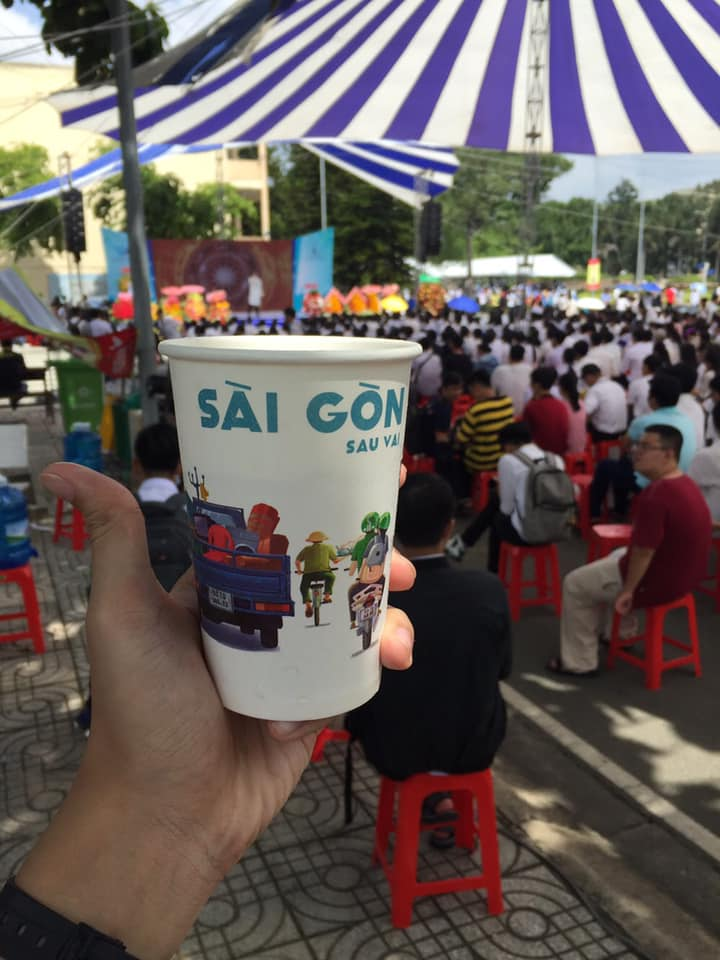

## Kỳ 12: GỬI NGÀY TRỞ VỀ

🗓 Hôm nay đã là mùng 5 Tết Nguyên đán Canh Tý 2020 rồi. Ngày mai, rất nhiều người sẽ trở lại với công việc, với việc học tập của mình. Ngày hôm nay, xin được dành bài viết này để tặng cho những người chuẩn bị rời xa quê hương thêm một lần nữa.

🎆 Tết này mọi người có vui không??? Chắc là mọi người cũng đã có một khoảng thời gian dài được nghỉ ngơi và sum vầy bên gia đình và bạn bè rồi, vậy thì không biết cảm xúc của mọi người như thế nào??? Liệu trong lòng mọi người có chút nuối tiếc không???...

🏡 Tại sao lại có câu hỏi cuối cùng??? Tôi chợt tìm ra bức hình này, rồi tôi nhìn vào cái cốc nước kia. Tôi lại chợt nhớ những ngày được chu du khắp cái chốn nội thành (sự thật vui: Nguyên cả quận 1 tôi đã đi tới đi lui cả chục lần rồi đấy, đi tới những nơi mà mọi người có thể chưa biết: Đó là các Tổng Lãnh sự quán của Mỹ, Anh và cả Trung Quốc ở thành phố, lạc sang công viên Tao Đàn, chợ Bến Thành, phố đi bộ Nguyễn Huệ, Nhà Văn hóa thanh niên, Nhà thờ Đức Bà, Bưu điện Thành phố hay thậm chí là đi tới Dinh Thống Nhất luôn rồi 😂). Tôi dạo bước trên đường, nhìn những dòng người đang di chuyển, có cả những người buôn bán nhỏ bên đường. Tôi lại hồi tưởng về quá khứ của mình, được một lần mẹ mua cho một món đồ ăn thật là ngon ở một xe bán hàng của một cô nọ, nhiều lúc cũng vui lắm. Chắc bây giờ những thứ như thế kiếm trong Sài Gòn cũng hơi khó hơn so với ngày trước rồi...

🎋 Ủa, thế rồi có liên quan gì tới câu hỏi cuối cùng??? Thực ra tôi cũng được biết, một số người họ không thể trở về quê để đón Tết, vì họ phải kiếm tiền để lo cho cả gia đình. Cho nên cái cảm giác được đoàn tụ ngày xuân đối với họ dường như là một thứ gì đó rất xa vời. Thế mới thấy, những người trở về được nhà để ăn Tết quả là may mắn. Để rồi, giờ đây, họ đang đi trên đường, nuối tiếc vì mình không thể ở lâu hơn, nuối tiếc vì mình không được gần với gia đình nhiều hơn. Để rồi, họ quyết tâm làm ăn chăm chỉ, qua năm sau sẽ về đón Tết tiếp, nhưng có mấy ai biết trước tương lai...

📝 Viết tới đây, tôi cũng chỉ mong tất cả mọi người sẽ vẫn luôn nhớ về gia đình, nhớ về những người thân thương nhất. Bởi họ chính là hậu phương vững chắc cho thành công của mọi người.
