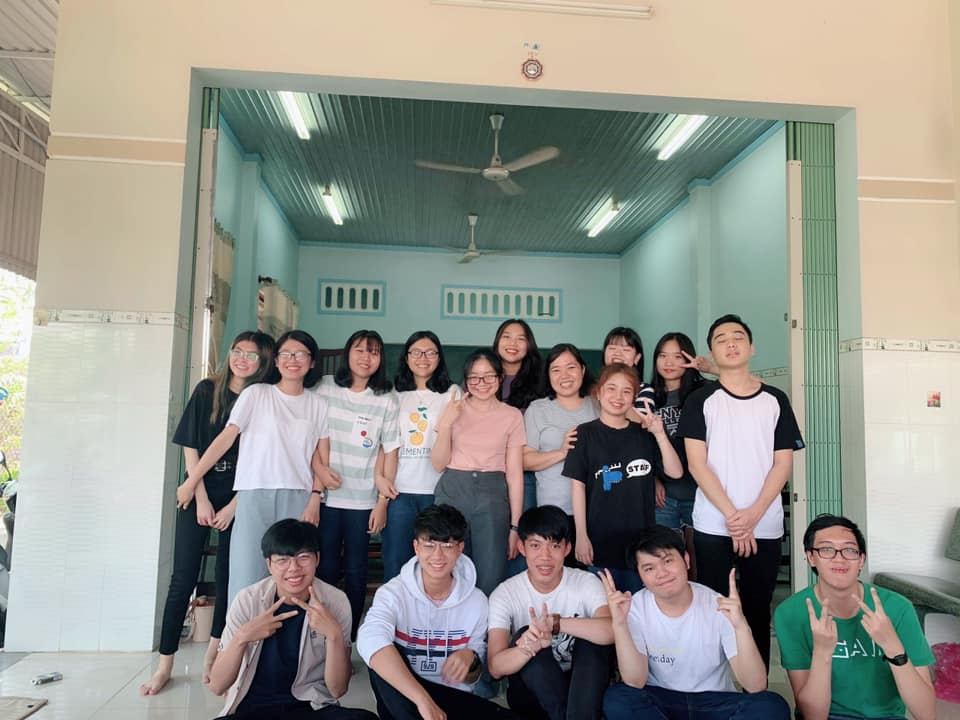

## KỲ 14: THANH XUÂN NỢ TÔI MỘT ÂN TÌNH

📝 Xin chào, đây là bài viết cuối cùng trước khi tôi lên đường trở lại thành phố Hồ Chí Minh và tiếp tục với việc học tập của mình. Thiệt sự là không vui khi lịch học Quân sự không thể dời đi, vì đây là sự sắp xếp của Đại học Quốc gia TPHCM và Trường ĐH Khoa học Tự nhiên nên tôi đành chịu. Bây giờ tôi lại bắt đầu.

🎋 Nhìn tấm hình được tôi mượn để chỉnh lại và đăng lên lần này, tôi lại nhớ về cái hồi #HLK_AK23 gặp nhau lần đầu tiên, đâu đó vài con người bỡ ngỡ (cả tôi cũng vậy). Vậy mà bây giờ, mỗi người cũng đã có lựa chọn riêng, con đường riêng của mình. Xã hội có người này, kẻ kia thì lớp tôi cũng có bạn này, người khác. Có những thứ một khi đã gọi là quá khứ thì không bao giờ quay trở lại được. Hôm qua, tôi lại được dịp họp lớp, cũng vui đấy chứ, cũng nhiều tiếng cười lắm chứ, nhưng tôi cứ thấy thiếu thiếu cái gì đó. Thiếu người??? Hay là thiếu cái cảm giác như trước kia???...

🏕 Hồi lúc làm trại Tết (#HLK_LNYCamping), đâu đó những tiếng cãi vã vang lên. Tôi cũng đã tiên liệu trước những chuyện sắp xảy ra. Cho đến lúc này, mọi thứ đã vượt qua khỏi những gì mà tôi dự đoán. Buồn lắm, cũng tiếc lắm. Nhưng biết sao giờ, tôi vẫn ở đó, chờ đợi được ĐÔNG ĐỦ tất cả mọi người tụ họp ở nhà chủ nhiệm. Tôi luôn như vậy, mãi mãi đứng ngoài mọi liên minh, giữ cho mình vai trò trung lập, để kết nối tất cả mọi người lại với nhau, dù cho chỉ cần 1 phút thôi cũng là đủ, nhưng cũng chẳng biết đến bao giờ tôi mới có thể làm được điều này...

🏫 Thanh xuân nợ tôi một ân tình, cái ân tình ấy nó lớn đến mức không tài nào có thể đong đếm một cách bình thường được. Đó chính là những khoảnh khắc tôi được chứng kiến một tập thể AK23 đồng lòng trong TẤT CẢ mọi hoàn cảnh khắc nghiệt nhất. Có lẽ sẽ mãi mãi chẳng bao giờ tôi có thể đòi lại được cái ân tình ấy đâu, nhưng ít ra đòi lại được một vài phần cũng làm tôi mãn nguyện lắm rồi...

🏡 Với tư cách là một lớp phó, viết ra hết những dòng tâm sự cuối cùng cho bài viết cuối cùng này, tôi cũng muốn gửi lời xin lỗi đến các thành viên vì thường xuyên khiến mọi người thất vọng. Và tôi cũng chỉ mong muốn mọi người hiểu được một thông điệp: Dù bạn là ai, dù bạn ở đâu, dù bạn có nhiều những quan điểm khác biệt cũng xin đừng quên rằng, chúng ta từng là một phần của nhau, của AK23, của khối chuyên Anh và của Hoàng chuyên.

✅ Chúc các bạn có một năm mới thành công và gặp nhiều may mắn trên con đường mà mình lựa chọn. Cũng chúc các bạn có thể sống sót an toàn qua dịch bệnh do con virus Corona kia gây ra nhé 😂

👋 Cảm ơn mọi người đã đồng hành qua 15 bài viết vừa qua, xin gửi lời chào tạm biệt và hẹn gặp lại trong một dịp không xa (và làm ơn, tự giác hú tôi chụp hình trước thời gian diễn ra #HLK_FoodFes2020, nếu không, coi như đợi qua năm học sau luôn đi nhé, đừng làm tôi quạu và đừng hỏi tại sao không có hình nếu không có hẹn trước 😂)

Trân trọng cảm ơn và kính chào.
