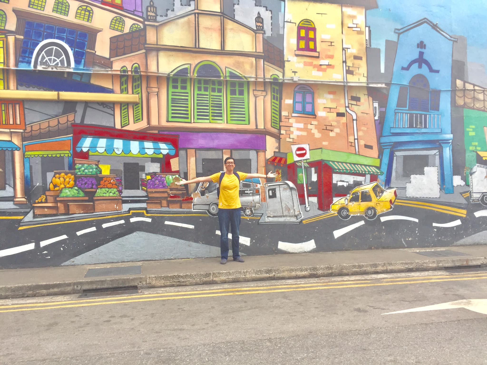

## Kỳ 1: REWIND 2020 - NHÌN LẠI MỘT NĂM BIẾN ĐỘNG...

Xin chào, tôi đang viết bài này vào ngày 30/12/2020, một ngày gần cuối năm...

### Mở đầu

🍀 Có quá nhiều chuyện đã xảy ra với cá nhân tôi, nhưng mà cuối cùng thì mọi thứ đã dần trở về với sự bình thường rồi. Hôm nay có dịp nên nhìn lại cái wishlist hồi đầu năm và xem mình đã làm được gì:

❌ 1. Có sức khỏe để bay lắc với các thành viên của khối chuyên Anh HLK 🏫 . Sức khỏe thì vẫn ổn đó, nhưng chuyện có bay lắc được không thì còn phụ thuộc vào diễn biến của dịch COVID và một số yếu tố liên quan đến cá nhân nữa. Mà mọi người biết đấy, tương lai vẫn rất bất định... 😞

✅ 2. Gia đình hạnh phúc, người thân bình an 🏡. Đến bây giờ vẫn rất ổn, thậm chí là rất tuyệt 😊

✅ 3. Học tốt và không rớt môn 📚. Cái này học kì trước đã thành công, còn học kì này thì hơi hoang mang, hy vọng sẽ qua được để còn ăn Tết vui vẻ nữa 😂

❌ 4. Tìm việc bán thời gian 🕰 . Chưa làm được, dịch COVID + kinh tế khó khăn nên cũng khó kiếm chỗ tuyển.

❌ 5. Thi IELTS. Định tháng 8 năm 2020 📅 mà lịch học ở ĐH thay đổi chóng mặt quá, không làm được gì, chắc qua năm sau...

✅ 6. Có bằng lái xe 💳. Chắc chắn rồi, bây giờ thì tôi có thể vi vu trên đường phố Sài Gòn rồi 😊

### Lời cảm ơn

À quên mất. Xin được gửi lời cảm ơn chân thành đến những người đã xuất hiện trong năm 2020 của tôi, chính mọi người đã làm nên một năm đầy cảm xúc của tôi. Và cũng xin gửi lời xin lỗi đến những người đã bị tôi làm tổn thương trong năm qua. Cho dù đối với mọi người, lời này có muộn màng thì đó cũng đến từ tất cả lòng thành của tôi. Và tôi sẽ nỗ lực không ngừng nghỉ trong năm 2021 để không khiến bản thân và mọi người phải thất vọng. Xin mọi người hãy rộng lượng bỏ qua cho thằng này, nay cũng nhờ nó có người phù trợ nên nó cũng bắt đầu trưởng thành hơn qua năm tháng rồi...

### Tổng kết

👋 Chuẩn bị tạm biệt 2020 đầy sắc màu u ám. Chào 2021 đầy mới mẻ và hy vọng. Với những dự án mới, ước mơ mới, thử thách mới và thành công mới...

🎆 Chúc mọi người năm mới nhiều sức khỏe, thành công, may mắn, đẹp hơn và (có thể) nhanh chóng thoát kiếm cô đơn nhé. Chúc mừng năm mới sớm, tạm biệt mọi người...

🖼 Ảnh minh họa cho khát vọng được chu du trở lại ở một nơi nào đó sau đại dịch, có thể là một chuyến đi của năm - chuyến đi của sự trở về chốn cũ cùng những gương mặt thân quen...
