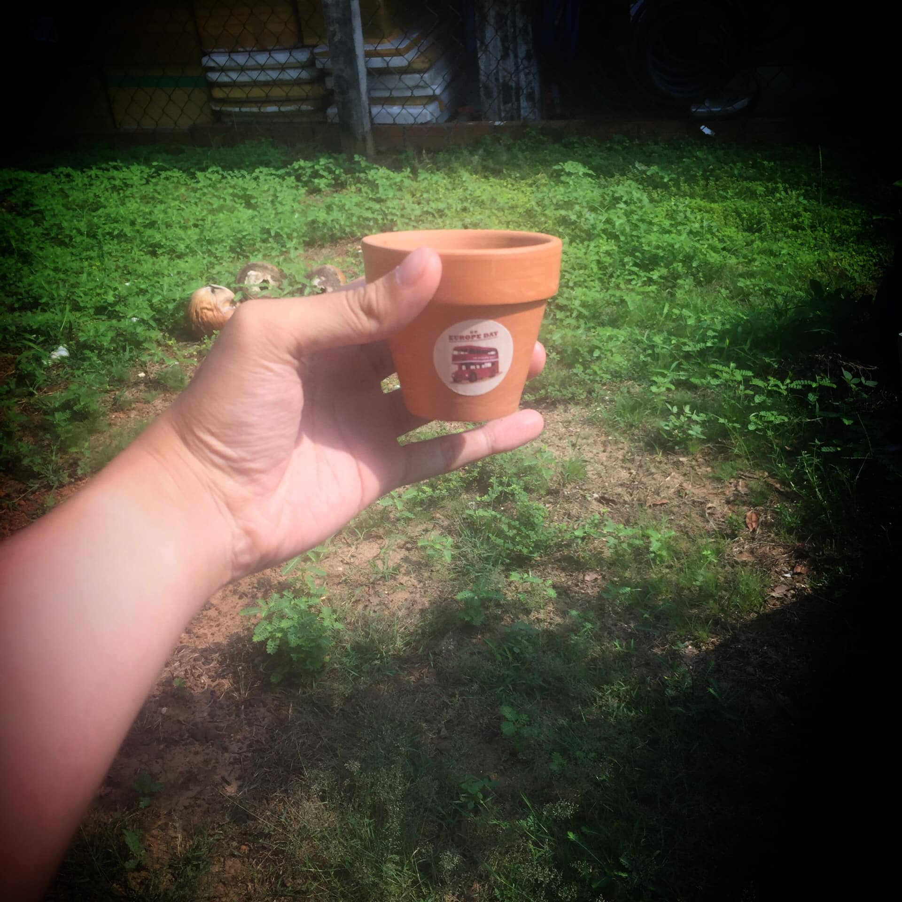

## Tháng 04 - BƯỚC CHÂN HY VỌNG

Hello, lâu rồi không viết lách. Quá nhiều thứ xảy ra với mình trong tháng 04 📆 rồi. Nên là hôm nay recap lại xíu cho mọi người đọc chơi 😂

⚠ Cảnh báo: Bài này có tính chất dễ gây sôi máu, hãy giữ bình tĩnh trước, trong và sau khi đọc nhé.

### Đầu tháng

Đầu tiên là chuyện buồn đầu tháng... Mọi người chắc cũng đọc stories ✏️ của tôi rồi. Những gì đã và đang diễn ra, xin phép không bình luận thêm 😕. Chỉ mong mỏi đúng một điều: Cho dù chỉ còn 1️⃣% cơ hội - chàng trai này vẫn sẽ cố gắng thể hiện hết khả năng của mình, chờ ngày người ấy trở về... ❤

### Giữa tháng

Rồi, đến chuyện vui giữa tháng... Từ khoảng đâu đó một tuần sau chuyện buồn, tôi bắt đầu được nhận vào cộng tác cho sự kiện lớn của Ban Quốc tế - HSV trường 💯. Phỏng vấn chơi chơi, ngờ đâu trúng thiệt 🎯 (Kỳ trước phỏng vấn CLB cũng chơi chơi, rồi cũng đậu thiệt 😂). Ban đầu đọc kế hoạch chỉ tưởng làm gian hàng giao lưu văn hóa thôi 🏡, ngờ đâu lúc sau đọc lại mới phát hiện ra là đón khách quy mô lớn 🏫 . Hơi sốc xỉu 😂.

Cơ mà làm chung với mấy anh chị em mới thấy nó vui banh nóc. Có quà 🎁 siêu đẹp🎍 (à còn cái bình thủy tinh với áo nữa mà không chụp lên), quen nhiều anh/chị/bạn/em mới, vừa xinh vừa dễ thương nữa (à có cả cô bạn với niềm đam mê haha bất diệt với bài đăng của tôi nữa 😂). Với lại tôi cũng học hỏi được khá nhiều điều 😎: Sự bình tĩnh, tinh thần tập thể và trên hết là sự bao dung, vốn là kim chỉ nam cho mọi thành công 🎉 sau này (nhiều người không biết hoặc biết nhưng không nhớ). Dù có lag hay low-tech tới cỡ nào thì mọi người vẫn thương yêu các CTV như mình, cảm ơn mọi người còn không hết ❤. (Chắc hôm nào mở poll về vụ xin vào Ban chạy event tiếp 😂)

### Cuối tháng

Vụ cuối tháng... Sự liều lĩnh. Ngay hôm qua thôi, thằng bạn chung lớp mời mình vào thi Hackathon 🖥. Mặc dù lưỡng lự vài giây, nhưng mà vẫn nhận ✅. Lần đầu tiên, tôi sẽ biến giấc mơ thành sự thật. Bước những bước đi đột phá, chắc chắn sẽ rất khó khăn, nhưng sẽ không chùn bước. Bởi lẽ đây chính là cơ hội để chứng minh cho tất cả mọi người (kể cả những người đặc biệt trong cuộc đời mình 😜) thấy được năng lực của mình 🍀. Nói chung là hy vọng mọi người sẽ ủng hộ, mong sẽ hết dịch để mọi thứ diễn ra thuận lợi. (À, vẫn đang kiếm nữ coder vào team thi nhé, thích thì pm 💬 cho tôi, vào đi chung cho vui, cam kết sẽ được mọi người yêu thương hết lòng 😂)

### Hiện tại???

Còn việc hiện tại? Đang học khóa thứ 2 trong 8 khóa học cấp TESOL 📚, hoàn toàn miễn phí (vâng, xin được trợ cấp rồi 🥰). Dạy thêm 👨‍🏫 một ít, đang luyện code 💻 tốc độ cao và luyện IELTS 7.5+. Đang chờ kết quả thi tìm hiểu của Văn phòng Quốc hội 🏢. Đang chạy cuộc thi viết 🖊của HSV TPHCM, chạy seminar 📕, chạy Ban PTHT và chạy mindmap... Quá nhiều việc rồi 😂

Những bước đi ấy - tôi gọi là "Bước chân hy vọng". Bởi nó thay tôi gửi gắm niềm tin vào tương lai: Rằng dù cho có bao nhiêu khó khăn, nếu dám bước đi, chắc chắn bạn sẽ đạt đến thành công cho riêng mình. Người nhiều việc làm hiển nhiên có nhiều trải nghiệm hơn rồi 😂

Mà mọi người ơi, tháng này có thể sẽ có nhiều hơn 2 bài, sắp tới mùa chia tay rồi... Nên là mọi người cứ tiếp tục theo dõi chùm bài này nhé, sẽ có một bài buồn xỉu cho mọi người đọc luôn ở phần sau. Chờ nhé 😊.

Tạm biệt và hẹn gặp lại 👋

🖼: Chậu cây xinh xinh đây rồi, cơ mà vẫn chưa lên mầm nữa 😂
