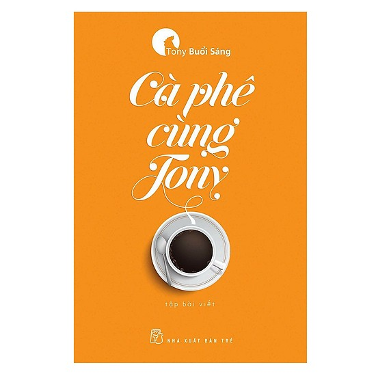

### 📙 CÀ PHÊ CÙNG TONY

_Chắc hẳn không ít bạn đọc trẻ biết đến Tony Buổi Sáng, một tác giả có cách viết hướng đến các bạn trẻ với ngôn ngữ nói tự nhiên, bút pháp trào phúng và phóng đại. Một trong những quyển sách làm nên tên tuổi của Tony Buổi Sáng là **Cà phê cùng Tony**. **"Đúng như tên gọi, mỗi bài nhẹ nhàng như một tách cà phê, mà bạn trẻ có thể nhận ra một chút gì của chính mình hay bạn bè mình trong đó: Từ chuyện lớn như định vị bản thân giữa bạn bè quốc tế, cho đến chuyện nhỏ như nên chú ý những phép tắc xã giao thông thường."**_

_**Cà phê cùng Tony** gồm hai phần. Phần đầu tiên có tên gọi: **Chuyện của Tony**. Gắn với tên gọi, đó là những câu chuyện từ thuở nhỏ của Tony cho đến khi Tony thành công và có sự nghiệp riêng. Những câu chuyện ấy được Tony chia sẻ theo từng giai đoạn gắn với sự trưởng thành và phát triển của mình. Phần thứ hai có tên gọi: **Tony và bạn trẻ**. Những câu chuyện trong đó gắn với giới trẻ nhiều hơn, chứa đựng nhiều ngôn từ hài hước đủ để thu hút bạn đọc. Qua mỗi câu chuyện được tác giả nhắc đến, các bạn trẻ cũng có thể rút ra bài học cho chính mình._

_Nếu bạn đang ở độ tuổi từ 15 đến 22, những tác phẩm của Tony Buổi Sáng sẽ là lựa chọn phù hợp với bạn. Như đã chia sẻ ở trên, Tony dùng ngôn phong trào phúng và phóng đại, diễn đạt theo văn nói, do vậy cũng dễ gần gũi với bạn đọc hơn các tác giả khác. Đồng thời, các bạn trẻ cũng có thể rút ra được rất nhiều bài học cũng như nhìn nhận bản thân tốt hơn khi lựa chọn đọc các tác phẩm của Tony Buổi Sáng._
