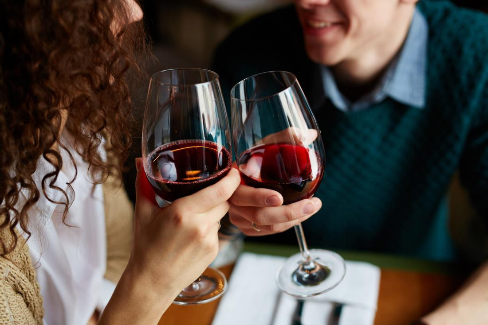

### CHUYỆN BÊN QUÁN BAR 🍷

**Nguồn ảnh: [Link](https://nld.mediacdn.vn/2018/8/2/red-wine-contains-resveratrol-which-appears-to-have-a-number-of-health-benefits-15332050387582026643206.jpg)**

> - **_"Mấy nay người cũ mày sao rồi?"_**
>
> - **_"Người cũ nào?"_**
>
> - **_"Latte ấy."_**

_Cậu cười, tay cầm ly sherry bên quầy bar cùng anh bạn thân của cậu._

> **_"Không biết. Mấy nay tao thích nhiều chị xinh, nên cũng không để ý lắm. Latte chả là gì so với mấy bà đó. Nhưng nhờ Latte mà tao biết được tao có thể nhường một đứa con gái như thế nào."_**

_Cậu trầm đi một nhịp, những ngón tay của cậu buông ly sherry lỏng hơn. Latte ngày xưa mà cậu thích, tay cầm bút lập chập, có quả mái cao tận đỉnh đầu, thích mặc quần thụng, áo thun và mang đồng hồ. Có lẽ giờ, Latte vẫn giữ thói quen mang đồng hồ ấy, đồng hồ luôn được mang rộng hơn một nấc so với tay của Latte._

_Latte chụp hình nhìn khá tiểu thư, lâu lâu hơi bựa, chứ không phải kiểu hở ngực hoặc hở mông như những chị mà cậu thích. À, Latte chẳng bao giờ mặc bra chụp hình, chắc vì thế mà trong mắt cậu, Latte luôn là gái ngoan._

_Thời gian trôi qua đủ lâu để cậu biết Latte đã khác xưa khá nhiều. Nhưng trong mắt cậu, Latte khá vụng về, hậu đậu, hay dỗi cậu nhiều thứ và cho cậu bộc lộ được bản tính bảo vệ của một thằng đàn ông._

> **_"Cảm ơn nhiều, Latte."_**

_Hơi ấm phát ra từ môi cậu đủ để không khí xung quanh ấm hơn vài độ. Cậu ra hiệu cho anh bartender làm đầy ly sherry đã vơi đi một nửa._

_Cậu liếc mắt ra hiệu cho anh bạn thân._

_Bước xuống ghế, đi độ vài bước, cậu nâng ly sherry lên ngang cằm một chị gái đủ quyến rũ để lọt vào mắt xanh của cậu._

> **_"Nếu không phiền thì anh mời em ly này."_**
