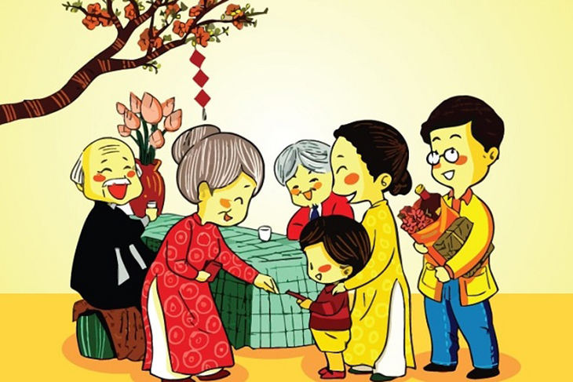

**_Kỳ này gồm hai bài nhỏ dưới đây..._**

### KHÓ LÒNG ĐỂ HIỂU ĐƯỢC GIỚI TRẺ

_Khoảng cách thế hệ xa đến mức nào? Một gang tay hay dài bằng đường chân trời? Đó là câu hỏi mà trong mỗi gia đình có khả năng tồn tại tối thiểu ba thế hệ: ông bà, cha mẹ và thế hệ con cháu._

_Mỗi quan điểm về một vấn đề sẽ được hiểu theo nhiều cách khác nhau qua từng thế hệ. Mỗi thế hệ sẽ có những lập luận riêng cho chính thế hệ của họ. Thời buổi hiện nay, gọi nôm na là **Gen (Generation)**... Những bạn trẻ tân thời được gọi là **GenZ**. Gen này là một trong những Gen có sự phát triển cùng những suy nghĩ hiện đại, thoải mái, phóng khoáng về mọi mặt..._

### 30 TẾT

**Nguồn ảnh: [Link](http://thptkontum.edu.vn/van-hoa-van-nghe/NGUON-GOC-VA-Y-NGHIA-CUA-NGAY-TET-NGUYEN-DAN-812)**

_Mình về nhà sau một năm đầy bộn bề ở xứ người. Mẹ với nội trang trí nhà cửa đã hoàn tất, mẹ cũng sắm một cây mai để trước sân nhà, dù không to lắm nhưng vẫn có không khí ngày Tết ở Sài Gòn._

> "Về thì nghỉ ngơi đi, mẹ với nội làm xong hết rồi."

_Nhà mình tuy không giàu có hơn ai, nhưng nhà mình luôn đong đầy tình cảm, mỗi khi mình về nhà, mẹ đều chuẩn bị sẵn một phần bánh gạo cay rất ngon cho mình._

_Mong rằng mỗi năm mình đều có thể về nhà, đều có thể thấy được cảnh gia đình hạnh phúc, vẫn còn đầy đủ các thành viên trong gia đình._

**_Sài Gòn, ba mươi Tết._**
