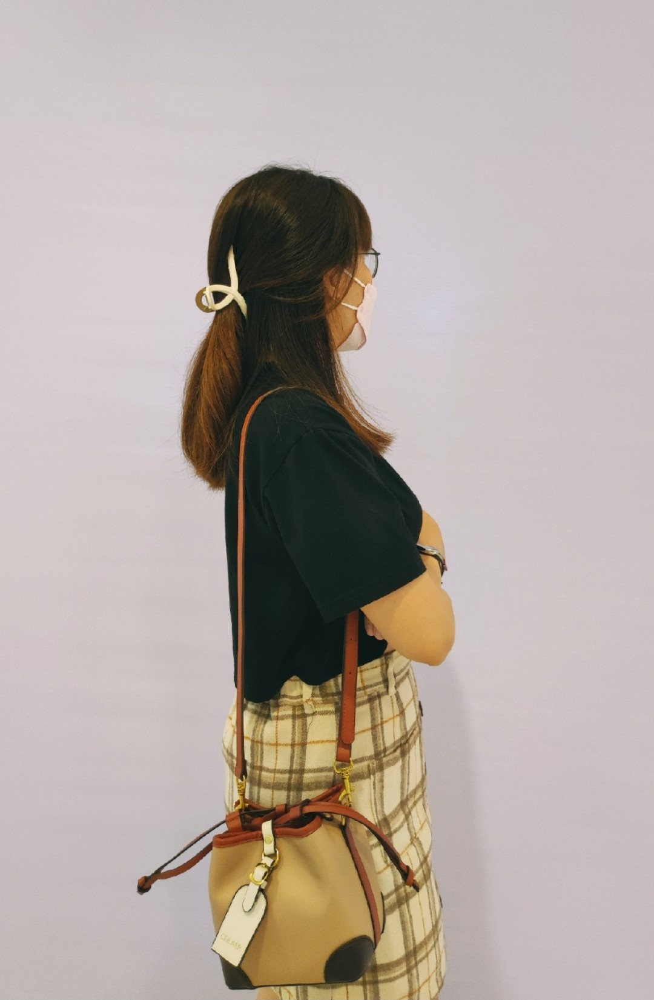

### VÀI DÒNG CHO EM

> - **_"Khi nào xong thì cứ gọi anh sang đón nha."_**
>
> - **_"Em biết rồi."_**

_Em của mình không thanh mảnh như những bạn nữ khác, chân không dài, mắt một mí, không biết make up là gì cả. Nhưng em của mình có những điều dễ thương lắm. Điển hình như việc mỗi khi cãi nhau, em luôn để mình giải quyết mọi việc theo ý mình, em không tạo áp lực, không gọi điện điên cuồng hoặc thúc giục mình phải làm huề khi hai đứa mình cãi nhau._

_Em của mình nói nhiều, nhưng không cằn nhằn mình nhiều, những lúc em khó chịu mình, em im lặng, mắt hơi ướt, phải đợi khi mình hỏi thì em mới nói, em ít khi chủ động than phiền về điều gì lắm._

_Em khá hậu đậu, hay quên những gì mình dặn, như việc uống nước đúng giờ, xăng chạy đến nấc số ba thì phải đổ xăng, và những điều khác. Nhưng khi mình đi công việc, nếu trời đổ mưa bất chợt, luôn có áo mưa trong cốp xe của mình dù mình chẳng để vào._

_Em của mình không hoàn hảo, em cũng hậu đậu và vụng về. Nhưng đối với mình, có được em, là điều tuyệt vời lắm rồi._

_Cảm ơn nhiều vì những gì em đã mang đến._

**_Espresso,_**

**_viết cho em, cho một chiều hoàng hôn đủ hồng để sưởi ấm._**
