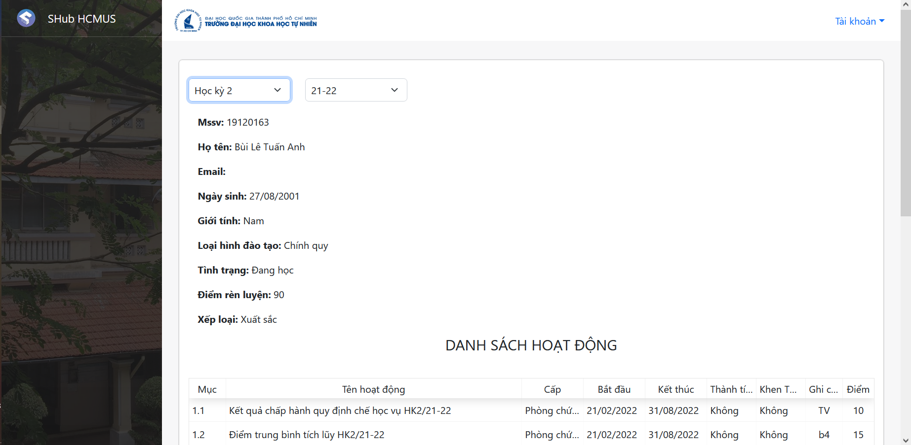
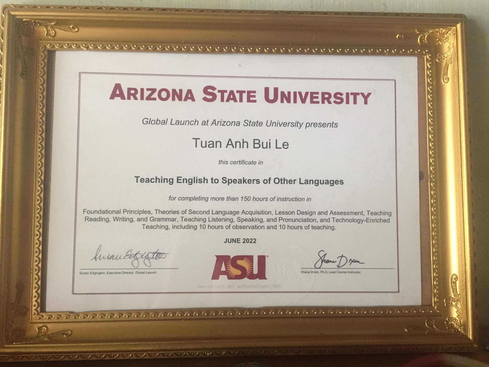
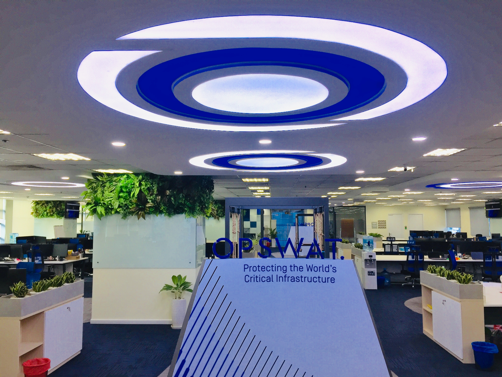
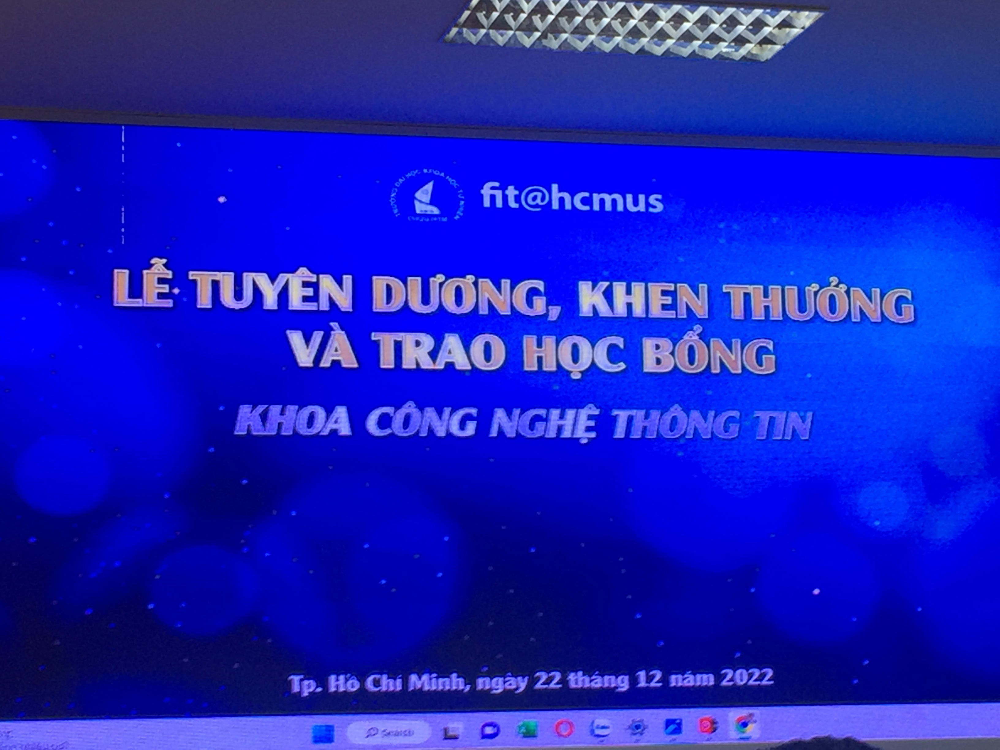

## Kỳ 3: Recap 2022 ⏪

Cuối cùng thì ngày này lại tới, một lần nữa. Hôm nay, ngày 01/01/2023, có nhiều thời gian hơn mọi ngày, tôi quyết định mở lại những tấm hình đẹp nhất và chiêm nghiệm lại một năm 2022 đầy cảm xúc của chính mình.

### Chiếc điểm rèn luyện Xuất sắc

- Nói thật tôi cũng không nghĩ mình sẽ có cơ hội quay lại chiếc điểm rèn luyện Xuất sắc đâu, nhưng lại một lần nữa, con điểm 9️⃣0️⃣/💯 tiếp tục khiến mình tự hào thêm một lần nữa. Hy vọng năm 2023 sẽ có thêm cơ hội để lụm điểm rèn luyện Xuất sắc 😂.

### TESOL và hành trình bất tận

- Lại một mùa hè khói lửa nữa, khi sau 1 năm nỗ lực không ngừng, TESOL là mục tiêu tiếp theo được hoàn thành trong năm 2022 ✅. Với việc nhận được chứng chỉ TESOL, con đường đi theo nghề tay trái của mình 👨‍🏫 cũng sẽ trở nên dễ dàng hơn đôi chút, bởi lẽ cũng đến lúc mình phải chọn một con đường cho riêng mình rồi...

### Mùa thu và chiếc trải nghiệm đời đầu 🏢

- Ngày **24/08/2022** 📆 sẽ được ghi dấu ấn đặc biệt, bởi lần đầu tiên, tôi cũng được trở thành 1 thực tập sinh tại OPSWAT Vietnam 👨‍💻. Tuy thực tập trong thời gian ngắn, nhưng đối với tôi, đó chính xác là những trải nghiệm vô cùng quý báu để tôi có thể vững bước trên con đường tiếp theo của mình - một con đường tuy gian lao vất vả nhưng vẫn rực lửa 🔥 niềm đam mê với CNTT.

### Đông ấm cùng chiếc Học bổng 🎓

- Ngày **22/12/2022**, ngày Thành lập QĐND Việt Nam, 2 ngày trước Giáng sinh 🎄 và 10 ngày trước năm mới 🎆, tôi cũng có cơ hội trở thành 1 người tham gia trực tiếp vào Lễ tuyên dương của Khoa, nhận được chiếc Học bổng sau nhiều năm cố gắng và nỗ lực không biết mệt mỏi 🎉. Lần đầu tiên, tôi được ngồi cùng các bạn, các em và chứng kiến giây phút từng người được xướng tên. Hình ảnh ấy làm tôi nhớ lại thời kì đỉnh cao trước đây của chính mình 💭, và tiếp thêm động lực cho tôi để tiếp tục mạnh mẽ hơn nữa trong năm 2️⃣0️⃣2️⃣3️⃣.

### Wishlist

Wishlist của năm sau, chắc sẽ như thế này:

✅ Thi IELTS (và lập đội thi TT, nếu có thể). Trời ơi, chiếc check kéo dài 2 năm nay rồi mà chưa thực hiện được nữa, mọi người xem lại kỳ 1/2022 đi rồi hiểu tại sao tôi lại phải đưa nó lên đây nhé 😂.

✅ Qua môn, Bảo vệ thành công và Tốt nghiệp đúng hạn. Khoa hủy môn 2 lần nên chiếc check này còn nguyên nha 😂

✅ Đi du lịch (có thể là 1 chuyến du lịch nội địa, hoặc 1 chuyến du lịch nước ngoài, tùy theo tình hình dịch bệnh). Đã rất lâu rồi chưa được đi du lịch trở lại, hy vọng sau khi bảo vệ Khóa luận xong sẽ có cơ hội vi vu khắp nơi.

✅ Tìm kiếm một công việc theo dạng Hybrid hoặc Remote toàn thời gian. Xu hướng và cũng như mong muốn của bản thân thúc đẩy việc này, sau Tốt nghiệp sẽ tính tiếp vụ này.

### Tổng kết

Hết phần recap. Một lần nữa, chân thành cảm ơn tất cả mọi người đã giúp đỡ để tôi có thể vượt qua năm 2️⃣0️⃣2️⃣2️⃣ đầy đặc biệt này. Hy vọng năm 2️⃣0️⃣2️⃣3️⃣, tất cả chúng ta sẽ có nhiều sức khỏe và thành công. Mọi thứ đã trở lại bình thường, và tất cả sẽ không ngừng phát triển hơn nữa.

🏡 2️⃣0️⃣2️⃣2️⃣, một năm đầy cảm xúc đã kết thúc. Chúng ta chia tay nhau từ đây. Chào từ biệt 2️⃣0️⃣2️⃣2️⃣, và xin chào 2️⃣0️⃣2️⃣3️⃣.

🌸 Câu chuyện mùa xuân 2️⃣0️⃣2️⃣2️⃣/2️⃣3️⃣ 🌼 - Kỳ 4️⃣ sẽ lên sóng trong vài ngày nữa. Goodbye mọi người, tôi đi làm Khóa luận tiếp 😂
