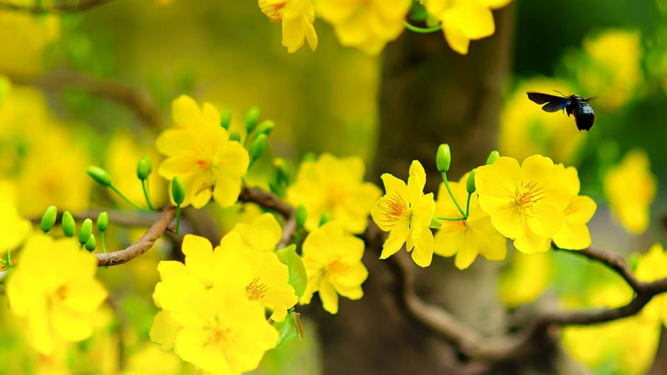

## Kỳ 4: Xuân muộn 🌸

Định là qua Tết 2023 sẽ viết luôn bài này, nhưng mà hay sao lịch trình nó bận sấp mặt luôn nên thành ra để tới bây giờ
mới bắt đầu viết, nên là cái tên **Xuân muộn** này cũng sẽ là tựa đề cho kỳ cuối của series 🌸 Câu chuyện mùa xuân 2022/23 🏵 này. Bắt đầu thôi...

### Chuyện của những lần đầu tiên...

Lần đầu tiên, tôi dấn thân vào thứ được gọi là trải nghiệm "**Dậy sớm để thành công**" (Early Morning Routine). Tôi đã thức dậy lúc 5h sáng vào hai ngày trong tuần, đu xe bus từ Quận 3 xuống Thủ Đức chỉ để học hai môn còn sót lại. Thật sự
đó là một cảm giác rất khủng khiếp, nếu ai đó không quen với những ngày kiểu như thế này. Cơ mà, giờ thì khi mọi thứ trở nên quen thuộc cũng là lúc mình chuẩn bị kết thúc một cuộc hành trình dài bốn năm trời...

Lần đầu tiên, tôi thử cảm giác đánh cược với chính mình để cùng lúc **vừa học hai môn, cày bốn, năm chiếc đồ án xen kẽ với đấu trí cùng Khóa luận tốt nghiệp**. Vốn là một người không thích sự liều lĩnh nếu không có sự chuẩn bị trước, nhưng mà lần này thì tôi đã làm điều đó. Cảm giác của hồi năm lớp 10 và hồi chờ kết quả vào Đại học lại hiện về y nguyên. Kết quả của hai lần trước là hai chiến thắng, còn lần này thì chưa biết thế nào, chỉ biết rằng phải cố gắng
hết sức...

Lần đầu tiên, tôi thử lại trải nghiệm đi chơi một mình. Chuyến đi chơi một mình gần nhất của bản thân cũng đã là cách đây bốn năm trời. Lần trở lại này, thật sự khiến cho bản thân cảm nhận được những góc khuất của chốn thành phố. Và vẫn là câu nói đó:

> **_Có lẽ thành phố này rất phồn hoa, nhưng nó không dành cho mình..._**

**_Bốn năm dài đằng đẳng, mọi thứ đã thay đổi, lòng người cũng đã đổi thay..._**

### Đến câu chuyện của những lần cuối cùng...

**_Có những lần cuối cùng mà tôi sẽ không thể nào quên. Đó là lúc tôi cảm nhận được rằng, thời gian đang không chờ đợi mình..._**

Lần cuối cùng tôi được ngồi trong lớp học hay giảng đường. Cái cảm giác được trêu mấy đứa bạn hay lắng nghe những lời tâm sự của các giảng viên thật sự đặc biệt lắm...

Lần cuối cùng tôi được dự một sự kiện ở trường học với vai trò của một thành viên trong Ban tổ chức. Cháy hết mình đến mức bầm dập tay chân, đến quên mất thời gian nhưng lại khiến tôi sống lại những ngày tháng máu lửa của mình...

Đến lần cuối cùng trải nghiệm cảm giác được ngồi trong văn phòng nơi mình thực tập. Được tâm sự với các đồng nghiệp, rồi lặng lẽ rời khỏi văn phòng, kết thúc một cuộc hành trình tuy ngắn ngủi nhưng thật sự thú vị. Tất cả những lần cuối cùng này, đều khiến cho tôi có cảm xúc thật bồi hồi.

Không biết sẽ còn bao nhiêu khoảnh khắc cuối cùng nữa, chỉ biết rằng **_cuộc vui nào cũng sẽ có lúc tàn, bữa tiệc nào cũng sẽ có lúc tan, và mọi thứ đều sẽ có lúc kết thúc_**. Có lẽ, đó là một phần của cuộc sống, một phần tuy rất nhỏ thôi nhưng cũng làm cho lòng người lắng lại đôi chút...

### Rồi thì Xuân hạ thu đông rồi lại Xuân...

Thời gian trôi qua, nhưng vòng tròn của bốn mùa vẫn ở đó. Xuân, Hạ, Thu, Đông rồi lại Xuân, mỗi mùa mang đến cho mỗi người một dòng cảm xúc khác nhau. Xuân dịu dàng như khởi đầu một thời kỳ mới, Hạ rực cháy như những chuyến hành trình sôi nổi, Thu lặng lẽ như những ngày lắng mình suy nghĩ về tương lai, Đông lạnh lẽo nhưng gợi nhắc tất cả về sự đoàn tụ ấm cúng.

Rồi thì mọi thứ vẫn sẽ thay đổi, nhưng mà **_có những thứ vẫn sẽ mãi vẹn nguyên_**, đó là chính bản thân mình. Là tôi của một thời oanh liệt, là tôi của những ngày sôi nổi nhất. Nhưng cũng sẽ là tôi, trưởng thành và bản lĩnh, kiên cường và bất khuất, vững vàng vượt qua những khó khăn. Ai cũng sẽ có những ngày buồn bã vì những bộn bề lo toan, nhưng những lúc như vậy, hãy suy nghĩ chậm lại một chút và tự hỏi bản thân rằng:

> **_Mình là ai?_**

**_Chúng ta có thể không phải là những người hoàn hảo nhất. Nhưng chắc chắn, khi mùa xuân trở lại, chúng ta chắc chắn sẽ là những người thành công nhất trên con đường mình đã chọn._**

Cảm ơn mọi người đã lựa chọn **🌸 Câu chuyện mùa xuân 2️⃣0️⃣2️⃣2️⃣/2️⃣3️⃣ 🏵** cho những phút giây lắng mình cùng những cảm xúc đặc biệt. Hẹn gặp lại quý vị vào **🌸 Câu chuyện mùa xuân 2️⃣0️⃣2️⃣4️⃣/2️⃣5️⃣ 🏵**
