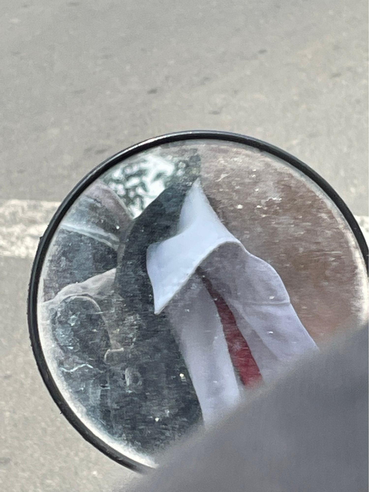
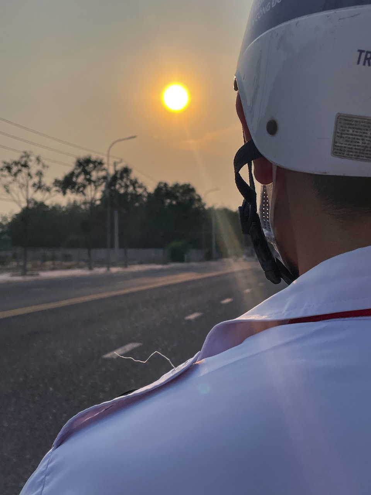

## Kỳ 3: NHỮNG CUỐC XE ĐI HỌC ĐẦY BẤT ỔN!

> **_Haizz, xin chào cậu - một người mà tớ chỉ vừa gặp cách đây vài ngày thôi... Cậu ổn chứ...còn tớ thì... KHÔNG!_**

_Nè,_

**_Không biết cậu đã bao giờ thử ngồi sau xe của người yêu mình hay đơn giản là của bạn bè nhưng là nam chưa? Tớ từng thử rồi, đã vậy còn thử rất nhiều lần nữa, nhiều đến ám ảnh luôn kìa._**

_Tớ trước khi quen người yêu tớ như bây giờ ấy thì toàn đi nhờ xe của bạn nữ thôi. Nữ thì chạy xe cẩn thận, vừa phải nên tớ yên tâm mà giao phó cả tính mạng này cho cô bạn của tớ. Cơ mà nó chạy xe an toàn thật, đúng ý tớ nên yên tâm lắm._

_Nhưng mà từ ngày tớ có anh ấy ý, thì anh ấy toàn dành chở tớ đi thôi. Ban đầu thì tớ còn ngu ngơ mà tin tưởng để ảnh chở. Nhưng đó chỉ là lúc đầu, mãi sau này, đi xe chung cũng trên dưới 20 lần thì tớ mới nhận ra... **anh ấy chạy xe như racing boy ý, đáng sợ lắm kìa**. Tuy không chạy kiểu đánh võng, lạng lách nhưng mà tốc độ thì khỏi bàn rồi, giờ mà cho ảnh 300 phân khối có khi chạy đến 250 phân khối ấy chứ._

_Ảnh chạy nhanh kinh khủng, chạy đến mức mà tớ hay đùa là mỗi lần đi với anh chắc phải cầu nguyện. Anh ấy cũng biết rằng ảnh chạy nhanh và làm tớ sợ nên đôi lúc cũng chạy từ từ lại. Nhưng không được bao lâu, ảnh vẫn chạy lại cái tốc độ cũ, riết rồi **tớ cũng chẳng còn sợ nữa mà chỉ đơn giản đổi người chở đi thôi**._

_Người tiếp theo mà tớ là nạn nhân ý, là một anh bạn lớp 12, dễ thương lắm á, cũng từng là crush cũ của tớ (**nhưng mà giờ thì là bạn vì tớ đã thuần hóa cho ảnh thích con trai rồi hihi**). Anh này thì tiện đường nên hay chở tớ đi học, dù chỉ là bạn nhưng mà ân cần, từ từ lắm, không như người yêu tớ đâu. Nhưng đó chỉ là lúc đầu, sau này thì anh ấy cũng **chẳng cách xa người yêu mình là bao cả, cũng vặn ga các thứ**. Nhưng với bản chất là quen rồi thì với tớ cũng chẳng đáng sợ nữa rồi._

_Thật ra tớ kể câu chuyện này không phải vì muốn bêu rếu đâu, mà là vì **tớ tức họ rằng hôm chiều thứ Tư, cả hai rủ nhau đi ăn đến nỗi mém bỏ quên mình ý. Với cả cũng muốn nhắn gửi đến mọi người chạy xe cẩn thận và để tâm đến mọi người nha.**_
