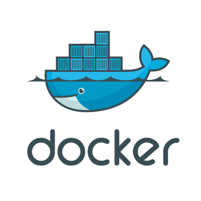

import Tabs from "@theme/Tabs";
import TabItem from "@theme/TabItem";
import FirstPost from "./partials/docs/_preevent.mdx";
import SecondPost from "./partials/docs/_docker.mdx";
import ThirdPost from "./partials/docs/_event.mdx";

Kính chào quý độc giả, đây là bài thứ hai của **Tech Blog**. Ngày hôm nay, tôi sẽ kể quý vị nghe về những gì
đã và đang xảy ra trong suốt thời gian qua đối với dịch vụ **_Youtube Downloader_** trên website này. Mời quý
vị chuyển sang các thẻ khác nhau ứng với ngày ghi nhận cụ thể để đọc nội dung từng bài.

<!-- truncate -->

### Thông tin chính thức (cập nhật)

- [Heroku's Next Chapter](https://blog.heroku.com/next-chapter)
- [Removal of Heroku Free Product Plans FAQ](https://help.heroku.com/RSBRUH58/removal-of-heroku-free-product-plans-faq)
- [Netlify Functions](https://www.netlify.com/products/functions/)
- [Functions overview](https://docs.netlify.com/functions/overview/)
- [Cập nhật về Youtube Downloader](https://www.builetuananh.name.vn/blog/tech-blog-01)

<Tabs lazy>
  <TabItem value="one" label="01/09" default>
    <FirstPost />
  </TabItem>
  <TabItem value="two" label="10/09">
    <SecondPost />
  </TabItem>
  <TabItem value="three" label="25/09">
    <ThirdPost />
  </TabItem>
</Tabs>

### Tổng kết bài viết

Vừa rồi là toàn bộ bài đăng số 2 của series **Tech Blog**. Mời quý độc giả theo dõi các bài đăng
tiếp theo và đóng góp ý kiến cũng trên website này. Trân trọng cảm ơn và kính chào 👋.
