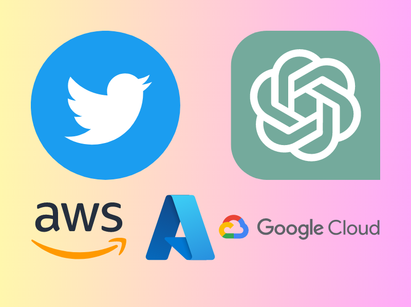

import Tabs from "@theme/Tabs";
import TabItem from "@theme/TabItem";
import FirstPost from "./partials/docs/_p1.mdx";
import SecondPost from "./partials/docs/_p2.mdx";
import ThirdPost from "./partials/docs/_p3.mdx";

Kính chào quý độc giả, đây là bài thứ ba của **Tech Blog** mà đã rất lâu rồi mới có dịp xuất hiện trở lại
trên website này. Ngày hôm nay, rất nhiều nội dung thú vị sẽ được chia sẻ tại chiếc Tech Blog này. Với tựa đề
**_Từ Twitter_** 🦉**_, ChatGPT_** 🧠 **_đến Điện toán đám mây_** ☁, đây sẽ là những câu chuyện được tổng hợp lại dưới góc nhìn
hài hước và dễ hiểu nhất. Mời quý vị chuyển sang các thẻ khác nhau ứng với từng phần của bài viết.

<!-- truncate -->

<Tabs lazy>
  <TabItem value="one" label="P1" default>
    <FirstPost />
  </TabItem>
  <TabItem value="two" label="P2">
    <SecondPost />
  </TabItem>
  <TabItem value="three" label="P3">
    <ThirdPost />
  </TabItem>
</Tabs>

### Tổng kết bài viết

Vừa rồi là toàn bộ bài đăng số 3 của series **Tech Blog**. Mời quý độc giả theo dõi các bài đăng
tiếp theo và đóng góp ý kiến cũng trên website này. Trân trọng cảm ơn và kính chào 👋.
